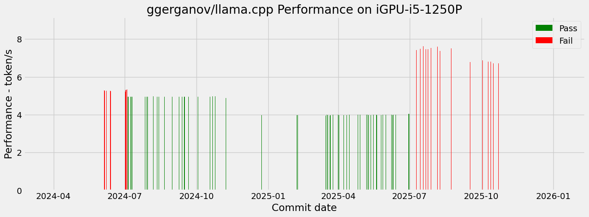

# llama.cpp CI for SYCL Backend

This CI system is developed and maintained by NeoZhangJianyu. If you have any issue, please contact to: [zhang.jianyu@outlook.com](zhang.jianyu@outlook.com).

## Repo CI

|Repo|Branch|Hardware|CI|Figure|
|-|-|-|-|-|
|arthw/llama.cpp|master|iGPU-i5-1250P|[CI Log](./arthw-llama.cpp/master/iGPU-i5-1250P/README.md)||
|arthw/llama.cpp|master|iGPU-13700k|[CI Log](./arthw-llama.cpp/master/iGPU-13700k/README.md)||
|arthw/llama.cpp|master|arc770|[CI Log](./arthw-llama.cpp/master/arc770/README.md)||
|ggerganov/llama.cpp|master|git_since.log|[CI Log](./ggerganov-llama.cpp/master/git_since.log/README.md)||
|ggerganov/llama.cpp|master|log|[CI Log](./ggerganov-llama.cpp/master/log/README.md)||
|ggerganov/llama.cpp|master|git.log|[CI Log](./ggerganov-llama.cpp/master/git.log/README.md)||
|ggerganov/llama.cpp|master|iGPU-i5-1250P|[CI Log](./ggerganov-llama.cpp/master/iGPU-i5-1250P/README.md)||
|ggerganov/llama.cpp|master|commit_id.txt|[CI Log](./ggerganov-llama.cpp/master/commit_id.txt/README.md)||
|ggerganov/llama.cpp|master|all_git_info.json|[CI Log](./ggerganov-llama.cpp/master/all_git_info.json/README.md)||
|ggerganov/llama.cpp|master|iGPU-13700k|[CI Log](./ggerganov-llama.cpp/master/iGPU-13700k/README.md)||
|ggerganov/llama.cpp|master|arc770|[CI Log](./ggerganov-llama.cpp/master/arc770/README.md)||
