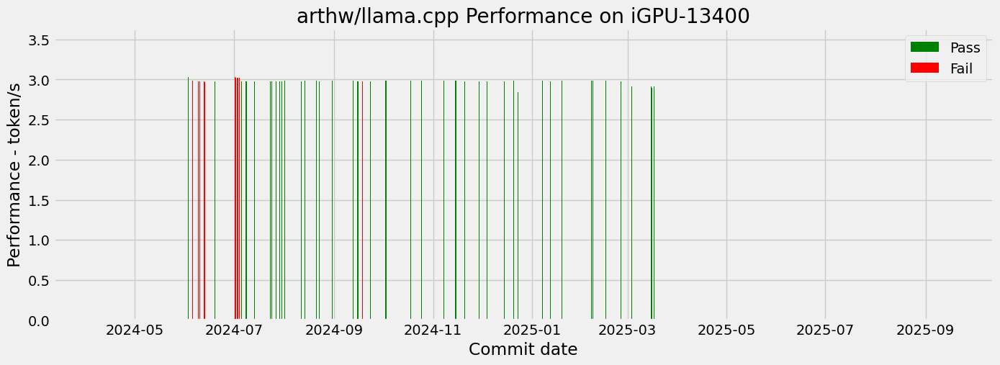

# llama.cpp CI for SYCL Backend

This CI system is developed and maintained by NeoZhangJianyu. If you have any issue, please contact to: [zhang.jianyu@outlook.com](zhang.jianyu@outlook.com).

## Repo CI

|Repo|Branch|Hardware|CI|Figure|
|-|-|-|-|-|
|arthw/llama.cpp|master|arc770|[CI Log](./arthw-llama.cpp/master/arc770/README.md)||
|arthw/llama.cpp|master|iGPU-13400|[CI Log](./arthw-llama.cpp/master/iGPU-13400/README.md)||
|arthw/llama.cpp|master|iGPU-13700k|[CI Log](./arthw-llama.cpp/master/iGPU-13700k/README.md)||
|arthw/llama.cpp|master|iGPU-i5-1250P|[CI Log](./arthw-llama.cpp/master/iGPU-i5-1250P/README.md)||
