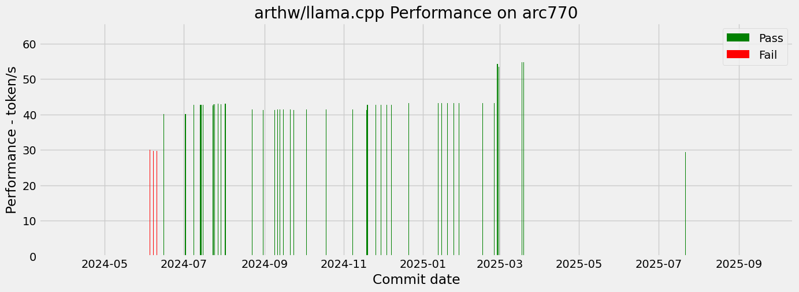

#  CI for arc770 by SYCL Backend

## Summary

Figure

## Detail

**GGUF res** is verified by script ./example/sycl/run.sh with llama2-7b-Q4 for correction

**GGUF Perf** is the performance data by script ./example/sycl/run.sh with llama2-7b-Q4

**Bench Perf** is the performance data by llama-bench with llama2-7b-Q4

|Commit Info|UT PassRate|Fault Detail|
GGUF res
|GGUF Perf (token/s)|Bench Perf (token/s)|Warn/Err|oneAPI|
|-|-|-|-|-|-|-|-|
|[c5dc8e9e4edc80a162fe673017384d2894f73d36](https://github.com//commit/c5dc8e9e4edc80a162fe673017384d2894f73d36) 2025-02-27 09:21:51 fix ut fault of Q4_1, Q5.. arthw  Log: [log](./log/c5dc8e9e4edc80a162fe673017384d2894f73d36)|Execute_Err|NA|NA|NA|tg=NA pp=NA|-1/-1|NA|
|[7ba151d24bef8ff866074a18586b504d7de49e47](https://github.com//commit/7ba151d24bef8ff866074a18586b504d7de49e47) 2025-02-26 22:16:33 add new line at end of file Neo Zhang Jianyu  Log: [log](./log/7ba151d24bef8ff866074a18586b504d7de49e47)|Execute_Err|NA|NA|NA|tg=NA pp=NA|-1/-1|NA|
|[420e3b326679a9e0e9f251670daabaed7b49a3e1](https://github.com//commit/420e3b326679a9e0e9f251670daabaed7b49a3e1) 2025-02-24 22:33:23 [SYCL] Optimize mul_mat for Q4_0 on Inte l GPU Neo Zhang Jianyu  Log: [log](./log/420e3b326679a9e0e9f251670daabaed7b49a3e1)|Execute_Err|NA|NA|NA|tg=NA pp=NA|-1/-1|NA|
|[7fecf7f0b7123bb1df3028f636943d227dd95dbc](https://github.com//commit/7fecf7f0b7123bb1df3028f636943d227dd95dbc) 2025-02-24 15:48:25 SYCL: Fix GGML_SYCL_DEBUG macro Akarshan Biswas  Log: [log](./log/7fecf7f0b7123bb1df3028f636943d227dd95dbc)|Execute_Err|NA|NA|NA|tg=NA pp=NA|-1/-1|NA|
|[edab2bd11bacddfd48315464a33f0945112cafa9](https://github.com//commit/edab2bd11bacddfd48315464a33f0945112cafa9) 2025-02-15 16:40:57 repo : update links to new url Georgi Gerganov  Log: [log](./log/edab2bd11bacddfd48315464a33f0945112cafa9)|Execute_Err|NA|NA|NA|tg=NA pp=NA|-1/-1|NA|
|[cf7f1c12ca7ee553199ce812addeafaa5275f235](https://github.com//commit/cf7f1c12ca7ee553199ce812addeafaa5275f235) 2025-02-07 14:57:53 SYCL: remove XMX info from print devices  Akarshan Biswas  Log: [log](./log/cf7f1c12ca7ee553199ce812addeafaa5275f235)|Execute_Err|NA|NA|NA|tg=NA pp=NA|-1/-1|NA|
|[ee194915c8b41fbda120d1b8c8ea52880898298f](https://github.com//commit/ee194915c8b41fbda120d1b8c8ea52880898298f) 2025-02-06 17:12:35 SYCL: Adjust support condition for norm  operators Akarshan Biswas  Log: [log](./log/ee194915c8b41fbda120d1b8c8ea52880898298f)|Execute_Err|NA|NA|NA|tg=NA pp=NA|-1/-1|NA|
|[6bb7538d3cdd0fc4b49a57c4dd889004e5da7373](https://github.com//commit/6bb7538d3cdd0fc4b49a57c4dd889004e5da7373) 2025-01-28 15:26:58 SYCL : SOFTMAX F16 mask support and othe r fixes Akarshan Biswas  Log: [log](./log/6bb7538d3cdd0fc4b49a57c4dd889004e5da7373)|Execute_Err|NA|NA|NA|tg=NA pp=NA|-1/-1|NA|
|[db9c9cc064d40ae5933c9280e157c3c321193245](https://github.com//commit/db9c9cc064d40ae5933c9280e157c3c321193245) 2025-01-24 13:30:13 docs : Update readme to build targets fo r local docker build Jafar Uruç  Log: [log](./log/db9c9cc064d40ae5933c9280e157c3c321193245)|Execute_Err|NA|NA|NA|tg=NA pp=NA|-1/-1|NA|
|[61259291b42f96b452ec067b724a90ca03eb545e](https://github.com//commit/61259291b42f96b452ec067b724a90ca03eb545e) 2025-01-19 14:33:34 SYCL: Introducing memory host pool Nicolò Scipione  Log: [log](./log/61259291b42f96b452ec067b724a90ca03eb545e)|Execute_Err|NA|NA|NA|tg=NA pp=NA|-1/-1|NA|
|[b598146c9ac5f1c68cddf5e2bedad1fdc5d1a8f1](https://github.com//commit/b598146c9ac5f1c68cddf5e2bedad1fdc5d1a8f1) 2025-01-15 08:50:17 SYCL: Add gated linear attention kernel Akarshan Biswas  Log: [log](./log/b598146c9ac5f1c68cddf5e2bedad1fdc5d1a8f1)|Execute_Err|NA|NA|NA|tg=NA pp=NA|-1/-1|NA|
|[4501233cc5ad7c289700a5860ea271421d5121ca](https://github.com//commit/4501233cc5ad7c289700a5860ea271421d5121ca) 2025-01-12 11:32:42 llama : add `llama_vocab`, functions ->  methods, naming Georgi Gerganov  Log: [log](./log/4501233cc5ad7c289700a5860ea271421d5121ca)|Execute_Err|NA|NA|NA|tg=NA pp=NA|-1/-1|NA|
|[b73dbc56378fc59bfcbc69547a09c19cf2500ab0](https://github.com//commit/b73dbc56378fc59bfcbc69547a09c19cf2500ab0) 2025-01-10 09:58:08 llama: add support for QRWKV6 model arch itecture Molly Sophia  Log: [log](./log/b73dbc56378fc59bfcbc69547a09c19cf2500ab0)|Execute_Err|NA|NA|NA|tg=NA pp=NA|-1/-1|NA|
|[8c87f2be19b841ee0a2769f2677a100bf767fb23](https://github.com//commit/8c87f2be19b841ee0a2769f2677a100bf767fb23) 2025-01-10 05:43:03 SYCL: Refactor ggml_sycl_compute_forward  Akarshan Biswas  Log: [log](./log/8c87f2be19b841ee0a2769f2677a100bf767fb23)|Execute_Err|NA|NA|NA|tg=NA pp=NA|-1/-1|NA|
|[05a034b35caca012f136a6cd51019783a1a8fe17](https://github.com//commit/05a034b35caca012f136a6cd51019783a1a8fe17) 2025-01-07 11:56:07 SYCL: Use get_multi_ptr instead of depre cated get_pointer in wkv6 Akarshan Biswas  Log: [log](./log/05a034b35caca012f136a6cd51019783a1a8fe17)|Execute_Err|NA|NA|NA|tg=NA pp=NA|-1/-1|NA|
|[7f97dccac994504eb2e33124393d393a830008b4](https://github.com//commit/7f97dccac994504eb2e33124393d393a830008b4) 2024-12-23 10:39:30 rpc-server : add support for the SYCL ba ckend Radoslav Gerganov  Log: [log](./log/7f97dccac994504eb2e33124393d393a830008b4)|Execute_Err|NA|NA|NA|tg=NA pp=NA|-1/-1|NA|
|[bcfe9787c97c67bba02f69cae742daf508edb37f](https://github.com//commit/bcfe9787c97c67bba02f69cae742daf508edb37f) 2024-12-20 22:05:39 correct the device info format arthw  Log: [log](./log/bcfe9787c97c67bba02f69cae742daf508edb37f)|93.0%|2212/2216|('ok', 'pass', 0)|42.67|tg=42.78 pp=948.4|264/0|2025.0.0|
|[7fed97b92243fa8d83bc0de3e24ddc4f0e2b616e](https://github.com//commit/7fed97b92243fa8d83bc0de3e24ddc4f0e2b616e) 2024-12-20 21:01:28 SYCL: Migrate away from deprecated ggml_ tensor->backend Akarshan Biswas  Log: [log](./log/7fed97b92243fa8d83bc0de3e24ddc4f0e2b616e)|Execute_Err|NA|NA|NA|tg=NA pp=NA|-1/-1|NA|
|[c12caff4211ae6391609dd91aefdb952669aa0b4](https://github.com//commit/c12caff4211ae6391609dd91aefdb952669aa0b4) 2024-12-14 20:43:46 llama : add Qwen2VL support + multimodal  RoPE HimariO  Log: [log](./log/c12caff4211ae6391609dd91aefdb952669aa0b4)|93.0%|2212/2216|('ok', 'pass', 0)|42.67|tg=42.81 pp=949.39|264/0|2025.0.0|
|[a674ffbf6d41b626e1dfb29a7023f2c5bd1a24ef](https://github.com//commit/a674ffbf6d41b626e1dfb29a7023f2c5bd1a24ef) 2024-12-13 12:12:15 SYCL: Reduce most of the compiler warnin gs Akarshan Biswas  Log: [log](./log/a674ffbf6d41b626e1dfb29a7023f2c5bd1a24ef)|93.0%|2200/2204|('ok', 'pass', 0)|42.66|tg=42.78 pp=948.71|264/0|2025.0.0|
|[d90c615041e3bdda82412b03cf0d61977a509bf4](https://github.com//commit/d90c615041e3bdda82412b03cf0d61977a509bf4) 2024-12-07 13:37:50 ggml : refactor online repacking Djip007  Log: [log](./log/d90c615041e3bdda82412b03cf0d61977a509bf4)|93.0%|2200/2204|('ok', 'pass', 0)|42.71|tg=42.77 pp=949.17|628/0|2025.0.0|
|[e480feb741c1944fb9505e7176a82e2e0a4cf143](https://github.com//commit/e480feb741c1944fb9505e7176a82e2e0a4cf143) 2024-12-04 08:26:37 clip : add sycl support piDack  Log: [log](./log/e480feb741c1944fb9505e7176a82e2e0a4cf143)|93.0%|2196/2200|('ok', 'pass', 0)|42.66|tg=42.81 pp=948.73|628/0|2025.0.0|
|[db892e11b4de94157682ce06f8dd2bf66d629a57](https://github.com//commit/db892e11b4de94157682ce06f8dd2bf66d629a57) 2024-12-04 02:29:20 SYCL : Move to compile time oneMKL inter face backend selection for NVIDIA backen d Nicolò Scipione  Log: [log](./log/db892e11b4de94157682ce06f8dd2bf66d629a57)|93.0%|2196/2200|('ok', 'pass', 0)|42.66|tg=42.76 pp=949.29|628/0|2025.0.0|
|[00bd8917c5cfa44aa65d8bf00c352ff8dc495d0a](https://github.com//commit/00bd8917c5cfa44aa65d8bf00c352ff8dc495d0a) 2024-11-29 12:38:45 sycl : offload of get_rows set to 0 Alberto Cabrera Pérez  Log: [log](./log/00bd8917c5cfa44aa65d8bf00c352ff8dc495d0a)|93.0%|1915/1919|('ok', 'pass', 0)|42.7|tg=42.8 pp=948.57|628/0|2025.0.0|
|[a64f340ada53193628df20302ac2878afbe97e77](https://github.com//commit/a64f340ada53193628df20302ac2878afbe97e77) 2024-11-29 09:49:43 sycl : Reroute permuted mul_mats through  oneMKL Alberto Cabrera Pérez  Log: [log](./log/a64f340ada53193628df20302ac2878afbe97e77)|93.0%|1915/1919|('ok', 'pass', 0)|42.63|tg=42.73 pp=903.93|628/0|2025.0.0|
|[c9dd5ab17073cf1b993d4e8bcc3cc4056cdaaeef](https://github.com//commit/c9dd5ab17073cf1b993d4e8bcc3cc4056cdaaeef) 2024-11-25 17:31:10 [SYCL] Fix building Win package for oneA PI 2025.0 update Neo Zhang Jianyu  Log: [log](./log/c9dd5ab17073cf1b993d4e8bcc3cc4056cdaaeef)|93.0%|NA|('ok', 'pass', 0)|42.66|tg=42.71 pp=904.64|628/0|2025.0.0|
|[fa4365c6f1697084ecbe87778177e46fbc8d9559](https://github.com//commit/fa4365c6f1697084ecbe87778177e46fbc8d9559) 2024-11-25 15:13:39 ggml : add support for dynamic loading o f backends Diego Devesa  Log: [log](./log/fa4365c6f1697084ecbe87778177e46fbc8d9559)|93.0%|NA|('ok', 'pass', 0)|42.65|tg=42.73 pp=918.67|628/0|2025.0.0|
|[68b25ede0c67a92ea5f7beb8d08be4ffa664ec74](https://github.com//commit/68b25ede0c67a92ea5f7beb8d08be4ffa664ec74) 2024-11-20 13:54:25 update rel to 4040 Neo Zhang Jianyu  Log: [log](./log/68b25ede0c67a92ea5f7beb8d08be4ffa664ec74)|93.0%|NA|('ok', 'pass', 0)|42.66|tg=42.79 pp=905.23|628/0|2025.0.0|
|[9a59aa2e6bba59feda3e6a8d22bcfa1181516206](https://github.com//commit/9a59aa2e6bba59feda3e6a8d22bcfa1181516206) 2024-11-19 09:02:23 sycl : Add option to set the SYCL archit ecture for all targets Romain Biessy  Log: [log](./log/9a59aa2e6bba59feda3e6a8d22bcfa1181516206)|93.0%|NA|('ok', 'pass', 0)|42.65|tg=42.76 pp=903.83|628/0|2025.0.0|
|[a97920143e2dc05e9919dabdb3de091dddec0d02](https://github.com//commit/a97920143e2dc05e9919dabdb3de091dddec0d02) 2024-11-19 08:20:52 fix for windows building arthw  Log: [log](./log/a97920143e2dc05e9919dabdb3de091dddec0d02)|93.0%|NA|('ok', 'pass', 0)|41.27|tg=42.73 pp=906.04|628/0|2025.0.0|
|[74b246bc63633bbd6e649172f1a525085793968c](https://github.com//commit/74b246bc63633bbd6e649172f1a525085793968c) 2024-11-19 00:50:04 sycl: Revert MUL_MAT_OP support changes Alberto Cabrera Pérez  Log: [log](./log/74b246bc63633bbd6e649172f1a525085793968c)|93.0%|NA|('ok', 'pass', 0)|42.65|tg=42.78 pp=904.68|628/0|2025.0.0|
|[7e98ad63bd1f5f77db49495a29836a638d5b08d1](https://github.com//commit/7e98ad63bd1f5f77db49495a29836a638d5b08d1) 2024-11-18 15:18:04 fix error arthw  Log: [log](./log/7e98ad63bd1f5f77db49495a29836a638d5b08d1)|93.0%|1603/1607|('ok', 'pass', 0)|41.34|tg=42.77 pp=951.76|536/0|2025.0.0|
|[71ee846eabeaa74f25273335f6a48599a23fe581](https://github.com//commit/71ee846eabeaa74f25273335f6a48599a23fe581) 2024-11-18 14:22:50 restore context to 4096 for perf test st andard arthw  Log: [log](./log/71ee846eabeaa74f25273335f6a48599a23fe581)|93.0%|1597/1601|('ok', 'pass', 0)|41.27|tg=42.71 pp=951.07|534/0|2025.0.0|
|[6b559cc88205d379ee838122cc53bd2993dc7006](https://github.com//commit/6b559cc88205d379ee838122cc53bd2993dc7006) 2024-11-15 12:10:45 sycl: Update Intel docker images to use  DPC++ 2025.0 Romain Biessy  Log: [log](./log/6b559cc88205d379ee838122cc53bd2993dc7006)|93.0%|NA|('ok', 'pass', 0)|41.29|tg=42.77 pp=906.23|628/0|2025.0.0|
|[e0dc41a443fb42adb695d9e691be8aefde1212cd](https://github.com//commit/e0dc41a443fb42adb695d9e691be8aefde1212cd) 2024-11-15 04:09:12 sycl: Use syclcompat::dp4a Romain Biessy  Log: [log](./log/e0dc41a443fb42adb695d9e691be8aefde1212cd)|93.0%|NA|('ok', 'pass', 0)|41.29|tg=42.72 pp=906.44|628/0|2025.0.0|
|[b3abcd3a44b6078c333f073356ee2f05d5fb76ca](https://github.com//commit/b3abcd3a44b6078c333f073356ee2f05d5fb76ca) 2024-11-14 18:04:35 ggml : build backends as libraries Diego Devesa  Log: [log](./log/b3abcd3a44b6078c333f073356ee2f05d5fb76ca)|93.0%|NA|('ok', 'pass', 0)|41.34|tg=42.71 pp=906.13|644/0|2025.0.0|
|[4c7310ded88a4de290a0a97621ef8b2a235287d7](https://github.com//commit/4c7310ded88a4de290a0a97621ef8b2a235287d7) 2024-11-07 18:19:10 Optimize RWKV6 Operator Naming and Imple ment Multi-core CPU/ SYCL Acceleration Zhiyuan Li  Log: [log](./log/4c7310ded88a4de290a0a97621ef8b2a235287d7)|93.0%|NA|('ok', 'pass', 0)|41.33|tg=42.65 pp=905.63|638/0|2025.0.0|
|[99255721763e472628dbbc2be25da42ba6a5dd7f](https://github.com//commit/99255721763e472628dbbc2be25da42ba6a5dd7f) 2024-10-30 02:01:23 llama : refactor model loader with backe nd registry Diego Devesa  Log: [log](./log/99255721763e472628dbbc2be25da42ba6a5dd7f)|93.0%|NA|('ok', 'pass', 0)|41.32|tg=42.72 pp=943.9|538/0|2025.0.0|
|[a5f5aad986e216bf5e3ee6a459e459486dd28849](https://github.com//commit/a5f5aad986e216bf5e3ee6a459e459486dd28849) 2024-10-24 21:23:33 ci : fix cmake flags for SYCL Georgi Gerganov  Log: [log](./log/a5f5aad986e216bf5e3ee6a459e459486dd28849)|93.0%|NA|('ok', 'pass', 0)|41.31|tg=42.7 pp=952.83|536/0|2025.0.0|
|[f2b7df5b78789de5bee247d00c7f613448379363](https://github.com//commit/f2b7df5b78789de5bee247d00c7f613448379363) 2024-10-21 14:26:09 fix mul_mat_vec_q and *_vec_q error Neo Zhang Jianyu  Log: [log](./log/f2b7df5b78789de5bee247d00c7f613448379363)|Build Err|NA|('err', 'diff in line 0: exp=Step 1: Get Domain and Hosting Error to run gguf', 0)|NA|tg=NA pp=NA|11/20|2025.0.0|
|[ccb5cbcb4b0b00a438232c311a6046252f8861ea](https://github.com//commit/ccb5cbcb4b0b00a438232c311a6046252f8861ea) 2024-10-18 06:46:16 [SYCL] Add SYCL Backend registry, device  and Event Interfaces Ouadie EL FAROUKI  Log: [log](./log/ccb5cbcb4b0b00a438232c311a6046252f8861ea)|93.0%|1603/1607|('ok', 'pass', 0)|41.32|tg=42.68 pp=950.73|536/0|2025.0.0|
|[9ccecbac5d241de7a7d72d341df9415ce3b67c2a](https://github.com//commit/9ccecbac5d241de7a7d72d341df9415ce3b67c2a) 2024-10-03 07:50:44 Fixed dequant precision issues in Q4_1 a nd Q5_1 Ouadie EL FAROUKI  Log: [log](./log/9ccecbac5d241de7a7d72d341df9415ce3b67c2a)|96.0%|NA|('ok', 'pass', 0)|41.34|tg=42.75 pp=952.65|534/0|2025.0.0|
|[230f88ac27b377ea6f863980e2af0990e78dc03a](https://github.com//commit/230f88ac27b377ea6f863980e2af0990e78dc03a) 2024-10-03 01:49:47 ggml-backend : add device and backend re g interfaces Diego Devesa  Log: [log](./log/230f88ac27b377ea6f863980e2af0990e78dc03a)|96.0%|NA|('ok', 'pass', 0)|41.32|tg=42.75 pp=953.41|534/0|2025.0.0|
|[8f7e0876fa473fdd63dd31eb5f9f4c49a22077e3](https://github.com//commit/8f7e0876fa473fdd63dd31eb5f9f4c49a22077e3) 2024-10-02 13:57:18 [SYCL] Initial cmake support of SYCL for  AMD GPUs Alberto Cabrera Pérez  Log: [log](./log/8f7e0876fa473fdd63dd31eb5f9f4c49a22077e3)|93.0%|1601/1605|('ok', 'pass', 0)|41.31|tg=42.74 pp=953.07|534/0|2025.0.0|
|[5b9803ee14bd14a2a7579b5d4e4f7c9e9d2586aa](https://github.com//commit/5b9803ee14bd14a2a7579b5d4e4f7c9e9d2586aa) 2024-09-26 17:38:31 [SYCL] add missed dll file in package Neo Zhang Jianyu  Log: [log](./log/5b9803ee14bd14a2a7579b5d4e4f7c9e9d2586aa)|93.0%|1601/1605|('ok', 'pass', 0)|41.26|tg=42.73 pp=952.15|534/0|2025.0.0|
|[45b9f19fa248ba09783496276e444699f92c174a](https://github.com//commit/45b9f19fa248ba09783496276e444699f92c174a) 2024-09-23 08:58:06 Revert "[SYCL] fallback mmvq Akarshan Biswas  Log: [log](./log/45b9f19fa248ba09783496276e444699f92c174a)|93.0%|1601/1605|('ok', 'pass', 0)|41.3|tg=42.72 pp=949.54|534/0|2025.0.0|
|[50d253c1c513f4a537155664e4374bd7e159aedd](https://github.com//commit/50d253c1c513f4a537155664e4374bd7e159aedd) 2024-09-20 20:12:52 ggml : fix builds Georgi Gerganov  Log: [log](./log/50d253c1c513f4a537155664e4374bd7e159aedd)|93.0%|1597/1601|('ok', 'pass', 0)|41.31|tg=42.74 pp=954.25|534/0|2025.0.0|
|[d4d42566debb6aeb05a8eb7d7aa2f976acd26ec8](https://github.com//commit/d4d42566debb6aeb05a8eb7d7aa2f976acd26ec8) 2024-09-20 19:04:44 ggml/examples: add backend support for n umerical optimization Johannes Gäßler  Log: [log](./log/d4d42566debb6aeb05a8eb7d7aa2f976acd26ec8)|Build Err|NA|('err', 'diff in line 0: exp=Step 1: Get Domain and Hosting Error to run gguf', 0)|NA|tg=NA pp=NA|76/3|2025.0.0|
|[6e0564c286a3bfc90d4abb6dbb658e9c70db81d9](https://github.com//commit/6e0564c286a3bfc90d4abb6dbb658e9c70db81d9) 2024-09-18 08:30:31 [SYCL]set context default value to avoid  memory issue, update guide Neo Zhang Jianyu  Log: [log](./log/6e0564c286a3bfc90d4abb6dbb658e9c70db81d9)|93.0%|1438/1442|('err', 'diff in line 0: exp=Step 1: Get Domain and Hosting Step 1:', 0)|41.32|tg=42.72 pp=952.43|534/0|2025.0.0|
|[74e41abc0e89395c568991df641349a74a6e8e5b](https://github.com//commit/74e41abc0e89395c568991df641349a74a6e8e5b) 2024-09-15 18:55:52 cmake : correct order of sycl flags Michael Podvitskiy  Log: [log](./log/74e41abc0e89395c568991df641349a74a6e8e5b)|92.0%|1438/1442|('ok', 'pass', 0)|41.34|tg=42.71 pp=951.04|534/0|2025.0.0|
|[f86e8db62950f1bd93c274a41d6dfba9fac28f8c](https://github.com//commit/f86e8db62950f1bd93c274a41d6dfba9fac28f8c) 2024-09-15 09:06:38 cmake : try to fix sycl+intel build Michael Podvitskiy  Log: [log](./log/f86e8db62950f1bd93c274a41d6dfba9fac28f8c)|92.0%|1438/1442|('ok', 'pass', 0)|41.33|tg=42.7 pp=952.82|534/0|2025.0.0|
|[299e70d39cb457b435f8881c12e479517b37f43b](https://github.com//commit/299e70d39cb457b435f8881c12e479517b37f43b) 2024-09-12 17:44:17 enhance run script to be easy to change  the parameters Neo Zhang Jianyu  Log: [log](./log/299e70d39cb457b435f8881c12e479517b37f43b)|92.0%|1438/1442|('ok', 'pass', 0)|41.33|tg=42.74 pp=948.77|534/0|2025.0.0|
|[4aa7e80b7c4f1c81289725f28e98e716bcd15670](https://github.com//commit/4aa7e80b7c4f1c81289725f28e98e716bcd15670) 2024-09-12 14:23:49 ggml : hide ggml_object, ggml_cgraph, gg ml_hash_set Georgi Gerganov  Log: [log](./log/4aa7e80b7c4f1c81289725f28e98e716bcd15670)|92.0%|1438/1442|('ok', 'pass', 0)|41.37|tg=42.7 pp=947.05|534/0|2025.0.0|
|[7823459807682b5d299059eb725574a9ae60711c](https://github.com//commit/7823459807682b5d299059eb725574a9ae60711c) 2024-09-11 01:53:42 sycl : update support conditions Alberto Cabrera Pérez  Log: [log](./log/7823459807682b5d299059eb725574a9ae60711c)|92.0%|1438/1442|('ok', 'pass', 0)|41.31|tg=NA pp=NA|534/0|2025.0.0|
|[dd8df932a30a6d79558b87f27531be50ffef96b1](https://github.com//commit/dd8df932a30a6d79558b87f27531be50ffef96b1) 2024-09-08 19:05:29 [SYCL] add check malloc result on device  Neo Zhang Jianyu  Log: [log](./log/dd8df932a30a6d79558b87f27531be50ffef96b1)|92.0%|NA|('ok', 'pass', 0)|41.28|tg=NA pp=NA|534/0|2025.0.0|
|[1085098fd47606ae881c712e34c178f01ad07084](https://github.com//commit/1085098fd47606ae881c712e34c178f01ad07084) 2024-08-30 20:10:01 Correct typo run_llama2.sh > run-llama2. sh 蕭澧邦  Log: [log](./log/1085098fd47606ae881c712e34c178f01ad07084)|92.0%|1417/1421|('ok', 'pass', 0)|41.25|tg=NA pp=NA|534/0|2025.0.0|
|[bc65fcf2b7098793689e6892815dfc03a3f3e03f](https://github.com//commit/bc65fcf2b7098793689e6892815dfc03a3f3e03f) 2024-08-22 19:39:47 [SYCL] Add a space to supress a cmake wa rning Akarshan Biswas  Log: [log](./log/bc65fcf2b7098793689e6892815dfc03a3f3e03f)|92.0%|1338/1342|('ok', 'pass', 0)|41.29|tg=NA pp=NA|534/0|2025.0.0|
|[88ed956ae969c0875246517cb757394c0192755d](https://github.com//commit/88ed956ae969c0875246517cb757394c0192755d) 2024-08-22 12:50:10 [SYCL] Add oneDNN primitive support luoyu-intel  Log: [log](./log/88ed956ae969c0875246517cb757394c0192755d)|92.0%|1338/1342|('ok', 'pass', 0)|41.32|tg=NA pp=NA|534/0|2025.0.0|
|[20ae2d8331ac563ec3f61b2f246018441fdfe9be](https://github.com//commit/20ae2d8331ac563ec3f61b2f246018441fdfe9be) 2024-08-20 23:50:17 [SYCL] fallback mmvq Meng, Hengyu  Log: [log](./log/20ae2d8331ac563ec3f61b2f246018441fdfe9be)|92.0%|1338/1342|('ok', 'pass', 0)|41.3|tg=NA pp=NA|516/0|2025.0.0|
|[5fcebd877e2372f5b4ce3a1cc635a8ce215983fa](https://github.com//commit/5fcebd877e2372f5b4ce3a1cc635a8ce215983fa) 2024-08-20 23:06:51 [SYCL] Fix SYCL `im2col` and `convert` O verflow with Large Dims zhentaoyu  Log: [log](./log/5fcebd877e2372f5b4ce3a1cc635a8ce215983fa)|92.0%|1338/1342|('ok', 'pass', 0)|41.31|tg=NA pp=NA|516/0|2025.0.0|
|[7e935f3b64d17ff50637f0c7ce6b126250a90d8c](https://github.com//commit/7e935f3b64d17ff50637f0c7ce6b126250a90d8c) 2024-08-13 21:13:15 ggml : move rope type enum to ggml.h Daniel Bevenius  Log: [log](./log/7e935f3b64d17ff50637f0c7ce6b126250a90d8c)|92.0%|1338/1342|('ok', 'pass', 0)|41.28|tg=NA pp=NA|502/0|2025.0.0|
|[ee55b946a670ad1441d03f31c340c4c339aa04c4](https://github.com//commit/ee55b946a670ad1441d03f31c340c4c339aa04c4) 2024-08-11 16:37:43 update guide Neo Zhang  Log: [log](./log/ee55b946a670ad1441d03f31c340c4c339aa04c4)|92.0%|1338/1342|('ok', 'pass', 0)|41.29|tg=NA pp=NA|502/0|2025.0.0|
|[75a32668b0d8d3e5f1c0fe62ed8e24b8d635a362](https://github.com//commit/75a32668b0d8d3e5f1c0fe62ed8e24b8d635a362) 2024-08-07 23:22:50 fix error arthw  Log: [log](./log/75a32668b0d8d3e5f1c0fe62ed8e24b8d635a362)|92.0%|1338/1342|('ok', 'pass', 0)|42.91|tg=NA pp=NA|504/0|2024.2.1|
|[ef4b1efcb9754626ec8821ef65bb16dc24998d9d](https://github.com//commit/ef4b1efcb9754626ec8821ef65bb16dc24998d9d) 2024-08-07 11:25:36 [SYCL] Updated SYCL device filtering Ouadie EL FAROUKI  Log: [log](./log/ef4b1efcb9754626ec8821ef65bb16dc24998d9d)|Execute_Err|NA|('err', 'diff in line 0: exp=Step 1: Get Domain and Hosting Error to run gguf', 0)|NA|tg=NA pp=NA|476/0|2024.2.1|
|[924ddb54d0ed737f7899a6cbf3ad5d67b21a90b6](https://github.com//commit/924ddb54d0ed737f7899a6cbf3ad5d67b21a90b6) 2024-08-06 15:26:46 ggml : add epsilon as a parameter for gr oup_norm Molly Sophia  Log: [log](./log/924ddb54d0ed737f7899a6cbf3ad5d67b21a90b6)|Execute_Err|NA|('err', 'diff in line 0: exp=Step 1: Get Domain and Hosting Error to run gguf', 0)|NA|tg=NA pp=NA|476/0|2024.2.1|
|[11c713b84415b93542dcb388cdc2b353c21c499c](https://github.com//commit/11c713b84415b93542dcb388cdc2b353c21c499c) 2024-08-02 01:55:17 [SYCL] Fixing wrong VDR iq4nl value Ouadie EL FAROUKI  Log: [log](./log/11c713b84415b93542dcb388cdc2b353c21c499c)|92.0%|1347/1351|('ok', 'pass', 0)|42.95|tg=NA pp=NA|504/0|2024.2.1|
|[345606c4b9f21678d0d2875b64d76c204ffb35c3](https://github.com//commit/345606c4b9f21678d0d2875b64d76c204ffb35c3) 2024-08-01 14:43:08 fix link arthw  Log: [log](./log/345606c4b9f21678d0d2875b64d76c204ffb35c3)|92.0%|1332/1334|('ok', 'pass', 0)|42.93|tg=NA pp=NA|474/0|2024.2.1|
|[7e63e58ab1acd81dc31d4b938529b40a366cbe6d](https://github.com//commit/7e63e58ab1acd81dc31d4b938529b40a366cbe6d) 2024-08-01 14:20:41 update guide arthw  Log: [log](./log/7e63e58ab1acd81dc31d4b938529b40a366cbe6d)|92.0%|1332/1334|('ok', 'pass', 0)|42.95|tg=NA pp=NA|474/0|2024.2.1|
|[f1bc5ad852d3007864bfca5c8898554a970fc1e6](https://github.com//commit/f1bc5ad852d3007864bfca5c8898554a970fc1e6) 2024-08-01 13:14:58 add final newline arthw  Log: [log](./log/f1bc5ad852d3007864bfca5c8898554a970fc1e6)|92.0%|1332/1334|('ok', 'pass', 0)|42.94|tg=NA pp=NA|474/0|2024.2.1|
|[4d71c98544c9150d974878867e1277a57d94ecb2](https://github.com//commit/4d71c98544c9150d974878867e1277a57d94ecb2) 2024-08-01 12:52:06 mv dpct/helper.hpp to dpct.hpp arthw  Log: [log](./log/4d71c98544c9150d974878867e1277a57d94ecb2)|92.0%|1332/1334|('ok', 'pass', 0)|42.95|tg=NA pp=NA|474/0|2024.2.1|
|[254a750249f74e838e744eedd8607f05fe9707d7](https://github.com//commit/254a750249f74e838e744eedd8607f05fe9707d7) 2024-08-01 12:48:18 rename device_infos to infos arthw  Log: [log](./log/254a750249f74e838e744eedd8607f05fe9707d7)|92.0%|1332/1334|('ok', 'pass', 0)|42.94|tg=NA pp=NA|474/0|2024.2.1|
|[6211ac040886495c44ad2ddee80204c9bcd6721a](https://github.com//commit/6211ac040886495c44ad2ddee80204c9bcd6721a) 2024-08-01 12:42:11 simple code for loop arthw  Log: [log](./log/6211ac040886495c44ad2ddee80204c9bcd6721a)|92.0%|1332/1334|('ok', 'pass', 0)|42.96|tg=NA pp=NA|474/0|2024.2.1|
|[1947c1200e1f5fd40ca8606454fe097efd3505aa](https://github.com//commit/1947c1200e1f5fd40ca8606454fe097efd3505aa) 2024-08-01 11:21:16 support set main gpu arthw  Log: [log](./log/1947c1200e1f5fd40ca8606454fe097efd3505aa)|92.0%|1332/1334|('ok', 'pass', 0)|42.95|tg=NA pp=NA|474/0|2024.2.1|
|[d5380f3af20cf5dd8d8a95854767891f29c5a4d1](https://github.com//commit/d5380f3af20cf5dd8d8a95854767891f29c5a4d1) 2024-07-30 23:49:34 refactor device in sycl_device, restore  ctx in create_queue arthw  Log: [log](./log/d5380f3af20cf5dd8d8a95854767891f29c5a4d1)|92.0%|1332/1334|('ok', 'pass', 0)|42.93|tg=NA pp=NA|472/0|2024.2.1|
|[e1256c69e3d63d539b8a31c2d0f83ba24aad2a95](https://github.com//commit/e1256c69e3d63d539b8a31c2d0f83ba24aad2a95) 2024-07-30 14:56:51 [SYCL] Add `TIMESTEP_EMBEDDING` OP zhentaoyu  Log: [log](./log/e1256c69e3d63d539b8a31c2d0f83ba24aad2a95)|92.0%|1332/1334|('ok', 'pass', 0)|42.94|tg=NA pp=NA|504/0|2024.2.1|
|[faaebf16a14e7417b2a76342ddd1ebb1e3e52f50](https://github.com//commit/faaebf16a14e7417b2a76342ddd1ebb1e3e52f50) 2024-07-29 10:50:27 [SYCL] add conv support Meng, Hengyu  Log: [log](./log/faaebf16a14e7417b2a76342ddd1ebb1e3e52f50)|92.0%|1332/1334|('ok', 'pass', 0)|42.93|tg=NA pp=NA|488/0|2024.2.1|
|[e702f2ff117a165dea685937dd4afb4c5306ec54](https://github.com//commit/e702f2ff117a165dea685937dd4afb4c5306ec54) 2024-07-27 04:41:55 ggml : reduce hash table reset cost slaren  Log: [log](./log/e702f2ff117a165dea685937dd4afb4c5306ec54)|92.0%|1332/1334|('ok', 'pass', 0)|42.95|tg=NA pp=NA|478/0|2024.2.1|
|[0aeae29190ccc052bdab49d6034dc96d9c51c99f](https://github.com//commit/0aeae29190ccc052bdab49d6034dc96d9c51c99f) 2024-07-24 14:36:00 Build Llama SYCL Intel with static libs Joe Todd  Log: [log](./log/0aeae29190ccc052bdab49d6034dc96d9c51c99f)|92.0%|1332/1334|('ok', 'pass', 0)|42.8|tg=NA pp=NA|482/0|2024.2.1|
|[146da8b6c635f817a78480ff71cceff8ed51ea5a](https://github.com//commit/146da8b6c635f817a78480ff71cceff8ed51ea5a) 2024-07-24 11:55:26 Re-add erroneously removed -fsycl from G GML_EXTRA_LIBS Joe Todd  Log: [log](./log/146da8b6c635f817a78480ff71cceff8ed51ea5a)|92.0%|1332/1334|('ok', 'pass', 0)|42.75|tg=NA pp=NA|480/0|2024.2.1|
|[e2d7ec46fc0b64762fbf7b22d6e24b589b741438](https://github.com//commit/e2d7ec46fc0b64762fbf7b22d6e24b589b741438) 2024-07-23 14:58:37 sycl : Add support for non-release DPC++  & oneMKL Joe Todd  Log: [log](./log/e2d7ec46fc0b64762fbf7b22d6e24b589b741438)|92.0%|1332/1334|('ok', 'pass', 0)|42.78|tg=NA pp=NA|480/0|2024.2.1|
|[a9c03e482701d00291401eca929de66f08280a92](https://github.com//commit/a9c03e482701d00291401eca929de66f08280a92) 2024-07-23 07:43:28 [SYCL] fix scratch size of softmax luoyu-intel  Log: [log](./log/a9c03e482701d00291401eca929de66f08280a92)|92.0%|1332/1334|('ok', 'pass', 0)|42.59|tg=NA pp=NA|482/0|2024.2.1|
|[88db0dc6be323da7b2cd31f82752d9e552d56825](https://github.com//commit/88db0dc6be323da7b2cd31f82752d9e552d56825) 2024-07-15 19:32:15 [SYCL] add concat through dim 1/2 Meng, Hengyu  Log: [log](./log/88db0dc6be323da7b2cd31f82752d9e552d56825)|91.0%|1279/1281|('ok', 'pass', 0)|42.76|tg=NA pp=NA|482/0|2024.2.1|
|[a364ec78f3ab2c240269ff370265815357753012](https://github.com//commit/a364ec78f3ab2c240269ff370265815357753012) 2024-07-14 11:07:56 fix UT of concat arthw  Log: [log](./log/a364ec78f3ab2c240269ff370265815357753012)|91.0%|1279/1281|('ok', 'pass', 0)|42.73|tg=NA pp=NA|474/0|2024.2.0|
|[e700d37f68b5473390a3aa39f2c63aaa5f0d6eab](https://github.com//commit/e700d37f68b5473390a3aa39f2c63aaa5f0d6eab) 2024-07-14 01:02:58 mv softmax to separated file Neo Zhang  Log: [log](./log/e700d37f68b5473390a3aa39f2c63aaa5f0d6eab)|91.0%|NA|('ok', 'pass', 0)|42.77|tg=NA pp=NA|472/0|2024.2.0|
|[a4c8edcb67be8a496c27b67aa9d37690d9519e5e](https://github.com//commit/a4c8edcb67be8a496c27b67aa9d37690d9519e5e) 2024-07-14 00:15:55 fix for multiple cards Neo Zhang  Log: [log](./log/a4c8edcb67be8a496c27b67aa9d37690d9519e5e)|91.0%|NA|('ok', 'pass', 0)|42.71|tg=NA pp=NA|686/0|2024.2.0|
|[74e3185cfd51d39a4738b631db5ced23eea7f1c6](https://github.com//commit/74e3185cfd51d39a4738b631db5ced23eea7f1c6) 2024-07-13 16:02:15 fix editorconfig check format issue arthw  Log: [log](./log/74e3185cfd51d39a4738b631db5ced23eea7f1c6)|91.0%|NA|('ok', 'pass', 0)|42.75|tg=NA pp=NA|686/0|2024.2.0|
|[4cd9e48670c7009099f4d900a5f3461cfb802755](https://github.com//commit/4cd9e48670c7009099f4d900a5f3461cfb802755) 2024-07-13 14:43:57 cherry-pick b549a1bbefb2f1fbb8b558bac1f2 ae7967e60964, arthw  Log: [log](./log/4cd9e48670c7009099f4d900a5f3461cfb802755)|91.0%|NA|('ok', 'pass', 0)|42.72|tg=NA pp=NA|686/0|2024.2.0|
|[fa700d1a84e9f41763f63acb3084541910e545b8](https://github.com//commit/fa700d1a84e9f41763f63acb3084541910e545b8) 2024-07-12 00:52:04 [SYCL] fix the mul_mat_id ut issues Chen Xi  Log: [log](./log/fa700d1a84e9f41763f63acb3084541910e545b8)|Build Err|NA|('err', 'diff in line 0: exp=Step 1: Get Domain and Hosting ./examples/sycl/run-llama2.sh: line 29:  ./build/bin/llama-cli: No such file or d ', 0)|NA|tg=NA pp=NA|53/2|2024.2.0|
|[35b1aff5cfd4f5dbf0d60a2084c995dd22f7eb2a](https://github.com//commit/35b1aff5cfd4f5dbf0d60a2084c995dd22f7eb2a) 2024-07-10 16:10:49 [SYCL] Use multi_ptr to clean up depreca ted warnings AidanBeltonS  Log: [log](./log/35b1aff5cfd4f5dbf0d60a2084c995dd22f7eb2a)|Build Err|NA|('err', 'diff in line 0: exp=Step 1: Get Domain and Hosting ./examples/sycl/run-llama2.sh: line 29:  ./build/bin/llama-cli: No such file or d ', 0)|NA|tg=NA pp=NA|53/2|2024.2.0|
|[7a8fa37316f2765c9fc09422ce3939d1e5b79777](https://github.com//commit/7a8fa37316f2765c9fc09422ce3939d1e5b79777) 2024-07-08 21:35:17 labeler : updated sycl to match docs and  code refactor Alberto Cabrera Pérez  Log: [log](./log/7a8fa37316f2765c9fc09422ce3939d1e5b79777)|91.0%|NA|('ok', 'pass', 0)|42.7|tg=NA pp=NA|686/0|2024.2.0|
|[a7d77816921f8f1eb75a0ed79b245d86e71e6ff6](https://github.com//commit/a7d77816921f8f1eb75a0ed79b245d86e71e6ff6) 2024-07-08 14:22:41 sycl : fix powf call in device code Alberto Cabrera Pérez  Log: [log](./log/a7d77816921f8f1eb75a0ed79b245d86e71e6ff6)|91.0%|NA|('ok', 'pass', 0)|42.73|tg=NA pp=NA|686/0|2024.2.0|
|[86d41e6e1c84be041736d339e5f643cd05cf1b70](https://github.com//commit/86d41e6e1c84be041736d339e5f643cd05cf1b70) 2024-07-08 13:51:31 scripts : fix sync for sycl Georgi Gerganov  Log: [log](./log/86d41e6e1c84be041736d339e5f643cd05cf1b70)|91.0%|NA|('ok', 'pass', 0)|42.73|tg=NA pp=NA|686/0|2024.2.0|
|[16ab65b7b9e1ed8cc774c9d09d05bbc109a05a57](https://github.com//commit/16ab65b7b9e1ed8cc774c9d09d05bbc109a05a57) 2024-07-05 18:08:32 Reorganize documentation pages Xuan Son Nguyen  Log: [log](./log/16ab65b7b9e1ed8cc774c9d09d05bbc109a05a57)|91.0%|NA|('ok', 'pass', 0)|42.75|tg=NA pp=NA|686/0|2024.2.0|
|[fdef7d606ef4864ceb5f51a576c0ecddec2cce2a](https://github.com//commit/fdef7d606ef4864ceb5f51a576c0ecddec2cce2a) 2024-07-04 11:55:23 replace get_work_group_size Neo Zhang  Log: [log](./log/fdef7d606ef4864ceb5f51a576c0ecddec2cce2a)|91.0%|NA|('ok', 'pass', 0)|41.14|tg=NA pp=NA|556/0|2024.2.0|
|[249347995825713ad03b9cda3a036851f2e95033](https://github.com//commit/249347995825713ad03b9cda3a036851f2e95033) 2024-07-04 08:28:58 skip UT for BF16 Neo Zhang  Log: [log](./log/249347995825713ad03b9cda3a036851f2e95033)|91.0%|NA|('ok', 'pass', 0)|41.13|tg=NA pp=NA|564/0|2024.2.0|
|[9c593619f363fda422375b386674d558fa48d437](https://github.com//commit/9c593619f363fda422375b386674d558fa48d437) 2024-07-03 11:20:54 fix multiple gpu, add device choose mode , update the guide for usages Neo Zhang  Log: [log](./log/9c593619f363fda422375b386674d558fa48d437)|91.0%|NA|('ok', 'pass', 0)|40.05|tg=NA pp=NA|571/0|2024.1.0|
|[51be86243892833c9779ae903d5b54241ec2507a](https://github.com//commit/51be86243892833c9779ae903d5b54241ec2507a) 2024-07-03 02:55:34 Dequant improvements rebase AidanBeltonS  Log: [log](./log/51be86243892833c9779ae903d5b54241ec2507a)|91.0%|NA|('ok', 'pass', 0)|40.06|tg=NA pp=NA|577/0|2024.1.0|
|[044995e2d1fbc21ca275be66a9cb580034124502](https://github.com//commit/044995e2d1fbc21ca275be66a9cb580034124502) 2024-07-02 12:18:10 Removes multiple newlines at the end of  files that is breaking the editorconfig  step of CI. Clint Herron  Log: [log](./log/044995e2d1fbc21ca275be66a9cb580034124502)|91.0%|NA|('ok', 'pass', 0)|40.06|tg=NA pp=NA|571/0|2024.1.0|
|[a9f3b102157ba992cfe058909b7f6e1906d2d647](https://github.com//commit/a9f3b102157ba992cfe058909b7f6e1906d2d647) 2024-07-02 04:50:07 [SYCL] Fix win build conflict of math li brary luoyu-intel  Log: [log](./log/a9f3b102157ba992cfe058909b7f6e1906d2d647)|91.0%|NA|('ok', 'pass', 0)|41.12|tg=NA pp=NA|550/0|2024.2.0|
|[d08c20eddedb24515a3212e2de66bdff41a26b8c](https://github.com//commit/d08c20eddedb24515a3212e2de66bdff41a26b8c) 2024-07-02 02:16:00 [SYCL] Fix the sub group size of Intel luoyu-intel  Log: [log](./log/d08c20eddedb24515a3212e2de66bdff41a26b8c)|91.0%|NA|('err', 'diff in line 0: exp=Step 1: Get Domain and Hosting Step 1: The original copy text needed sh ould describe the products/ services.',  0)|43.39|tg=NA pp=NA|599/0|2024.1.0|
|[cb5fad4c6c2cbef92e9b8b63449e1cb7664e4846](https://github.com//commit/cb5fad4c6c2cbef92e9b8b63449e1cb7664e4846) 2024-07-01 20:39:06 CUDA: refactor and optimize IQ MMVQ Johannes Gäßler  Log: [log](./log/cb5fad4c6c2cbef92e9b8b63449e1cb7664e4846)|91.0%|NA|('ok', 'pass', 0)|40.09|tg=NA pp=NA|543/0|2024.1.0|
|[197fe6c1d7bec6718ce901f0141b2725240f298c](https://github.com//commit/197fe6c1d7bec6718ce901f0141b2725240f298c) 2024-07-01 19:39:06 [SYCL] Update SYCL-Rope op and Refactor zhentaoyu  Log: [log](./log/197fe6c1d7bec6718ce901f0141b2725240f298c)|91.0%|NA|('ok', 'pass', 0)|40.08|tg=NA pp=NA|543/0|2024.1.0|
|[f3f65429c44bb195a9195bfdc19a30a79709db7b](https://github.com//commit/f3f65429c44bb195a9195bfdc19a30a79709db7b) 2024-06-26 18:33:02 llama : reorganize source code + improve  CMake Georgi Gerganov  Log: [log](./log/f3f65429c44bb195a9195bfdc19a30a79709db7b)|95.0%|NA|('ok', 'pass', 0)|40.09|tg=NA pp=NA|533/0|2024.1.0|
|[083bacce14c1aaf9976aa40e8266cdc25ac749d3](https://github.com//commit/083bacce14c1aaf9976aa40e8266cdc25ac749d3) 2024-06-25 10:19:20 [SYCL] Re-enabled mul_mat_batched_sycl Meng, Hengyu  Log: [log](./log/083bacce14c1aaf9976aa40e8266cdc25ac749d3)|91.0%|NA|('ok', 'pass', 0)|40.17|tg=NA pp=NA|554/0|2024.1.0|
|[de391e4c803383bbea054b6edd016e78c024a74d](https://github.com//commit/de391e4c803383bbea054b6edd016e78c024a74d) 2024-06-20 13:19:05 [SYCL] Fix windows build and inference luoyu-intel  Log: [log](./log/de391e4c803383bbea054b6edd016e78c024a74d)|91.0%|NA|('ok', 'pass', 0)|40.09|tg=NA pp=NA|554/0|2024.1.0|
|[de2763118fd5b6ea89702cc9981349e0556b0c3d](https://github.com//commit/de2763118fd5b6ea89702cc9981349e0556b0c3d) 2024-06-19 22:54:15 fix to support multiple GPUs, fix set si ngle device, unify id/device_id/device_i ndex Jianyu Zhang  Log: [log](./log/de2763118fd5b6ea89702cc9981349e0556b0c3d)|Build Err|NA|('err', 'diff in line 0: exp=Step 1: Get Domain and Hosting ./examples/sycl/run-llama2.sh: line 29:  ./build/bin/llama-cli: No such file or d ', 0)|NA|tg=NA pp=NA|13/6|2024.1.0|
|[623494a478134432fd2d7ee40135770a3340674f](https://github.com//commit/623494a478134432fd2d7ee40135770a3340674f) 2024-06-19 09:11:51 [SYCL] refactor Meng, Hengyu  Log: [log](./log/623494a478134432fd2d7ee40135770a3340674f)|91.0%|NA|('ok', 'pass', 0)|40.09|tg=NA pp=NA|542/0|2024.1.0|
|[df68d4fa5dc929217d3e64d673e099d7a417b206](https://github.com//commit/df68d4fa5dc929217d3e64d673e099d7a417b206) 2024-06-17 11:17:07 [SYCL] Update README-sycl.md for Chapter  "Recommended release" and "News" Neo Zhang  Log: [log](./log/df68d4fa5dc929217d3e64d673e099d7a417b206)|91.0%|NA|('ok', 'pass', 0)|40.08|tg=NA pp=NA|480/0|2024.1.0|
|[7b2f4a7d193ef2475259bbe7656fcccfab4b1217](https://github.com//commit/7b2f4a7d193ef2475259bbe7656fcccfab4b1217) 2024-06-15 14:05:10 [SYCL] remove global variables Meng, Hengyu  Log: [log](./log/7b2f4a7d193ef2475259bbe7656fcccfab4b1217)|91.0%|NA|('ok', 'pass', 0)|40.09|tg=NA pp=NA|480/0|2024.1.0|
|[f578b86b2123d0f92afbaa98a031df4d4464e582](https://github.com//commit/f578b86b2123d0f92afbaa98a031df4d4464e582) 2024-06-13 03:11:35 move BLAS to a separate backend slaren  Log: [log](./log/f578b86b2123d0f92afbaa98a031df4d4464e582)|91.0%|NA|('err', 'diff in line 6: exp=Step 7: Make the site visible Step 7: Make,orsz onседа atir Byett, 1./ doV’3ar/F(, knowledgejyl onop5all', 6)|29.65|tg=NA pp=NA|493/0|2024.1.0|
|[1c641e6aac5c18b964e7b32d9dbbb4bf5301d0d7](https://github.com//commit/1c641e6aac5c18b964e7b32d9dbbb4bf5301d0d7) 2024-06-13 00:41:52 `build`: rename main → llama-cli, server  → llama-server, llava-cli → llama-llava -cli, etc... Olivier Chafik  Log: [log](./log/1c641e6aac5c18b964e7b32d9dbbb4bf5301d0d7)|91.0%|NA|('err', 'diff in line 6: exp=Step 7: Make the site visible Step 7: Make,orsz onседа atir Byett, 1./ doV’3ar/F(, knowledgejyl onop5all', 6)|29.73|tg=NA pp=NA|493/0|2024.1.0|
|[a9cae48003dfc4fe95b8f5c81682fc6e63425235](https://github.com//commit/a9cae48003dfc4fe95b8f5c81682fc6e63425235) 2024-06-12 16:00:22 tests : add non-cont unary tests Georgi Gerganov  Log: [log](./log/a9cae48003dfc4fe95b8f5c81682fc6e63425235)|91.0%|NA|('err', 'diff in line 6: exp=Step 7: Make the site visible Step 7: Make,orsz onседа atir Byett, 1./ doV’3ar/F(, knowledgejyl onop5all', 6)|29.69|tg=NA pp=NA|493/0|2024.1.0|
|[af4ae502ddaeb03cd5861273ca2e9a5ae4551db7](https://github.com//commit/af4ae502ddaeb03cd5861273ca2e9a5ae4551db7) 2024-06-10 02:21:31 use the correct SYCL context for host US M allocations Ben Ashbaugh  Log: [log](./log/af4ae502ddaeb03cd5861273ca2e9a5ae4551db7)|91.0%|NA|('err', 'diff in line 6: exp=Step 7: Make the site visible Step 7: Make,orsz onседа atir Byett, 1./ doV’3ar/F(, knowledgejyl onop5all', 6)|29.7|tg=NA pp=NA|493/0|2024.1.0|
|[fe1e3917cfa0f9397a765cfd0aef880674d938d5](https://github.com//commit/fe1e3917cfa0f9397a765cfd0aef880674d938d5) 2024-06-09 01:43:39 Revert "[SYCL] Update rpc-server.cpp to  include SYCL backend slaren  Log: [log](./log/fe1e3917cfa0f9397a765cfd0aef880674d938d5)|91.0%|NA|('err', 'diff in line 6: exp=Step 7: Make the site visible Step 7: Make,orszomen, he jump -major30  atau, OldC and 2 in.O(men, Int 1unker, b ', 6)|30.37|tg=NA pp=NA|463/0|2024.2.0|
|[d5c938cd7716b9a2ace49a43a469dfbffcff4d28](https://github.com//commit/d5c938cd7716b9a2ace49a43a469dfbffcff4d28) 2024-06-07 14:28:26 [SYCL] fix softmax r2r result wrong issu e pengxin99  Log: [log](./log/d5c938cd7716b9a2ace49a43a469dfbffcff4d28)|91.0%|NA|('err', 'diff in line 6: exp=Step 7: Make the site visible Step 7: Make,orsz onседа atir Byett, 1./ doV’3ar/F(, knowledgejyl onop5all', 6)|29.64|tg=NA pp=NA|493/0|2024.1.0|
|[2b3389677a833cee0880226533a1768b1a9508d2](https://github.com//commit/2b3389677a833cee0880226533a1768b1a9508d2) 2024-06-05 11:29:20 ggml : refactor rope norm/neox Georgi Gerganov  Log: [log](./log/2b3389677a833cee0880226533a1768b1a9508d2)|91.0%|NA|('err', 'diff in line 6: exp=Step 7: Make the site visible Step 7: Make,orsz onседа atir Byett, 1./ doV’3ar/F(, knowledgejyl onop5all', 6)|29.73|tg=NA pp=NA|493/0|2024.1.0|
|[554c247caffed64465f372661f2826640cb10430](https://github.com//commit/554c247caffed64465f372661f2826640cb10430) 2024-06-04 21:23:20 ggml : remove OpenCL Georgi Gerganov  Log: [log](./log/554c247caffed64465f372661f2826640cb10430)|91.0%|NA|('err', 'diff in line 6: exp=Step 7: Make the site visible Step 7: Make report (v has have has got  (pay( Big and (c gu in to The(Col U2 R,2 ', 6)|29.97|tg=NA pp=NA|487/0|2024.1.0|
|[9422c5e34bbd302493b77a8f6d546154a1f4fe82](https://github.com//commit/9422c5e34bbd302493b77a8f6d546154a1f4fe82) 2024-06-02 19:13:54 [SYCL] Update rpc-server.cpp to include  SYCL backend nickp27  Log: [log](./log/9422c5e34bbd302493b77a8f6d546154a1f4fe82)|91.0%|NA|('ok', 'pass', 0)|30.69|tg=NA pp=NA|457/0|2024.2.0|
