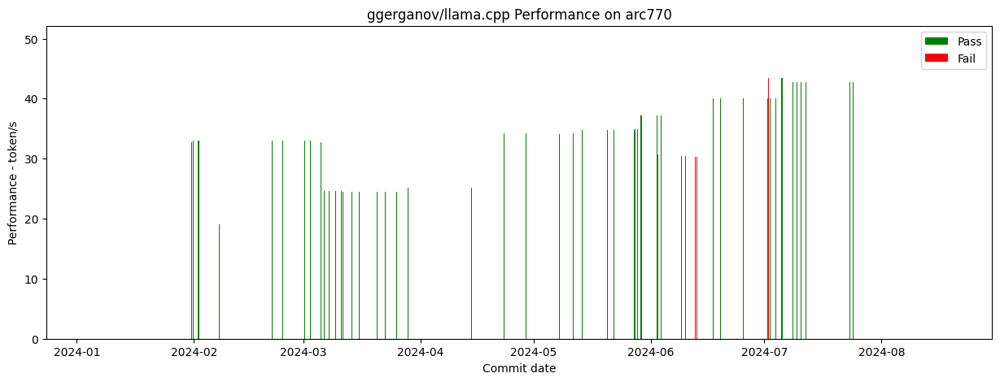

# [ggerganov/llama.cpp](https://github.com/ggerganov/llama.cpp) CI for arc770 by SYCL Backend

## Summary

Figure

## Detail

**GGUF res** is verified by script ./example/sycl/run.sh with llama2-7b-Q4 for correction

**Perf** is the performance data by script ./example/sycl/run.sh with llama2-7b-Q4

|Commit Info|UT PassRate|Fault Detail|
GGUF res
|Perf(token/s)|Warn/Err|
|-|-|-|-|-|-|
|[be20e7f49d9e5c6d9e8d9b4871eeba3df7a1639d](https://github.com/ggerganov/llama.cpp/commit/be20e7f49d9e5c6d9e8d9b4871eeba3df7a1639d) 2024-07-05 18:08:32 Reorganize documentation pages Xuan Son Nguyen  Log: [log](./log/be20e7f49d9e5c6d9e8d9b4871eeba3df7a1639d)|91.0%|NA|('ok', 'pass')|43.43|705/0|
|[1f3e1b66e21310ed78b964f72f19766549633f0e](https://github.com/ggerganov/llama.cpp/commit/1f3e1b66e21310ed78b964f72f19766549633f0e) 2024-07-05 13:23:25 Enabled more data types for oneMKL gemm_batch Ouadie EL FAROUKI  Log: [log](./log/1f3e1b66e21310ed78b964f72f19766549633f0e)|91.0%|NA|('ok', 'pass')|43.43|705/0|
|[a9554e20b66546b0549aebe2e1034bc8afe9d809](https://github.com/ggerganov/llama.cpp/commit/a9554e20b66546b0549aebe2e1034bc8afe9d809) 2024-07-05 05:06:13 [SYCL] Fix WARP_SIZE=16 bug of Intel GPU luoyu-intel  Log: [log](./log/a9554e20b66546b0549aebe2e1034bc8afe9d809)|91.0%|NA|('ok', 'pass')|43.45|703/0|
|[f09b7cb609d80b8031803f89255991dc8b35db69](https://github.com/ggerganov/llama.cpp/commit/f09b7cb609d80b8031803f89255991dc8b35db69) 2024-07-05 10:32:29 rm get_work_group_size Neo Zhang Jianyu  Log: [log](./log/f09b7cb609d80b8031803f89255991dc8b35db69)|91.0%|NA|('ok', 'pass')|40.05|561/0|
|[f619024764e72261f14d7c31d892b8fb976603b4](https://github.com/ggerganov/llama.cpp/commit/f619024764e72261f14d7c31d892b8fb976603b4) 2024-07-04 02:07:19 [SYCL] Remove unneeded semicolons AidanBeltonS  Log: [log](./log/f619024764e72261f14d7c31d892b8fb976603b4)|91.0%|NA|('ok', 'pass')|40.07|569/0|
|[fadde6713506d9e6c124f5680ab8c7abebe31837](https://github.com/ggerganov/llama.cpp/commit/fadde6713506d9e6c124f5680ab8c7abebe31837) 2024-07-03 02:55:34 Dequant improvements rebase AidanBeltonS  Log: [log](./log/fadde6713506d9e6c124f5680ab8c7abebe31837)|91.0%|NA|('ok', 'pass')|40.05|569/0|
|[07a3fc0608a68c0c93a5fbfa9c58f4c9ec64cb81](https://github.com/ggerganov/llama.cpp/commit/07a3fc0608a68c0c93a5fbfa9c58f4c9ec64cb81) 2024-07-02 12:18:10 Removes multiple newlines at the end of files that is breaking the editorconfig step of CI. Clint Herron  Log: [log](./log/07a3fc0608a68c0c93a5fbfa9c58f4c9ec64cb81)|91.0%|NA|('ok', 'pass')|40.06|563/0|
|[d08c20eddedb24515a3212e2de66bdff41a26b8c](https://github.com/ggerganov/llama.cpp/commit/d08c20eddedb24515a3212e2de66bdff41a26b8c) 2024-07-02 02:16:00 [SYCL] Fix the sub group size of Intel luoyu-intel  Log: [log](./log/d08c20eddedb24515a3212e2de66bdff41a26b8c)|91.0%|NA|('err', 'diff in line 0: exp=Step 1: Get to know the basics of web design out=Step 1: The original copy text needed should describe the products/ services.')|43.38|599/0|
|[cb5fad4c6c2cbef92e9b8b63449e1cb7664e4846](https://github.com/ggerganov/llama.cpp/commit/cb5fad4c6c2cbef92e9b8b63449e1cb7664e4846) 2024-07-01 20:39:06 CUDA: refactor and optimize IQ MMVQ Johannes Gäßler  Log: [log](./log/cb5fad4c6c2cbef92e9b8b63449e1cb7664e4846)|91.0%|NA|('ok', 'pass')|40.11|543/0|
|[197fe6c1d7bec6718ce901f0141b2725240f298c](https://github.com/ggerganov/llama.cpp/commit/197fe6c1d7bec6718ce901f0141b2725240f298c) 2024-07-01 19:39:06 [SYCL] Update SYCL-Rope op and Refactor zhentaoyu  Log: [log](./log/197fe6c1d7bec6718ce901f0141b2725240f298c)|91.0%|NA|('ok', 'pass')|40.09|543/0|
|[f3f65429c44bb195a9195bfdc19a30a79709db7b](https://github.com/ggerganov/llama.cpp/commit/f3f65429c44bb195a9195bfdc19a30a79709db7b) 2024-06-26 18:33:02 llama : reorganize source code + improve CMake Georgi Gerganov  Log: [log](./log/f3f65429c44bb195a9195bfdc19a30a79709db7b)|95.0%|NA|('ok', 'pass')|40.08|533/0|
|[083bacce14c1aaf9976aa40e8266cdc25ac749d3](https://github.com/ggerganov/llama.cpp/commit/083bacce14c1aaf9976aa40e8266cdc25ac749d3) 2024-06-25 10:19:20 [SYCL] Re-enabled mul_mat_batched_sycl Meng, Hengyu  Log: [log](./log/083bacce14c1aaf9976aa40e8266cdc25ac749d3)|91.0%|NA|('ok', 'pass')|40.11|554/0|
|[de391e4c803383bbea054b6edd016e78c024a74d](https://github.com/ggerganov/llama.cpp/commit/de391e4c803383bbea054b6edd016e78c024a74d) 2024-06-20 13:19:05 [SYCL] Fix windows build and inference luoyu-intel  Log: [log](./log/de391e4c803383bbea054b6edd016e78c024a74d)|91.0%|NA|('ok', 'pass')|40.12|554/0|
|[623494a478134432fd2d7ee40135770a3340674f](https://github.com/ggerganov/llama.cpp/commit/623494a478134432fd2d7ee40135770a3340674f) 2024-06-19 09:11:51 [SYCL] refactor Meng, Hengyu  Log: [log](./log/623494a478134432fd2d7ee40135770a3340674f)|91.0%|NA|('ok', 'pass')|40.11|542/0|
|[df68d4fa5dc929217d3e64d673e099d7a417b206](https://github.com/ggerganov/llama.cpp/commit/df68d4fa5dc929217d3e64d673e099d7a417b206) 2024-06-17 11:17:07 [SYCL] Update README-sycl.md for Chapter "Recommended release" and "News" Neo Zhang  Log: [log](./log/df68d4fa5dc929217d3e64d673e099d7a417b206)|91.0%|NA|('ok', 'pass')|40.05|480/0|
|[7b2f4a7d193ef2475259bbe7656fcccfab4b1217](https://github.com/ggerganov/llama.cpp/commit/7b2f4a7d193ef2475259bbe7656fcccfab4b1217) 2024-06-15 14:05:10 [SYCL] remove global variables Meng, Hengyu  Log: [log](./log/7b2f4a7d193ef2475259bbe7656fcccfab4b1217)|91.0%|NA|('ok', 'pass')|40.04|480/0|
|[f578b86b2123d0f92afbaa98a031df4d4464e582](https://github.com/ggerganov/llama.cpp/commit/f578b86b2123d0f92afbaa98a031df4d4464e582) 2024-06-13 03:11:35 move BLAS to a separate backend slaren  Log: [log](./log/f578b86b2123d0f92afbaa98a031df4d4464e582)|91.0%|NA|('err', 'diff in line 6: exp=Step 7: Make the site responsive out=Step 7: Make,orsz onседа atir Byett, 1./doV’3ar/F(, knowledgejyl onop5all')|36.8|0/0|
|[1c641e6aac5c18b964e7b32d9dbbb4bf5301d0d7](https://github.com/ggerganov/llama.cpp/commit/1c641e6aac5c18b964e7b32d9dbbb4bf5301d0d7) 2024-06-13 00:41:52 `build`: rename main → llama-cli, server → llama-server, llava-cli → llama-llava-cli, etc... Olivier Chafik  Log: [log](./log/1c641e6aac5c18b964e7b32d9dbbb4bf5301d0d7)|91.0%|NA|('err', 'diff in line 6: exp=Step 7: Make the site responsive out=Step 7: Make,orsz onседа atir Byett, 1./doV’3ar/F(, knowledgejyl onop5all')|36.79|0/0|
|[a9cae48003dfc4fe95b8f5c81682fc6e63425235](https://github.com/ggerganov/llama.cpp/commit/a9cae48003dfc4fe95b8f5c81682fc6e63425235) 2024-06-12 16:00:22 tests : add non-cont unary tests Georgi Gerganov  Log: [log](./log/a9cae48003dfc4fe95b8f5c81682fc6e63425235)|91.0%|NA|('err', 'diff in line 6: exp=Step 7: Make the site responsive out=Step 7: Make,orsz onседа atir Byett, 1./doV’3ar/F(, knowledgejyl onop5all')|36.83|0/0|
|[af4ae502ddaeb03cd5861273ca2e9a5ae4551db7](https://github.com/ggerganov/llama.cpp/commit/af4ae502ddaeb03cd5861273ca2e9a5ae4551db7) 2024-06-10 02:21:31 use the correct SYCL context for host USM allocations Ben Ashbaugh  Log: [log](./log/af4ae502ddaeb03cd5861273ca2e9a5ae4551db7)|91.0%|NA|('err', 'diff in line 6: exp=Step 7: Make the site responsive out=Step 7: Make,orsz onседа atir Byett, 1./doV’3ar/F(, knowledgejyl onop5all')|36.8|0/0|
|[d5c938cd7716b9a2ace49a43a469dfbffcff4d28](https://github.com/ggerganov/llama.cpp/commit/d5c938cd7716b9a2ace49a43a469dfbffcff4d28) 2024-06-07 14:28:26 [SYCL] fix softmax r2r result wrong issue pengxin99  Log: [log](./log/d5c938cd7716b9a2ace49a43a469dfbffcff4d28)|91.0%|NA|('err', 'diff in line 6: exp=Step 7: Make the site responsive out=Step 7: Make,orsz onседа atir Byett, 1./doV’3ar/F(, knowledgejyl onop5all')|36.8|0/0|
|[2b3389677a833cee0880226533a1768b1a9508d2](https://github.com/ggerganov/llama.cpp/commit/2b3389677a833cee0880226533a1768b1a9508d2) 2024-06-05 11:29:20 ggml : refactor rope norm/neox Georgi Gerganov  Log: [log](./log/2b3389677a833cee0880226533a1768b1a9508d2)|91.0%|NA|('err', 'diff in line 6: exp=Step 7: Make the site responsive out=Step 7: Make,orsz onседа atir Byett, 1./doV’3ar/F(, knowledgejyl onop5all')|36.76|0/0|
|[554c247caffed64465f372661f2826640cb10430](https://github.com/ggerganov/llama.cpp/commit/554c247caffed64465f372661f2826640cb10430) 2024-06-04 21:23:20 ggml : remove OpenCL Georgi Gerganov  Log: [log](./log/554c247caffed64465f372661f2826640cb10430)|91.0%|NA|('err', 'diff in line 6: exp=Step 7: Make the site responsive out=Step 7: Make report (v has have has got (pay( Big and (c gu in to The(Col U2 R,2')|37.13|0/0|
|[3b38d48609280aa5f8ab7ea135a4351b2a5ee240](https://github.com/ggerganov/llama.cpp/commit/3b38d48609280aa5f8ab7ea135a4351b2a5ee240) 2024-06-04 09:17:17 Per token attributes jaime-m-p  Log: [log](./log/3b38d48609280aa5f8ab7ea135a4351b2a5ee240)|91.0%|NA|('err', 'diff in line 6: exp=Step 7: Make the site responsive out=Step 7: Make report (v has have has got (pay( Big and (c gu in to The(Col U2 R,2')|37.21|0/0|
|[bde7cd3cd949c1a85d3a199498ac98e78039d46f](https://github.com/ggerganov/llama.cpp/commit/bde7cd3cd949c1a85d3a199498ac98e78039d46f) 2024-06-03 20:03:26 llama : offload to RPC in addition to other backends Radoslav Gerganov  Log: [log](./log/bde7cd3cd949c1a85d3a199498ac98e78039d46f)|91.0%|NA|('err', 'diff in line 6: exp=Step 7: Make the site responsive out=Step 7: Make report (v has have has got (pay( Big and (c gu in to The(Col U2 R,2')|37.18|0/0|
|[a5735e4426b19a3ebd0c653ad8ac01420458ee95](https://github.com/ggerganov/llama.cpp/commit/a5735e4426b19a3ebd0c653ad8ac01420458ee95) 2024-06-04 00:14:15 ggml : use OpenMP as a thread pool Masaya, Kato  Log: [log](./log/a5735e4426b19a3ebd0c653ad8ac01420458ee95)|91.0%|NA|('ok', 'pass')|37.23|0/0|
|[0b832d53ba0ffcc759c8d62ede3772dd62321f8e](https://github.com/ggerganov/llama.cpp/commit/0b832d53ba0ffcc759c8d62ede3772dd62321f8e) 2024-06-03 16:28:58 make: fix debug options not being applied to NVCC Johannes Gäßler  Log: [log](./log/0b832d53ba0ffcc759c8d62ede3772dd62321f8e)|91.0%|NA|('ok', 'pass')|37.2|0/0|
|[7c4e5b7eae26581869e782015d9deca947c34997](https://github.com/ggerganov/llama.cpp/commit/7c4e5b7eae26581869e782015d9deca947c34997) 2024-06-02 13:39:08 chore : add ignore rule for generated server themes Austin  Log: [log](./log/7c4e5b7eae26581869e782015d9deca947c34997)|91.0%|NA|('ok', 'pass')|37.19|0/0|
|[fb76ec31a9914b7761c1727303ab30380fd4f05c](https://github.com/ggerganov/llama.cpp/commit/fb76ec31a9914b7761c1727303ab30380fd4f05c) 2024-05-29 20:17:31 ggml : fix YARN + add tests + add asserts Georgi Gerganov  Log: [log](./log/fb76ec31a9914b7761c1727303ab30380fd4f05c)|91.0%|NA|('ok', 'pass')|37.18|0/0|
|[0e8d8bfd6caf1d0a8cbdf9d3d5c06fbbb9dfced8](https://github.com/ggerganov/llama.cpp/commit/0e8d8bfd6caf1d0a8cbdf9d3d5c06fbbb9dfced8) 2024-05-29 12:23:47 Add Arc A750 and Arch linux to readme-sycl.md as verified GPU model and Linux distro Akarshan Biswas  Log: [log](./log/0e8d8bfd6caf1d0a8cbdf9d3d5c06fbbb9dfced8)|91.0%|NA|('ok', 'pass')|37.24|0/0|
|[b864b50ce5e2beefc8c2fd31733e4e1a978b7754](https://github.com/ggerganov/llama.cpp/commit/b864b50ce5e2beefc8c2fd31733e4e1a978b7754) 2024-05-29 07:00:24 [SYCL] Align GEMM dispatch Meng, Hengyu  Log: [log](./log/b864b50ce5e2beefc8c2fd31733e4e1a978b7754)|91.0%|NA|('ok', 'pass')|37.25|0/0|
|[6bd12ce409f949012935b7d1b15a21ffa473a565](https://github.com/ggerganov/llama.cpp/commit/6bd12ce409f949012935b7d1b15a21ffa473a565) 2024-05-28 22:22:50 sycl : fix assert Georgi Gerganov  Log: [log](./log/6bd12ce409f949012935b7d1b15a21ffa473a565)|91.0%|NA|('ok', 'pass')|34.86|0/0|
|[e2b065071c5fc8ac5697d12ca343551faee465cc](https://github.com/ggerganov/llama.cpp/commit/e2b065071c5fc8ac5697d12ca343551faee465cc) 2024-05-28 17:53:37 [SYCL]fix ggml_sycl_mul_mat_id Neo Zhang  Log: [log](./log/e2b065071c5fc8ac5697d12ca343551faee465cc)|91.0%|NA|('ok', 'pass')|34.85|0/0|
|[0548a4187f2e53b8fc6d9ff0f4c71988f708ff42](https://github.com/ggerganov/llama.cpp/commit/0548a4187f2e53b8fc6d9ff0f4c71988f708ff42) 2024-05-28 11:04:19 ggml : generalize GGML_OP_CONCAT Georgi Gerganov  Log: [log](./log/0548a4187f2e53b8fc6d9ff0f4c71988f708ff42)|91.0%|NA|('ok', 'pass')|34.85|0/0|
|[95f84d5ce8b449a9b16009434aca800df504a02e](https://github.com/ggerganov/llama.cpp/commit/95f84d5ce8b449a9b16009434aca800df504a02e) 2024-05-27 17:34:51 Fix q_xxs using mul_mat_q AidanBeltonS  Log: [log](./log/95f84d5ce8b449a9b16009434aca800df504a02e)|91.0%|NA|('ok', 'pass')|34.84|0/0|
|[5487593bc7ee0b65b9d2e2985b4b61dc77043101](https://github.com/ggerganov/llama.cpp/commit/5487593bc7ee0b65b9d2e2985b4b61dc77043101) 2024-05-27 13:34:09 Add freq factors AidanBeltonS  Log: [log](./log/5487593bc7ee0b65b9d2e2985b4b61dc77043101)|91.0%|NA|('ok', 'pass')|34.81|0/0|
|[0df0aa8e43c3378975269a51f9b876c8692e70da](https://github.com/ggerganov/llama.cpp/commit/0df0aa8e43c3378975269a51f9b876c8692e70da) 2024-05-24 10:06:56 add build shared lib in win release package Neo Zhang  Log: [log](./log/0df0aa8e43c3378975269a51f9b876c8692e70da)|91.0%|NA|('ok', 'pass')|34.78|0/0|
|[e84b71c2c6da6e69c8f815168ea836f9716a325e](https://github.com/ggerganov/llama.cpp/commit/e84b71c2c6da6e69c8f815168ea836f9716a325e) 2024-05-23 10:00:21 ggml : drop support for QK_K=64 Georgi Gerganov  Log: [log](./log/e84b71c2c6da6e69c8f815168ea836f9716a325e)|91.0%|NA|('ok', 'pass')|34.83|0/0|
|[201cc11afa0a1950e1f632390b2ac6c937a0d8f0](https://github.com/ggerganov/llama.cpp/commit/201cc11afa0a1950e1f632390b2ac6c937a0d8f0) 2024-05-22 04:28:32 llama : add phi3 128K model support liuwei-git  Log: [log](./log/201cc11afa0a1950e1f632390b2ac6c937a0d8f0)|91.0%|NA|('ok', 'pass')|34.79|0/0|
|[6bf9b66fa3f263ca2175dcb5f6d0a658581e1dfb](https://github.com/ggerganov/llama.cpp/commit/6bf9b66fa3f263ca2175dcb5f6d0a658581e1dfb) 2024-05-20 12:08:23 [SYCL] Update SYCL upscale operation AidanBeltonS  Log: [log](./log/6bf9b66fa3f263ca2175dcb5f6d0a658581e1dfb)|91.0%|NA|('ok', 'pass')|34.82|0/0|
|[9a17ab914b0aa7353389c656a3f2a0f086726868](https://github.com/ggerganov/llama.cpp/commit/9a17ab914b0aa7353389c656a3f2a0f086726868) 2024-05-15 13:26:30 Add missing " AidanBeltonS  Log: [log](./log/9a17ab914b0aa7353389c656a3f2a0f086726868)|91.0%|NA|('ok', 'pass')|34.85|0/0|
|[48aa8fd1f213a69b41569f809cc954f24dbc4366](https://github.com/ggerganov/llama.cpp/commit/48aa8fd1f213a69b41569f809cc954f24dbc4366) 2024-05-15 03:52:33 ggml : add `ggml_upscale_ext` John Balis  Log: [log](./log/48aa8fd1f213a69b41569f809cc954f24dbc4366)|Execute_Err|NA|('err', 'diff in line 0: exp=Step 1: Get to know the basics of web design out=./examples/sycl/run-llama2.sh: line 29: ./build/bin/main: No such file or direct')|NA|0/0|
|[948f4ec7c5bff92b18e63303f2b2d1645bccd943](https://github.com/ggerganov/llama.cpp/commit/948f4ec7c5bff92b18e63303f2b2d1645bccd943) 2024-05-13 18:11:26 [SYCL] rm wait Neo Zhang  Log: [log](./log/948f4ec7c5bff92b18e63303f2b2d1645bccd943)|91.0%|NA|('ok', 'pass')|34.79|0/0|
|[9cb317f77e53067f7a138cc89ef7657148eae8e6](https://github.com/ggerganov/llama.cpp/commit/9cb317f77e53067f7a138cc89ef7657148eae8e6) 2024-05-11 10:32:41 ggml : full ALiBi support Georgi Gerganov  Log: [log](./log/9cb317f77e53067f7a138cc89ef7657148eae8e6)|91.0%|NA|('ok', 'pass')|34.18|0/0|
|[8c570c9496212073079476651c7517c02581101f](https://github.com/ggerganov/llama.cpp/commit/8c570c9496212073079476651c7517c02581101f) 2024-05-10 01:32:15 Minor arithmetic improvement to mmvq wrapper kernel Ouadie EL FAROUKI  Log: [log](./log/8c570c9496212073079476651c7517c02581101f)|91.0%|NA|('ok', 'pass')|34.16|0/0|
|[04976db7a819fcf8bfefbfc09a3344210b79dd27](https://github.com/ggerganov/llama.cpp/commit/04976db7a819fcf8bfefbfc09a3344210b79dd27) 2024-05-07 17:20:33 docs: fix typos omahs  Log: [log](./log/04976db7a819fcf8bfefbfc09a3344210b79dd27)|90.0%|NA|('ok', 'pass')|34.15|0/0|
|[9c67c2773d4b706cf71d70ecf4aa180b62501960](https://github.com/ggerganov/llama.cpp/commit/9c67c2773d4b706cf71d70ecf4aa180b62501960) 2024-04-30 12:16:08 ggml : add Flash Attention Georgi Gerganov  Log: [log](./log/9c67c2773d4b706cf71d70ecf4aa180b62501960)|90.0%|NA|('ok', 'pass')|34.1|0/0|
|[b8a7a5a90fd3187175d84227dad705ade395ba46](https://github.com/ggerganov/llama.cpp/commit/b8a7a5a90fd3187175d84227dad705ade395ba46) 2024-04-29 17:02:45 build Olivier Chafik  Log: [log](./log/b8a7a5a90fd3187175d84227dad705ade395ba46)|90.0%|NA|('ok', 'pass')|34.19|0/0|
|[ce023f6f2ff34fbe840e32e65d443d2fed7393de](https://github.com/ggerganov/llama.cpp/commit/ce023f6f2ff34fbe840e32e65d443d2fed7393de) 2024-04-28 22:40:31 add device version in device list Neo Zhang  Log: [log](./log/ce023f6f2ff34fbe840e32e65d443d2fed7393de)|91.0%|NA|('ok', 'pass')|34.16|0/0|
|[4e96a812b3ce7322a29a3008db2ed73d9087b176](https://github.com/ggerganov/llama.cpp/commit/4e96a812b3ce7322a29a3008db2ed73d9087b176) 2024-04-23 02:53:18 [SYCL] Windows default build instructions without -DLLAMA_SYCL_F16 flag activated Anas Ahouzi  Log: [log](./log/4e96a812b3ce7322a29a3008db2ed73d9087b176)|91.0%|NA|('ok', 'pass')|34.21|0/0|
|[bca40e98149c7b673558ddd7a3ebeffef789349d](https://github.com/ggerganov/llama.cpp/commit/bca40e98149c7b673558ddd7a3ebeffef789349d) 2024-04-19 09:16:31 fix wrong parameter in cmd in readme-sycl.md Neo Zhang  Log: [log](./log/bca40e98149c7b673558ddd7a3ebeffef789349d)|91.0%|NA|('ok', 'pass')|34.21|0/0|
|[0d56246f4b9764158525d894b96606f6163c53a8](https://github.com/ggerganov/llama.cpp/commit/0d56246f4b9764158525d894b96606f6163c53a8) 2024-04-18 15:18:48 ggml : group all experts in a single ggml_mul_mat_id slaren  Log: [log](./log/0d56246f4b9764158525d894b96606f6163c53a8)|91.0%|NA|('ok', 'pass')|34.2|0/0|
|[17e98d4c96a583d420f12046bc92102381dbd28e](https://github.com/ggerganov/llama.cpp/commit/17e98d4c96a583d420f12046bc92102381dbd28e) 2024-04-15 17:12:26 fix mul_mat_id Neo Zhang Jianyu  Log: [log](./log/17e98d4c96a583d420f12046bc92102381dbd28e)|96.0%|2207/2253|('ok', 'pass')|25.13|0/0|
|[de17e3f7455dc7fd298cc61d86798533b9ca7a29](https://github.com/ggerganov/llama.cpp/commit/de17e3f7455dc7fd298cc61d86798533b9ca7a29) 2024-04-14 10:42:29 fix memcpy Neo Zhang Jianyu  Log: [log](./log/de17e3f7455dc7fd298cc61d86798533b9ca7a29)|96.0%|NA|('ok', 'pass')|25.15|0/0|
|[5c4d767ac028c0f9c31cba3fceaf765c6097abfc](https://github.com/ggerganov/llama.cpp/commit/5c4d767ac028c0f9c31cba3fceaf765c6097abfc) 2024-04-12 10:52:36 chore: Fix markdown warnings Rene Leonhardt  Log: [log](./log/5c4d767ac028c0f9c31cba3fceaf765c6097abfc)|96.0%|1075/1665|('ok', 'pass')|25.21|0/0|
|[87fb5b4234d4b9c56ac94cf7aa229c8fd7defdb0](https://github.com/ggerganov/llama.cpp/commit/87fb5b4234d4b9c56ac94cf7aa229c8fd7defdb0) 2024-04-08 13:56:01 remove row=1 cond Abhilash Majumder  Log: [log](./log/87fb5b4234d4b9c56ac94cf7aa229c8fd7defdb0)|96.0%|1076/1665|('ok', 'pass')|25.28|0/0|
|[9472bce30800a581071478a839bf93abf404c893](https://github.com/ggerganov/llama.cpp/commit/9472bce30800a581071478a839bf93abf404c893) 2024-04-07 07:05:40 Run make to build the project limitedAtonement  Log: [log](./log/9472bce30800a581071478a839bf93abf404c893)|96.0%|1076/1665|('ok', 'pass')|25.22|0/0|
|[d4f220a5ccdc6308173c1a31fad21d7c3fbc96c1](https://github.com/ggerganov/llama.cpp/commit/d4f220a5ccdc6308173c1a31fad21d7c3fbc96c1) 2024-04-07 10:55:59 support/fix OPs GGML_TYPE_IQ4_NL, GGML_TYPE_IQ4_XS, GGML_TYPE_IQ3_XXS, GGML_TYPE_IQ3_S, GGML_TYPE_IQ2_XXS, GGML_TYPE_IQ2_XS, GGML_TYPE_IQ2_S, GGML_TYPE_IQ1_S, GGML_TYPE_IQ1_M Neo Zhang Jianyu  Log: [log](./log/d4f220a5ccdc6308173c1a31fad21d7c3fbc96c1)|96.0%|1076/1665|('ok', 'pass')|25.25|0/0|
|[1b496a745c315022df2d919374052e6004ced8d3](https://github.com/ggerganov/llama.cpp/commit/1b496a745c315022df2d919374052e6004ced8d3) 2024-04-05 14:35:06 [SYCL] Fixed minor bug when enabling FP16 for non intel targets Ouadie EL FAROUKI  Log: [log](./log/1b496a745c315022df2d919374052e6004ced8d3)|95.0%|NA|('ok', 'pass')|25.17|0/0|
|[a74401f0e5ebb15fa4d8b6619d1baa6ea9179123](https://github.com/ggerganov/llama.cpp/commit/a74401f0e5ebb15fa4d8b6619d1baa6ea9179123) 2024-04-04 10:30:02 Correct README link limitedAtonement  Log: [log](./log/a74401f0e5ebb15fa4d8b6619d1baa6ea9179123)|95.0%|NA|('ok', 'pass')|25.23|0/0|
|[52604860f93063ef98863921da697576af1c7665](https://github.com/ggerganov/llama.cpp/commit/52604860f93063ef98863921da697576af1c7665) 2024-04-03 10:34:40 [SYCL] Disable iqx on windows as WA Meng, Hengyu  Log: [log](./log/52604860f93063ef98863921da697576af1c7665)|95.0%|NA|('ok', 'pass')|25.17|0/0|
|[5106ef482c65ac60ac14da9a68c7b37bca4c6993](https://github.com/ggerganov/llama.cpp/commit/5106ef482c65ac60ac14da9a68c7b37bca4c6993) 2024-03-28 16:01:47 [SYCL] Revisited & updated SYCL build documentation Ouadie EL FAROUKI  Log: [log](./log/5106ef482c65ac60ac14da9a68c7b37bca4c6993)|95.0%|NA|('ok', 'pass')|25.21|0/0|
|[25f4a613c4ed6451162a87cb90be10d610b49f0f](https://github.com/ggerganov/llama.cpp/commit/25f4a613c4ed6451162a87cb90be10d610b49f0f) 2024-03-28 08:55:24 [SYCL] fix set main gpu crash Neo Zhang Jianyu  Log: [log](./log/25f4a613c4ed6451162a87cb90be10d610b49f0f)|95.0%|NA|('ok', 'pass')|25.2|0/0|
|[e82f9e2b833d88cd2b30123ef57346c2cb8abd99](https://github.com/ggerganov/llama.cpp/commit/e82f9e2b833d88cd2b30123ef57346c2cb8abd99) 2024-03-27 08:16:40 [SYCL] Fix batched impl for NVidia GPU AidanBeltonS  Log: [log](./log/e82f9e2b833d88cd2b30123ef57346c2cb8abd99)|95.0%|NA|('ok', 'pass')|25.2|0/0|
|[557410b8f06380560155ac7fcb8316d71ddc9837](https://github.com/ggerganov/llama.cpp/commit/557410b8f06380560155ac7fcb8316d71ddc9837) 2024-03-26 10:46:41 llama : greatly reduce output buffer memory usage compilade  Log: [log](./log/557410b8f06380560155ac7fcb8316d71ddc9837)|95.0%|NA|('ok', 'pass')|25.2|0/0|
|[95ad616cddda50273e955bfe192328acd9aa4896](https://github.com/ggerganov/llama.cpp/commit/95ad616cddda50273e955bfe192328acd9aa4896) 2024-03-25 15:52:41 [SYCL] fix SYCL backend build on windows is break by LOG Neo Zhang Jianyu  Log: [log](./log/95ad616cddda50273e955bfe192328acd9aa4896)|95.0%|NA|('ok', 'pass')|24.5|0/0|
|[ddf65685105a39a57b1e7f80c3aa502a6313af24](https://github.com/ggerganov/llama.cpp/commit/ddf65685105a39a57b1e7f80c3aa502a6313af24) 2024-03-24 12:04:25 [SYCL] offload op Meng, Hengyu  Log: [log](./log/ddf65685105a39a57b1e7f80c3aa502a6313af24)|95.0%|NA|('ok', 'pass')|24.41|0/0|
|[59c17f02de8fdf7b084d6100b875b7e2bc07a83b](https://github.com/ggerganov/llama.cpp/commit/59c17f02de8fdf7b084d6100b875b7e2bc07a83b) 2024-03-22 15:19:37 add blog link Neo Zhang Jianyu  Log: [log](./log/59c17f02de8fdf7b084d6100b875b7e2bc07a83b)|95.0%|NA|('ok', 'pass')|24.52|0/0|
|[f372c49ccdc561ab96fb3c7d2b7cbc0f89a4b359](https://github.com/ggerganov/llama.cpp/commit/f372c49ccdc561ab96fb3c7d2b7cbc0f89a4b359) 2024-03-21 11:52:35 Corrected typo to wrong file semidark  Log: [log](./log/f372c49ccdc561ab96fb3c7d2b7cbc0f89a4b359)|95.0%|NA|('ok', 'pass')|24.46|0/0|
|[c5b8595e3f4f4ed319ef71c9c9d868d1b7a27626](https://github.com/ggerganov/llama.cpp/commit/c5b8595e3f4f4ed319ef71c9c9d868d1b7a27626) 2024-03-21 06:10:52 Add nvidia and amd backends AidanBeltonS  Log: [log](./log/c5b8595e3f4f4ed319ef71c9c9d868d1b7a27626)|95.0%|NA|('ok', 'pass')|24.45|0/0|
|[6c0b287748327741b113d7d6018b68c63039b1c5](https://github.com/ggerganov/llama.cpp/commit/6c0b287748327741b113d7d6018b68c63039b1c5) 2024-03-20 11:21:41 update readme sycl for new update Neo Zhang Jianyu  Log: [log](./log/6c0b287748327741b113d7d6018b68c63039b1c5)|95.0%|NA|('ok', 'pass')|24.43|0/0|
|[d26e8b669dbf1f5f5a0afe4d2d885e86cf566302](https://github.com/ggerganov/llama.cpp/commit/d26e8b669dbf1f5f5a0afe4d2d885e86cf566302) 2024-03-20 08:28:49 increase igpu cluster limit Abhilash Majumder  Log: [log](./log/d26e8b669dbf1f5f5a0afe4d2d885e86cf566302)|95.0%|NA|('ok', 'pass')|24.5|0/0|
|[2bf8d0f7c4cc1235755ad06961ca761e458c5e55](https://github.com/ggerganov/llama.cpp/commit/2bf8d0f7c4cc1235755ad06961ca761e458c5e55) 2024-03-18 11:03:04 backend : offload large batches to GPU slaren  Log: [log](./log/2bf8d0f7c4cc1235755ad06961ca761e458c5e55)|95.0%|NA|('ok', 'pass')|24.53|0/0|
|[46acb3676718b983157058aecf729a2064fc7d34](https://github.com/ggerganov/llama.cpp/commit/46acb3676718b983157058aecf729a2064fc7d34) 2024-03-15 18:53:53 fix set main gpu error Neo Zhang Jianyu  Log: [log](./log/46acb3676718b983157058aecf729a2064fc7d34)|95.0%|NA|('ok', 'pass')|24.44|0/0|
|[753e36f650fa2a5869f89188d9ee745dc74cf14b](https://github.com/ggerganov/llama.cpp/commit/753e36f650fa2a5869f89188d9ee745dc74cf14b) 2024-03-15 09:26:20 [SYCL] Fix non-intel device selection AidanBeltonS  Log: [log](./log/753e36f650fa2a5869f89188d9ee745dc74cf14b)|95.0%|NA|('ok', 'pass')|24.51|0/0|
|[f30ea47a87ed4446ad55adb265755dc9102956a2](https://github.com/ggerganov/llama.cpp/commit/f30ea47a87ed4446ad55adb265755dc9102956a2) 2024-03-13 18:54:21 llama : add pipeline parallelism support slaren  Log: [log](./log/f30ea47a87ed4446ad55adb265755dc9102956a2)|95.0%|NA|('ok', 'pass')|24.44|0/0|
|[b3d978600f07f22e94f2e797f18a8b5f6df23c89](https://github.com/ggerganov/llama.cpp/commit/b3d978600f07f22e94f2e797f18a8b5f6df23c89) 2024-03-13 13:17:54 Update get version AidanBeltonS  Log: [log](./log/b3d978600f07f22e94f2e797f18a8b5f6df23c89)|95.0%|1595/1595|('ok', 'pass')|24.5|0/0|
|[8030da7afea2d89f997aeadbd14183d399a017b9](https://github.com/ggerganov/llama.cpp/commit/8030da7afea2d89f997aeadbd14183d399a017b9) 2024-03-12 14:27:20 ggml : reuse quantum structs across backends Georgi Gerganov  Log: [log](./log/8030da7afea2d89f997aeadbd14183d399a017b9)|95.0%|1595/1595|('ok', 'pass')|24.53|0/0|
|[48358b2e5b3983c41ba7e61a493e84d3901dc7b9](https://github.com/ggerganov/llama.cpp/commit/48358b2e5b3983c41ba7e61a493e84d3901dc7b9) 2024-03-12 11:15:05 sycl : update IQ1_S kernels Georgi Gerganov  Log: [log](./log/48358b2e5b3983c41ba7e61a493e84d3901dc7b9)|95.0%|1595/1595|('ok', 'pass')|24.51|0/0|
|[ef3ced26a3817d92890b97b83acaeb018ade02d0](https://github.com/ggerganov/llama.cpp/commit/ef3ced26a3817d92890b97b83acaeb018ade02d0) 2024-03-11 10:27:56 [SYCL] Add q3_s and q1_s Abhilash Majumder  Log: [log](./log/ef3ced26a3817d92890b97b83acaeb018ade02d0)|95.0%|1595/1595|('ok', 'pass')|24.48|0/0|
|[3814a07392d2bdc22911652bc7c2f9bdb0ce042e](https://github.com/ggerganov/llama.cpp/commit/3814a07392d2bdc22911652bc7c2f9bdb0ce042e) 2024-03-11 01:13:57 [SYCL] Add support for SYCL Nvidia target AidanBeltonS  Log: [log](./log/3814a07392d2bdc22911652bc7c2f9bdb0ce042e)|100.0%|NA|('ok', 'pass')|24.63|0/0|
|[8a3012a4ad08112bb3dc3f1399afec4e93780c44](https://github.com/ggerganov/llama.cpp/commit/8a3012a4ad08112bb3dc3f1399afec4e93780c44) 2024-03-09 12:47:57 ggml : add ggml-common.h to deduplicate shared code Georgi Gerganov  Log: [log](./log/8a3012a4ad08112bb3dc3f1399afec4e93780c44)|100.0%|NA|('ok', 'pass')|24.57|0/0|
|[89fb735fcfd21781a8194b211cf32824beb3f71f](https://github.com/ggerganov/llama.cpp/commit/89fb735fcfd21781a8194b211cf32824beb3f71f) 2024-03-07 19:14:49 Revert "[SYCL] fix error when set main gpu to non-zero Neo Zhang Jianyu  Log: [log](./log/89fb735fcfd21781a8194b211cf32824beb3f71f)|95.0%|1592/1595|('ok', 'pass')|24.61|0/0|
|[ceca1aef0738b57951cd12c603c3477e75312dec](https://github.com/ggerganov/llama.cpp/commit/ceca1aef0738b57951cd12c603c3477e75312dec) 2024-03-07 16:34:31 [SYCL] fix error when set main gpu to non-zero Neo Zhang Jianyu  Log: [log](./log/ceca1aef0738b57951cd12c603c3477e75312dec)|95.0%|1593/1595|('ok', 'pass')|24.61|0/0|
|[8ced9f7e3225adb8501e9821ed1bbd92e3a5c7ae](https://github.com/ggerganov/llama.cpp/commit/8ced9f7e3225adb8501e9821ed1bbd92e3a5c7ae) 2024-03-06 12:08:32 add wait Neo Zhang Jianyu  Log: [log](./log/8ced9f7e3225adb8501e9821ed1bbd92e3a5c7ae)|95.0%|1594/1595|('ok', 'pass')|24.59|0/0|
|[21b08674331e1ea1b599f17c5ca91f0ed173be31](https://github.com/ggerganov/llama.cpp/commit/21b08674331e1ea1b599f17c5ca91f0ed173be31) 2024-03-05 16:08:35 [SYCL] fix mul_mat fault in CI/unit-test Neo Zhang Jianyu  Log: [log](./log/21b08674331e1ea1b599f17c5ca91f0ed173be31)|100.0%|NA|('ok', 'pass')|32.79|0/0|
|[9fa262734733573fa629ffc97dfcb971fe3f4832](https://github.com/ggerganov/llama.cpp/commit/9fa262734733573fa629ffc97dfcb971fe3f4832) 2024-03-04 10:05:42 ggml : introduce ggml_status Michael Podvitskiy  Log: [log](./log/9fa262734733573fa629ffc97dfcb971fe3f4832)|95.0%|1595/1595|('ok', 'pass')|33.02|0/0|
|[715641391dda1ff9762dc5d99d9a30acce99f2c6](https://github.com/ggerganov/llama.cpp/commit/715641391dda1ff9762dc5d99d9a30acce99f2c6) 2024-03-02 19:49:30 Support multiple GPUs Neo Zhang Jianyu  Log: [log](./log/715641391dda1ff9762dc5d99d9a30acce99f2c6)|95.0%|1593/1593|('ok', 'pass')|33.02|0/0|
|[38d152160898b0173ffe4dc7df5daadcbd2eceb0](https://github.com/ggerganov/llama.cpp/commit/38d152160898b0173ffe4dc7df5daadcbd2eceb0) 2024-03-01 07:36:47 [SYCL] Use batched mul_mat pathway AidanBeltonS  Log: [log](./log/38d152160898b0173ffe4dc7df5daadcbd2eceb0)|95.0%|1593/1593|('ok', 'pass')|33.02|0/0|
|[5f706718566e3a5147916dc381f3b99de0ffad47](https://github.com/ggerganov/llama.cpp/commit/5f706718566e3a5147916dc381f3b99de0ffad47) 2024-02-24 11:27:36 Introduce backend GUIDs UEXTM.com  Log: [log](./log/5f706718566e3a5147916dc381f3b99de0ffad47)|95.0%|1593/1593|('ok', 'pass')|33.07|0/0|
|[e849078c6e09e72fdd2c95ba61f5fba9a7b2d9ef](https://github.com/ggerganov/llama.cpp/commit/e849078c6e09e72fdd2c95ba61f5fba9a7b2d9ef) 2024-02-26 14:02:11 [SYCL] Add support for soft_max ALiBi AidanBeltonS  Log: [log](./log/e849078c6e09e72fdd2c95ba61f5fba9a7b2d9ef)|95.0%|1469/1469|('ok', 'pass')|33.0|0/0|
|[ab336a9d5e5352ecdcdf4c12d2d54cf4ef82ce31](https://github.com/ggerganov/llama.cpp/commit/ab336a9d5e5352ecdcdf4c12d2d54cf4ef82ce31) 2024-02-25 12:09:09 code : normalize enum names Georgi Gerganov  Log: [log](./log/ab336a9d5e5352ecdcdf4c12d2d54cf4ef82ce31)|95.0%|1469/1469|('ok', 'pass')|33.0|0/0|
|[88c46cbdac05cebd936511b1d3c74112e721615f](https://github.com/ggerganov/llama.cpp/commit/88c46cbdac05cebd936511b1d3c74112e721615f) 2024-02-21 17:52:06 [SYCL] conext add name Meng, Hengyu  Log: [log](./log/88c46cbdac05cebd936511b1d3c74112e721615f)|95.0%|1407/1407|('ok', 'pass')|32.98|0/0|
|[b9111bd209c7b11b0592450a6ed2e0ca545b2c84](https://github.com/ggerganov/llama.cpp/commit/b9111bd209c7b11b0592450a6ed2e0ca545b2c84) 2024-02-20 07:01:25 Update ggml_sycl_op_mul_mat_vec_q AidanBeltonS  Log: [log](./log/b9111bd209c7b11b0592450a6ed2e0ca545b2c84)|95.0%|1199/1345|('err', 'diff in line 0: exp=Step 1: Get to know the basics of web design out=./examples/sycl/run-llama2.sh: line 17: 1521970 Segmentation fault      (core du')|NA|0/0|
|[70d45af0efce9ed360e1858b827989d971dd9caf](https://github.com/ggerganov/llama.cpp/commit/70d45af0efce9ed360e1858b827989d971dd9caf) 2024-02-19 02:37:10 readme : fix typo in README-sycl.md valiray  Log: [log](./log/70d45af0efce9ed360e1858b827989d971dd9caf)|95.0%|1345/1345|('err', 'diff in line 0: exp=Step 1: Get to know the basics of web design out=./examples/sycl/run-llama2.sh: line 17: 1994862 Segmentation fault      (core du')|NA|0/0|
|[13e2c771aa4212cd5405cf310203848d50f7f859](https://github.com/ggerganov/llama.cpp/commit/13e2c771aa4212cd5405cf310203848d50f7f859) 2024-02-19 14:45:18 cmake : remove obsolete sycl compile flags Abhilash Majumder  Log: [log](./log/13e2c771aa4212cd5405cf310203848d50f7f859)|95.0%|1345/1345|('err', 'diff in line 0: exp=Step 1: Get to know the basics of web design out=./examples/sycl/run-llama2.sh: line 17: 2467829 Segmentation fault      (core du')|NA|0/0|
|[43fe07c1a4f3a58612e1d9543f7c6b556710f5d0](https://github.com/ggerganov/llama.cpp/commit/43fe07c1a4f3a58612e1d9543f7c6b556710f5d0) 2024-02-12 20:22:05 ggml-sycl: Replace 3d ops with macro Abhilash Majumder  Log: [log](./log/43fe07c1a4f3a58612e1d9543f7c6b556710f5d0)|95.0%|1389/1389|('err', 'diff in line 0: exp=Step 1: Get to know the basics of web design out=./examples/sycl/run-llama2.sh: line 17: 2937155 Segmentation fault      (core du')|NA|0/0|
|[6e99f2a04f1871d637dd77eb4d81de31a5510253](https://github.com/ggerganov/llama.cpp/commit/6e99f2a04f1871d637dd77eb4d81de31a5510253) 2024-02-08 22:39:10 Fix f16_sycl cpy call from Arc Abhilash Majumder  Log: [log](./log/6e99f2a04f1871d637dd77eb4d81de31a5510253)|95.0%|1389/1389|('ok', 'pass')|32.92|0/0|
|[10afa6f1d11ebc9fcc1085f468170002cbf6e2b5](https://github.com/ggerganov/llama.cpp/commit/10afa6f1d11ebc9fcc1085f468170002cbf6e2b5) 2024-02-07 18:16:55 [SYCL] update install make by w64devkit Neo Zhang Jianyu  Log: [log](./log/10afa6f1d11ebc9fcc1085f468170002cbf6e2b5)|Execute_Err|NA|('ok', 'pass')|19.04|0/0|
|[4833ac209da6a427de64f97e8f403dcdc5de6bc3](https://github.com/ggerganov/llama.cpp/commit/4833ac209da6a427de64f97e8f403dcdc5de6bc3) 2024-02-05 07:08:24 [SYCL] Fix cpy with dims of 3 AidanBeltonS  Log: [log](./log/4833ac209da6a427de64f97e8f403dcdc5de6bc3)|Execute_Err|NA|('ok', 'pass')|32.97|0/0|
|[a305dba8ff642e57f538f42010868fe0bc5262a1](https://github.com/ggerganov/llama.cpp/commit/a305dba8ff642e57f538f42010868fe0bc5262a1) 2024-02-03 08:11:37 Fix im2col with 32fp AidanBeltonS  Log: [log](./log/a305dba8ff642e57f538f42010868fe0bc5262a1)|95.0%|1389/1389|('ok', 'pass')|33.04|0/0|
|[b05102fe8cfa9893851c6bf6efd15cdc20b6afa2](https://github.com/ggerganov/llama.cpp/commit/b05102fe8cfa9893851c6bf6efd15cdc20b6afa2) 2024-02-02 08:39:48 Tidy ggml-sycl AidanBeltonS  Log: [log](./log/b05102fe8cfa9893851c6bf6efd15cdc20b6afa2)|95.0%|1389/1389|('ok', 'pass')|33.05|0/0|
|[6b91b1e0a92ac2e4e269eec6361ca53a61ced6c6](https://github.com/ggerganov/llama.cpp/commit/6b91b1e0a92ac2e4e269eec6361ca53a61ced6c6) 2024-02-02 08:56:31 docker : add build for SYCL, Vulkan + update readme Xuan Son Nguyen  Log: [log](./log/6b91b1e0a92ac2e4e269eec6361ca53a61ced6c6)|95.0%|1389/1389|('ok', 'pass')|33.03|0/0|
|[e805f0fa9951081ce0a86378a7aa52b6f636b82d](https://github.com/ggerganov/llama.cpp/commit/e805f0fa9951081ce0a86378a7aa52b6f636b82d) 2024-02-02 15:54:14 [SYCL] get MAX_MEM_ALLOC from device property Meng, Hengyu  Log: [log](./log/e805f0fa9951081ce0a86378a7aa52b6f636b82d)|95.0%|1389/1389|('ok', 'pass')|33.03|0/0|
|[af3ba5d94627d337e32a95129e31a3064c459f6b](https://github.com/ggerganov/llama.cpp/commit/af3ba5d94627d337e32a95129e31a3064c459f6b) 2024-02-02 15:53:27 [SYCL] update guide of SYCL backend Neo Zhang Jianyu  Log: [log](./log/af3ba5d94627d337e32a95129e31a3064c459f6b)|95.0%|1389/1389|('ok', 'pass')|33.04|0/0|
|[128dcbd3c9c4b12f42b560a4430427d7b2828628](https://github.com/ggerganov/llama.cpp/commit/128dcbd3c9c4b12f42b560a4430427d7b2828628) 2024-02-02 03:48:53 add --no-mmap in llama-bench Neo Zhang Jianyu  Log: [log](./log/128dcbd3c9c4b12f42b560a4430427d7b2828628)|95.0%|1389/1389|('ok', 'pass')|33.01|0/0|
|[b2b9f025e7821e78bd501d75d01838c26de07a57](https://github.com/ggerganov/llama.cpp/commit/b2b9f025e7821e78bd501d75d01838c26de07a57) 2024-01-31 21:04:46 format license text, restore apache license by legal suggestion Neo Zhang Jianyu  Log: [log](./log/b2b9f025e7821e78bd501d75d01838c26de07a57)|95.0%|1260/1260|('ok', 'pass')|33.04|0/0|
|[01684139c352561840ae55ec627ab58abc3e06ab](https://github.com/ggerganov/llama.cpp/commit/01684139c352561840ae55ec627ab58abc3e06ab) 2024-01-31 10:38:07 support SYCL backend windows build Neo Zhang Jianyu  Log: [log](./log/01684139c352561840ae55ec627ab58abc3e06ab)|95.0%|1260/1260|('ok', 'pass')|32.67|0/0|
|[2307523d322af762ae06648b29ec5a9eb1c73032](https://github.com/ggerganov/llama.cpp/commit/2307523d322af762ae06648b29ec5a9eb1c73032) 2024-01-28 18:03:59 ggml : add Vulkan backend 0cc4m  Log: [log](./log/2307523d322af762ae06648b29ec5a9eb1c73032)|95.0%|1182/1182|('ok', 'pass')|32.6|0/0|
|[0f648573dde61c510560f68244f70ece7e60d8c1](https://github.com/ggerganov/llama.cpp/commit/0f648573dde61c510560f68244f70ece7e60d8c1) 2024-01-28 21:26:23 ggml : add unified SYCL backend for Intel GPUs Abhilash Majumder  Log: [log](./log/0f648573dde61c510560f68244f70ece7e60d8c1)|95.0%|1182/1182|('ok', 'pass')|32.64|0/0|
