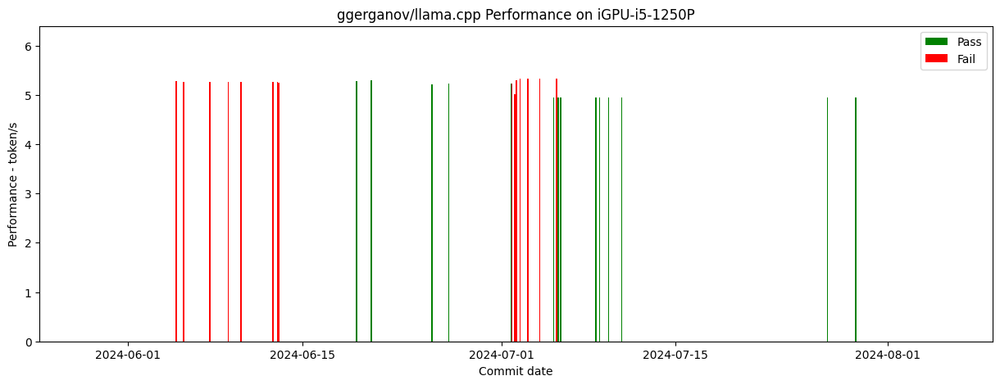

# [ggerganov/llama.cpp](https://github.com/ggerganov/llama.cpp) CI for iGPU-i5-1250P by SYCL Backend

## Summary

Figure

## Detail

**GGUF res** is verified by script ./example/sycl/run.sh with llama2-7b-Q4 for correction

**Perf** is the performance data by script ./example/sycl/run.sh with llama2-7b-Q4

|Commit Info|UT PassRate|Fault Detail|
GGUF res
|Perf(token/s)|Warn/Err|
|-|-|-|-|-|-|
|[0832de723695ab400316a6c49b9f712380e3a731](https://github.com/ggerganov/llama.cpp/commit/0832de723695ab400316a6c49b9f712380e3a731) 2024-07-29 10:50:27 [SYCL] add conv support Meng, Hengyu  Log: [log](./log/0832de723695ab400316a6c49b9f712380e3a731)|96.0%|1332/1334|('ok', 'pass', 0)|4.95|475/0|
|[2b1f616b208a4a21c4ee7a7eb85d822ff1d787af](https://github.com/ggerganov/llama.cpp/commit/2b1f616b208a4a21c4ee7a7eb85d822ff1d787af) 2024-07-27 04:41:55 ggml : reduce hash table reset cost slaren  Log: [log](./log/2b1f616b208a4a21c4ee7a7eb85d822ff1d787af)|96.0%|1332/1334|('ok', 'pass', 0)|4.95|461/0|
|[ed67bcb24f2d6ac0072cae72620b2bd971741b98](https://github.com/ggerganov/llama.cpp/commit/ed67bcb24f2d6ac0072cae72620b2bd971741b98) 2024-07-25 11:45:18 [SYCL] fix multi-gpu issue on sycl Chen Xi  Log: [log](./log/ed67bcb24f2d6ac0072cae72620b2bd971741b98)|96.0%|NA|('err', 'diff in line 0: exp=Step 1: Get Domain and Hosting main: error: unable to load model', 0)|NA|465/0|
|[f19bf99c015d3d745143e8bb4f056e0ea015ad40](https://github.com/ggerganov/llama.cpp/commit/f19bf99c015d3d745143e8bb4f056e0ea015ad40) 2024-07-24 14:36:00 Build Llama SYCL Intel with static libs Joe Todd  Log: [log](./log/f19bf99c015d3d745143e8bb4f056e0ea015ad40)|96.0%|NA|('err', 'diff in line 0: exp=Step 1: Get Domain and Hosting main: error: unable to load model', 0)|NA|485/0|
|[79167d9e49aef9caa98e13ee7ca067ec9f88b4b5](https://github.com/ggerganov/llama.cpp/commit/79167d9e49aef9caa98e13ee7ca067ec9f88b4b5) 2024-07-24 11:55:26 Re-add erroneously removed -fsycl from G GML_EXTRA_LIBS Joe Todd  Log: [log](./log/79167d9e49aef9caa98e13ee7ca067ec9f88b4b5)|96.0%|NA|('err', 'diff in line 0: exp=Step 1: Get Domain and Hosting main: error: unable to load model', 0)|NA|483/0|
|[64cf50a0ed62d41e4f6c13e08a9b6b0816f46c6e](https://github.com/ggerganov/llama.cpp/commit/64cf50a0ed62d41e4f6c13e08a9b6b0816f46c6e) 2024-07-23 14:58:37 sycl : Add support for non-release DPC++  & oneMKL Joe Todd  Log: [log](./log/64cf50a0ed62d41e4f6c13e08a9b6b0816f46c6e)|96.0%|NA|('err', 'diff in line 0: exp=Step 1: Get Domain and Hosting main: error: unable to load model', 0)|NA|483/0|
|[063d99ad11f1295046610ce5b97e105849a4b573](https://github.com/ggerganov/llama.cpp/commit/063d99ad11f1295046610ce5b97e105849a4b573) 2024-07-23 07:43:28 [SYCL] fix scratch size of softmax luoyu-intel  Log: [log](./log/063d99ad11f1295046610ce5b97e105849a4b573)|96.0%|NA|('err', 'diff in line 0: exp=Step 1: Get Domain and Hosting main: error: unable to load model', 0)|NA|487/0|
|[16bdfa42acb09175e88cf97e9d9e4e48f616d120](https://github.com/ggerganov/llama.cpp/commit/16bdfa42acb09175e88cf97e9d9e4e48f616d120) 2024-07-15 19:32:15 [SYCL] add concat through dim 1/2 Meng, Hengyu  Log: [log](./log/16bdfa42acb09175e88cf97e9d9e4e48f616d120)|95.0%|NA|('err', 'diff in line 0: exp=Step 1: Get Domain and Hosting main: error: unable to load model', 0)|NA|487/0|
|[b549a1bbefb2f1fbb8b558bac1f2ae7967e60964](https://github.com/ggerganov/llama.cpp/commit/b549a1bbefb2f1fbb8b558bac1f2ae7967e60964) 2024-07-12 00:52:04 [SYCL] fix the mul_mat_id ut issues Chen Xi  Log: [log](./log/b549a1bbefb2f1fbb8b558bac1f2ae7967e60964)|95.0%|NA|('err', 'diff in line 0: exp=Step 1: Get Domain and Hosting main: error: unable to load model', 0)|NA|475/0|
|[f4444d992c16b6b9442f4770c7c3a10b19a08343](https://github.com/ggerganov/llama.cpp/commit/f4444d992c16b6b9442f4770c7c3a10b19a08343) 2024-07-10 16:10:49 [SYCL] Use multi_ptr to clean up depreca ted warnings AidanBeltonS  Log: [log](./log/f4444d992c16b6b9442f4770c7c3a10b19a08343)|95.0%|NA|('ok', 'pass', 0)|4.95|487/0|
|[5b0b8d8cfb5ddf2118f686ba6c30fab3f71b384b](https://github.com/ggerganov/llama.cpp/commit/5b0b8d8cfb5ddf2118f686ba6c30fab3f71b384b) 2024-07-09 15:03:15 sycl : Reenabled mmvq path for the SYCL  Nvidia Backend Alberto Cabrera Pérez  Log: [log](./log/5b0b8d8cfb5ddf2118f686ba6c30fab3f71b384b)|95.0%|NA|('ok', 'pass', 0)|4.95|705/0|
|[a130eccef42b75a84da270411cefeed45c153e30](https://github.com/ggerganov/llama.cpp/commit/a130eccef42b75a84da270411cefeed45c153e30) 2024-07-08 21:35:17 labeler : updated sycl to match docs and  code refactor Alberto Cabrera Pérez  Log: [log](./log/a130eccef42b75a84da270411cefeed45c153e30)|95.0%|NA|('ok', 'pass', 0)|4.95|705/0|
|[2ec846d558f6385ea647f7b8e665eb249c1ebce7](https://github.com/ggerganov/llama.cpp/commit/2ec846d558f6385ea647f7b8e665eb249c1ebce7) 2024-07-08 14:22:41 sycl : fix powf call in device code Alberto Cabrera Pérez  Log: [log](./log/2ec846d558f6385ea647f7b8e665eb249c1ebce7)|95.0%|NA|('ok', 'pass', 0)|4.95|705/0|
|[3f2d538b817112ad8429341c7e8657dcd660f4d3](https://github.com/ggerganov/llama.cpp/commit/3f2d538b817112ad8429341c7e8657dcd660f4d3) 2024-07-08 13:51:31 scripts : fix sync for sycl Georgi Gerganov  Log: [log](./log/3f2d538b817112ad8429341c7e8657dcd660f4d3)|95.0%|NA|('ok', 'pass', 0)|4.94|705/0|
|[be20e7f49d9e5c6d9e8d9b4871eeba3df7a1639d](https://github.com/ggerganov/llama.cpp/commit/be20e7f49d9e5c6d9e8d9b4871eeba3df7a1639d) 2024-07-05 18:08:32 Reorganize documentation pages Xuan Son Nguyen  Log: [log](./log/be20e7f49d9e5c6d9e8d9b4871eeba3df7a1639d)|95.0%|NA|('ok', 'pass', 0)|4.95|705/0|
|[1f3e1b66e21310ed78b964f72f19766549633f0e](https://github.com/ggerganov/llama.cpp/commit/1f3e1b66e21310ed78b964f72f19766549633f0e) 2024-07-05 13:23:25 Enabled more data types for oneMKL gemm_ batch Ouadie EL FAROUKI  Log: [log](./log/1f3e1b66e21310ed78b964f72f19766549633f0e)|95.0%|NA|('ok', 'pass', 0)|4.95|705/0|
|[a9554e20b66546b0549aebe2e1034bc8afe9d809](https://github.com/ggerganov/llama.cpp/commit/a9554e20b66546b0549aebe2e1034bc8afe9d809) 2024-07-05 05:06:13 [SYCL] Fix WARP_SIZE=16 bug of Intel GPU  luoyu-intel  Log: [log](./log/a9554e20b66546b0549aebe2e1034bc8afe9d809)|95.0%|NA|('ok', 'pass', 0)|4.95|703/0|
|[f09b7cb609d80b8031803f89255991dc8b35db69](https://github.com/ggerganov/llama.cpp/commit/f09b7cb609d80b8031803f89255991dc8b35db69) 2024-07-05 10:32:29 rm get_work_group_size Neo Zhang Jianyu  Log: [log](./log/f09b7cb609d80b8031803f89255991dc8b35db69)|95.0%|NA|('err', 'diff in line 0: exp=Step 1: Get Domain and Hosting Step 1:', 0)|5.33|561/0|
|[f619024764e72261f14d7c31d892b8fb976603b4](https://github.com/ggerganov/llama.cpp/commit/f619024764e72261f14d7c31d892b8fb976603b4) 2024-07-04 02:07:19 [SYCL] Remove unneeded semicolons AidanBeltonS  Log: [log](./log/f619024764e72261f14d7c31d892b8fb976603b4)|95.0%|NA|('err', 'diff in line 0: exp=Step 1: Get Domain and Hosting Step 1:', 0)|5.33|569/0|
|[fadde6713506d9e6c124f5680ab8c7abebe31837](https://github.com/ggerganov/llama.cpp/commit/fadde6713506d9e6c124f5680ab8c7abebe31837) 2024-07-03 02:55:34 Dequant improvements rebase AidanBeltonS  Log: [log](./log/fadde6713506d9e6c124f5680ab8c7abebe31837)|95.0%|NA|('err', 'diff in line 0: exp=Step 1: Get Domain and Hosting Step 1:', 0)|5.32|569/0|
|[07a3fc0608a68c0c93a5fbfa9c58f4c9ec64cb81](https://github.com/ggerganov/llama.cpp/commit/07a3fc0608a68c0c93a5fbfa9c58f4c9ec64cb81) 2024-07-02 12:18:10 Removes multiple newlines at the end of  files that is breaking the editorconfig  step of CI. Clint Herron  Log: [log](./log/07a3fc0608a68c0c93a5fbfa9c58f4c9ec64cb81)|95.0%|NA|('err', 'diff in line 0: exp=Step 1: Get Domain and Hosting Step 1:', 0)|5.32|563/0|
|[a9f3b102157ba992cfe058909b7f6e1906d2d647](https://github.com/ggerganov/llama.cpp/commit/a9f3b102157ba992cfe058909b7f6e1906d2d647) 2024-07-02 04:50:07 [SYCL] Fix win build conflict of math li brary luoyu-intel  Log: [log](./log/a9f3b102157ba992cfe058909b7f6e1906d2d647)|95.0%|NA|('err', 'diff in line 0: exp=Step 1: Get Domain and Hosting Step 1:', 0)|5.3|563/0|
|[d08c20eddedb24515a3212e2de66bdff41a26b8c](https://github.com/ggerganov/llama.cpp/commit/d08c20eddedb24515a3212e2de66bdff41a26b8c) 2024-07-02 02:16:00 [SYCL] Fix the sub group size of Intel luoyu-intel  Log: [log](./log/d08c20eddedb24515a3212e2de66bdff41a26b8c)|95.0%|NA|('err', 'diff in line 0: exp=Step 1: Get Domain and Hosting Step 1: The original copy text needed sh ould describe the products/ services.',  0)|5.01|599/0|
|[cb5fad4c6c2cbef92e9b8b63449e1cb7664e4846](https://github.com/ggerganov/llama.cpp/commit/cb5fad4c6c2cbef92e9b8b63449e1cb7664e4846) 2024-07-01 20:39:06 CUDA: refactor and optimize IQ MMVQ Johannes Gäßler  Log: [log](./log/cb5fad4c6c2cbef92e9b8b63449e1cb7664e4846)|95.0%|NA|('err', 'diff in line 6: exp=Step 7: Make the site visible Step 7: Customize your site', 6)|5.23|543/0|
|[197fe6c1d7bec6718ce901f0141b2725240f298c](https://github.com/ggerganov/llama.cpp/commit/197fe6c1d7bec6718ce901f0141b2725240f298c) 2024-07-01 19:39:06 [SYCL] Update SYCL-Rope op and Refactor zhentaoyu  Log: [log](./log/197fe6c1d7bec6718ce901f0141b2725240f298c)|95.0%|NA|('ok', 'pass', 0)|5.23|543/0|
|[f3f65429c44bb195a9195bfdc19a30a79709db7b](https://github.com/ggerganov/llama.cpp/commit/f3f65429c44bb195a9195bfdc19a30a79709db7b) 2024-06-26 18:33:02 llama : reorganize source code + improve  CMake Georgi Gerganov  Log: [log](./log/f3f65429c44bb195a9195bfdc19a30a79709db7b)|100.0%|NA|('ok', 'pass', 0)|5.23|533/0|
|[083bacce14c1aaf9976aa40e8266cdc25ac749d3](https://github.com/ggerganov/llama.cpp/commit/083bacce14c1aaf9976aa40e8266cdc25ac749d3) 2024-06-25 10:19:20 [SYCL] Re-enabled mul_mat_batched_sycl Meng, Hengyu  Log: [log](./log/083bacce14c1aaf9976aa40e8266cdc25ac749d3)|95.0%|NA|('ok', 'pass', 0)|5.21|554/0|
|[de391e4c803383bbea054b6edd016e78c024a74d](https://github.com/ggerganov/llama.cpp/commit/de391e4c803383bbea054b6edd016e78c024a74d) 2024-06-20 13:19:05 [SYCL] Fix windows build and inference luoyu-intel  Log: [log](./log/de391e4c803383bbea054b6edd016e78c024a74d)|95.0%|NA|('ok', 'pass', 0)|5.29|554/0|
|[623494a478134432fd2d7ee40135770a3340674f](https://github.com/ggerganov/llama.cpp/commit/623494a478134432fd2d7ee40135770a3340674f) 2024-06-19 09:11:51 [SYCL] refactor Meng, Hengyu  Log: [log](./log/623494a478134432fd2d7ee40135770a3340674f)|95.0%|NA|('ok', 'pass', 0)|5.28|542/0|
|[df68d4fa5dc929217d3e64d673e099d7a417b206](https://github.com/ggerganov/llama.cpp/commit/df68d4fa5dc929217d3e64d673e099d7a417b206) 2024-06-17 11:17:07 [SYCL] Update README-sycl.md for Chapter  "Recommended release" and "News" Neo Zhang  Log: [log](./log/df68d4fa5dc929217d3e64d673e099d7a417b206)|95.0%|NA|('err', 'diff in line 0: exp=Step 1: Get Domain and Hosting The number of work-items in each dimensi on of a work-group cannot exceed {512, 5 ', 0)|NA|480/0|
|[7b2f4a7d193ef2475259bbe7656fcccfab4b1217](https://github.com/ggerganov/llama.cpp/commit/7b2f4a7d193ef2475259bbe7656fcccfab4b1217) 2024-06-15 14:05:10 [SYCL] remove global variables Meng, Hengyu  Log: [log](./log/7b2f4a7d193ef2475259bbe7656fcccfab4b1217)|95.0%|NA|('err', 'diff in line 0: exp=Step 1: Get Domain and Hosting The number of work-items in each dimensi on of a work-group cannot exceed {512, 5 ', 0)|NA|480/0|
|[f578b86b2123d0f92afbaa98a031df4d4464e582](https://github.com/ggerganov/llama.cpp/commit/f578b86b2123d0f92afbaa98a031df4d4464e582) 2024-06-13 03:11:35 move BLAS to a separate backend slaren  Log: [log](./log/f578b86b2123d0f92afbaa98a031df4d4464e582)|95.0%|NA|('err', 'diff in line 6: exp=Step 7: Make the site visible Step 7: Make,orsz onседа atir Byett, 1./ doV’4Cin2? TheCre or 2-over - components ', 6)|5.25|493/0|
|[1c641e6aac5c18b964e7b32d9dbbb4bf5301d0d7](https://github.com/ggerganov/llama.cpp/commit/1c641e6aac5c18b964e7b32d9dbbb4bf5301d0d7) 2024-06-13 00:41:52 `build`: rename main → llama-cli, server  → llama-server, llava-cli → llama-llava -cli, etc... Olivier Chafik  Log: [log](./log/1c641e6aac5c18b964e7b32d9dbbb4bf5301d0d7)|95.0%|NA|('err', 'diff in line 6: exp=Step 7: Make the site visible Step 7: Custom LeDo’A—s have.-5- for the  classicCo:F/8 (3.archivioni andmulticol ', 6)|5.27|493/0|
|[a9cae48003dfc4fe95b8f5c81682fc6e63425235](https://github.com/ggerganov/llama.cpp/commit/a9cae48003dfc4fe95b8f5c81682fc6e63425235) 2024-06-12 16:00:22 tests : add non-cont unary tests Georgi Gerganov  Log: [log](./log/a9cae48003dfc4fe95b8f5c81682fc6e63425235)|95.0%|NA|('err', 'diff in line 6: exp=Step 7: Make the site visible Step 7: Make,orsz onседа atir Byett, 1./ doV’4Cin2? TheCre or 2-over - components ', 6)|5.27|493/0|
|[af4ae502ddaeb03cd5861273ca2e9a5ae4551db7](https://github.com/ggerganov/llama.cpp/commit/af4ae502ddaeb03cd5861273ca2e9a5ae4551db7) 2024-06-10 02:21:31 use the correct SYCL context for host US M allocations Ben Ashbaugh  Log: [log](./log/af4ae502ddaeb03cd5861273ca2e9a5ae4551db7)|95.0%|NA|('err', 'diff in line 6: exp=Step 7: Make the site visible Step 7: Make,orsz onседа atir Byett, 1./ doV’4Cin2? TheCre or 2-over - components ', 6)|5.27|491/0|
|[fe1e3917cfa0f9397a765cfd0aef880674d938d5](https://github.com/ggerganov/llama.cpp/commit/fe1e3917cfa0f9397a765cfd0aef880674d938d5) 2024-06-09 01:43:39 Revert "[SYCL] Update rpc-server.cpp to  include SYCL backend slaren  Log: [log](./log/fe1e3917cfa0f9397a765cfd0aef880674d938d5)|95.0%|NA|('err', 'diff in line 6: exp=Step 7: Make the site visible Step 7: Make,orszomen, he jump -major30  atau, OldC and 2 in. on your un(, with a ', 6)|5.27|493/0|
|[d5c938cd7716b9a2ace49a43a469dfbffcff4d28](https://github.com/ggerganov/llama.cpp/commit/d5c938cd7716b9a2ace49a43a469dfbffcff4d28) 2024-06-07 14:28:26 [SYCL] fix softmax r2r result wrong issu e pengxin99  Log: [log](./log/d5c938cd7716b9a2ace49a43a469dfbffcff4d28)|95.0%|NA|('err', 'diff in line 6: exp=Step 7: Make the site visible Step 7: Make,orszomen, he jump -major30  atau, OldC and 2 in. on your un(, with a ', 6)|5.26|493/0|
|[2b3389677a833cee0880226533a1768b1a9508d2](https://github.com/ggerganov/llama.cpp/commit/2b3389677a833cee0880226533a1768b1a9508d2) 2024-06-05 11:29:20 ggml : refactor rope norm/neox Georgi Gerganov  Log: [log](./log/2b3389677a833cee0880226533a1768b1a9508d2)|95.0%|NA|('err', 'diff in line 6: exp=Step 7: Make the site visible Step 7: Make,orszomen, he jump -major30  atau, OldC and 2 in. on your un(, with a ', 6)|5.27|493/0|
|[554c247caffed64465f372661f2826640cb10430](https://github.com/ggerganov/llama.cpp/commit/554c247caffed64465f372661f2826640cb10430) 2024-06-04 21:23:20 ggml : remove OpenCL Georgi Gerganov  Log: [log](./log/554c247caffed64465f372661f2826640cb10430)|95.0%|NA|('err', 'diff in line 6: exp=Step 7: Make the site visible Step 7: Make report (v has have has got  (pay( Big and (c gu in to The(Col U2k 2  ', 6)|5.28|487/0|
