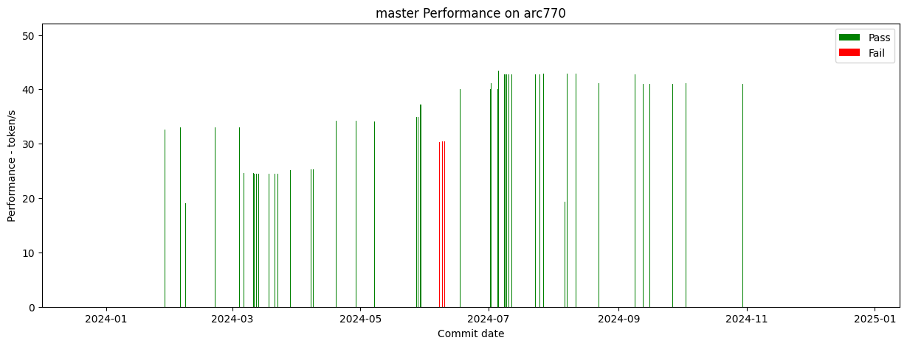

# [ggerganov/llama.cpp](https://github.com/ggerganov/llama.cpp/tree/master) CI for arc770 by SYCL Backend

## Summary

Figure

## Detail

**GGUF res** is verified by script ./example/sycl/run.sh with llama2-7b-Q4 for correction

**GGUF Perf** is the performance data by script ./example/sycl/run.sh with llama2-7b-Q4

**Bench Perf** is the performance data by llama-bench with llama2-7b-Q4

|Commit Info|UT PassRate Detail|GGUF Perf (token/s)|Bench Perf (token/s)|
GGUF res
|Warn/Err|oneAPI|
|-|-|-|-|-|-|-|
|[8308f98c7fb778e54bf75538f5234d8bd20915e9](https://github.com/ggerganov/llama.cpp/commit/8308f98c7fb778e54bf75538f5234d8bd20915e9) 2025-06-20 15:07:21 sycl: add usage of enqueue_functions ext ension Nicolò Scipione  Log: [log](./log/8308f98c7fb778e54bf75538f5234d8bd20915e9)|94.0% NA|50.18|tg=49.75 pp=924.33|('ok', 'pass', 0)|0/0|2025.0.4|
|[600e3e9b50c1f0c9fc4a70356241fd87f00e8e14](https://github.com/ggerganov/llama.cpp/commit/600e3e9b50c1f0c9fc4a70356241fd87f00e8e14) 2025-06-19 11:40:21 sycl: Cleanup codepaths in Get Rows in s ycl backend Anton Mitkov  Log: [log](./log/600e3e9b50c1f0c9fc4a70356241fd87f00e8e14)|91.0% 5634/5635|42.96|tg=42.86 pp=913.76|('ok', 'pass', 0)|0/0|2025.0.4|
|[40643edb86eb10b471b0f57d4f3f7eb0e06a0df7](https://github.com/ggerganov/llama.cpp/commit/40643edb86eb10b471b0f57d4f3f7eb0e06a0df7) 2025-06-13 17:32:56 sycl: fix docker image Svetlozar Georgiev  Log: [log](./log/40643edb86eb10b471b0f57d4f3f7eb0e06a0df7)|Execute_Err NA|NA|tg=NA pp=NA|('err', 'diff in line 0: exp=Step 1: Get Domain and Hosting Error to run gguf', 0)|0/0|2025.0.4|
|[0889eba570126f8a2f5a0e88fde776bbc91cca66](https://github.com/ggerganov/llama.cpp/commit/0889eba570126f8a2f5a0e88fde776bbc91cca66) 2025-06-13 08:51:39 sycl: Adding additional cpy dbg print ou tput Anton Mitkov  Log: [log](./log/0889eba570126f8a2f5a0e88fde776bbc91cca66)|97.0% NA|21.04|tg=20.98 pp=436.49|('ok', 'pass', 0)|0/0|2025.0.4|
|[c61285e7396c8e526fe7794c19e8d4f1c99bfc51](https://github.com/ggerganov/llama.cpp/commit/c61285e7396c8e526fe7794c19e8d4f1c99bfc51) 2025-06-13 08:45:37 SYCL: Bump oneMath commit Ewan Crawford  Log: [log](./log/c61285e7396c8e526fe7794c19e8d4f1c99bfc51)|97.0% NA|21.08|tg=21.03 pp=430.73|('ok', 'pass', 0)|0/0|2025.0.4|
|[ed52f3668e633423054a4eab61bb7efee47025ab](https://github.com/ggerganov/llama.cpp/commit/ed52f3668e633423054a4eab61bb7efee47025ab) 2025-06-12 14:15:11 sycl: Remove not needed copy f16->f32 fo r dnnl mul mat Anton Mitkov  Log: [log](./log/ed52f3668e633423054a4eab61bb7efee47025ab)|97.0% NA|21.09|tg=20.92 pp=432.32|('ok', 'pass', 0)|0/0|2025.0.4|
|[f470bc36bed4d836b9de5a483fa0dfaee176d6f5](https://github.com/ggerganov/llama.cpp/commit/f470bc36bed4d836b9de5a483fa0dfaee176d6f5) 2025-06-09 22:47:13 ggml-cpu : split arch-specific implement ations xctan  Log: [log](./log/f470bc36bed4d836b9de5a483fa0dfaee176d6f5)|100.0% NA|29.2|tg=20.85 pp=554.35|('ok', 'pass', 0)|0/0|2025.0.4|
|[b460d16ae858c6624fd37aec316622a4060ca325](https://github.com/ggerganov/llama.cpp/commit/b460d16ae858c6624fd37aec316622a4060ca325) 2025-06-09 11:47:07 sycl: Add reorder to Q6_K mmvq implement ation Nicolò Scipione  Log: [log](./log/b460d16ae858c6624fd37aec316622a4060ca325)|100.0% NA|41.88|tg=20.74 pp=553.83|('ok', 'pass', 0)|0/0|2025.0.4|
|[228f34c9ceefa3ea4f4d6933edd858121e8106cb](https://github.com/ggerganov/llama.cpp/commit/228f34c9ceefa3ea4f4d6933edd858121e8106cb) 2025-06-07 18:58:20 SYCL: Implement few same quantized type  copy kernels Akarshan Biswas  Log: [log](./log/228f34c9ceefa3ea4f4d6933edd858121e8106cb)|100.0% NA|42.94|tg=42.89 pp=914.01|('ok', 'pass', 0)|0/0|2025.0.4|
|[663445b0deb21fb602176da030d4154197a4fca6](https://github.com/ggerganov/llama.cpp/commit/663445b0deb21fb602176da030d4154197a4fca6) 2025-06-02 10:12:20 sycl: quantize and reorder the input to  q8_1 when reorder is enabled Atharva Dubey  Log: [log](./log/663445b0deb21fb602176da030d4154197a4fca6)|100.0% NA|42.85|tg=42.79 pp=914.83|('ok', 'pass', 0)|0/0|2025.0.4|
|[d337252acf14a91a685c355fa4f3f599a8068207](https://github.com/ggerganov/llama.cpp/commit/d337252acf14a91a685c355fa4f3f599a8068207) 2025-05-31 12:39:19 cmake : Fix broken CMake error messages Kai Pastor  Log: [log](./log/d337252acf14a91a685c355fa4f3f599a8068207)|100.0% NA|42.83|tg=42.78 pp=914.5|('ok', 'pass', 0)|0/0|2025.0.4|
|[b49a8ff96b769b8a4c36d89fb783ec0135be582b](https://github.com/ggerganov/llama.cpp/commit/b49a8ff96b769b8a4c36d89fb783ec0135be582b) 2025-05-30 19:40:57 SYCL: Add mrope kernel Akarshan Biswas  Log: [log](./log/b49a8ff96b769b8a4c36d89fb783ec0135be582b)|100.0% NA|42.21|tg=42.08 pp=912.25|('ok', 'pass', 0)|0/0|2025.0.4|
|[f3101a8cc665f73217c752a10a7042889275cfbc](https://github.com/ggerganov/llama.cpp/commit/f3101a8cc665f73217c752a10a7042889275cfbc) 2025-05-27 20:52:59 SYCL: add gelu_erf kernel Akarshan Biswas  Log: [log](./log/f3101a8cc665f73217c752a10a7042889275cfbc)|100.0% NA|42.8|tg=42.62 pp=914.62|('ok', 'pass', 0)|0/0|2025.0.4|
|[6f180b915c9ed9ec0c240b5dcd64644988fb5e82](https://github.com/ggerganov/llama.cpp/commit/6f180b915c9ed9ec0c240b5dcd64644988fb5e82) 2025-05-26 21:10:36 SYCL: Add non contiguous support in RMS_ NORM and NORM kernels Akarshan Biswas  Log: [log](./log/6f180b915c9ed9ec0c240b5dcd64644988fb5e82)|100.0% NA|42.86|tg=42.76 pp=914.42|('ok', 'pass', 0)|0/0|2025.0.4|
|[9012eb9b454a82eaa4cd77ae904c0ea391e4db42](https://github.com/ggerganov/llama.cpp/commit/9012eb9b454a82eaa4cd77ae904c0ea391e4db42) 2025-05-26 10:28:53 sycl: Add more debug prints Romain Biessy  Log: [log](./log/9012eb9b454a82eaa4cd77ae904c0ea391e4db42)|100.0% NA|42.85|tg=42.78 pp=914.52|('ok', 'pass', 0)|0/0|2025.0.4|
|[515fdbf7ed839dfe6a24aeb6225936609a7f6d6d](https://github.com/ggerganov/llama.cpp/commit/515fdbf7ed839dfe6a24aeb6225936609a7f6d6d) 2025-05-25 12:38:37 SYCL: revert "sycl: simplify bin_bcast_k ernel Akarshan Biswas  Log: [log](./log/515fdbf7ed839dfe6a24aeb6225936609a7f6d6d)|100.0% NA|42.84|tg=42.8 pp=913.67|('ok', 'pass', 0)|0/0|2025.0.4|
|[d394a9aedc50a13b7f6373416f7c1ccabfe79c32](https://github.com/ggerganov/llama.cpp/commit/d394a9aedc50a13b7f6373416f7c1ccabfe79c32) 2025-05-22 13:54:43 sycl : Remove waits from function calls Nicolò Scipione  Log: [log](./log/d394a9aedc50a13b7f6373416f7c1ccabfe79c32)|97.0% 5503/5527|43.48|tg=43.42 pp=910.79|('ok', 'pass', 0)|0/0|2025.0.4|
|[6b56a64690a318fcabcd7739ac7e314d44785ea8](https://github.com/ggerganov/llama.cpp/commit/6b56a64690a318fcabcd7739ac7e314d44785ea8) 2025-05-22 09:24:09 SYCL: Avoid using with SYCL-Graph for un supported nodes Ewan Crawford  Log: [log](./log/6b56a64690a318fcabcd7739ac7e314d44785ea8)|97.0% 5502/5527|43.45|tg=43.32 pp=910.67|('ok', 'pass', 0)|0/0|2025.0.4|
|[4245e622e0cc3af1ca3056104e465dc4d303bd7d](https://github.com/ggerganov/llama.cpp/commit/4245e622e0cc3af1ca3056104e465dc4d303bd7d) 2025-05-20 10:34:15 sycl: disable reorder for sycl mulmat Svetlozar Georgiev  Log: [log](./log/4245e622e0cc3af1ca3056104e465dc4d303bd7d)|97.0% 5494/5519|43.47|tg=43.3 pp=911.0|('ok', 'pass', 0)|0/0|2025.0.4|
|[f7c9429c85748cde9599499601ba48d0057722e6](https://github.com/ggerganov/llama.cpp/commit/f7c9429c85748cde9599499601ba48d0057722e6) 2025-05-20 02:54:43 sycl : Overcoming workaround for mmap Nicolò Scipione  Log: [log](./log/f7c9429c85748cde9599499601ba48d0057722e6)|97.0% 5494/5519|43.44|tg=43.38 pp=912.44|('ok', 'pass', 0)|0/0|2025.0.4|
|[725f23f1f3f0d3adf49f95d8dfa6e7c74adff149](https://github.com/ggerganov/llama.cpp/commit/725f23f1f3f0d3adf49f95d8dfa6e7c74adff149) 2025-05-19 14:38:20 sycl : backend documentation review Alberto Cabrera Pérez  Log: [log](./log/725f23f1f3f0d3adf49f95d8dfa6e7c74adff149)|97.0% 5495/5519|43.41|tg=43.4 pp=905.6|('ok', 'pass', 0)|0/0|2025.0.4|
|[f71f40a2847d4c9f57b86cd206e0a27b2bfb6d1c](https://github.com/ggerganov/llama.cpp/commit/f71f40a2847d4c9f57b86cd206e0a27b2bfb6d1c) 2025-05-19 11:46:09 ci : upgraded oneAPI version in SYCL wor kflows and dockerfile Alberto Cabrera Pérez  Log: [log](./log/f71f40a2847d4c9f57b86cd206e0a27b2bfb6d1c)|97.0% 5496/5519|43.46|tg=43.39 pp=910.65|('ok', 'pass', 0)|0/0|2025.0.4|
|[0a338ed013c23aecdce6449af736a35a465fa60f](https://github.com/ggerganov/llama.cpp/commit/0a338ed013c23aecdce6449af736a35a465fa60f) 2025-05-16 12:15:29 sycl : fixed compilation warnings Łukasz Ślusarczyk  Log: [log](./log/0a338ed013c23aecdce6449af736a35a465fa60f)|97.0% 5493/5519|43.48|tg=43.37 pp=908.07|('ok', 'pass', 0)|0/0|2025.0.4|
|[9c404ed54c3c8d8d2aa3153313766c8286739387](https://github.com/ggerganov/llama.cpp/commit/9c404ed54c3c8d8d2aa3153313766c8286739387) 2025-05-15 16:53:41 sycl: use oneDNN for matrices multiplica tion Łukasz Ślusarczyk  Log: [log](./log/9c404ed54c3c8d8d2aa3153313766c8286739387)|100.0% NA|42.85|tg=42.78 pp=911.43|('ok', 'pass', 0)|0/0|2025.0.4|
|[02cdd2d8b092b5a4bb18e013c6887ce49ba20ac5](https://github.com/ggerganov/llama.cpp/commit/02cdd2d8b092b5a4bb18e013c6887ce49ba20ac5) 2025-05-15 16:39:52 sycl: simplify bin_bcast_kernel Atharva Dubey  Log: [log](./log/02cdd2d8b092b5a4bb18e013c6887ce49ba20ac5)|97.0% 5494/5519|43.42|tg=43.42 pp=907.82|('ok', 'pass', 0)|0/0|2025.0.4|
|[64bb51cf90d3eede8c150a23d59a0c718b78065b](https://github.com/ggerganov/llama.cpp/commit/64bb51cf90d3eede8c150a23d59a0c718b78065b) 2025-05-15 16:35:44 sycl: reordered Q4_K MMVQ Svetlozar Georgiev  Log: [log](./log/64bb51cf90d3eede8c150a23d59a0c718b78065b)|100.0% NA|42.84|tg=42.79 pp=911.47|('ok', 'pass', 0)|0/0|2025.0.4|
|[14492144c286bbf38bb1903128403d9e2ebad54c](https://github.com/ggerganov/llama.cpp/commit/14492144c286bbf38bb1903128403d9e2ebad54c) 2025-05-12 06:15:32 enable dpcpp nightly builds with librari es Atharva Dubey  Log: [log](./log/14492144c286bbf38bb1903128403d9e2ebad54c)|100.0% NA|42.82|tg=42.79 pp=911.77|('ok', 'pass', 0)|0/0|2025.0.4|
|[17512a94d636c4b6c1332370acb3e5af3ca70918](https://github.com/ggerganov/llama.cpp/commit/17512a94d636c4b6c1332370acb3e5af3ca70918) 2025-05-09 16:34:08 sycl : implementation of reordered Q4_0  MMVQ for Intel GPUs Alberto Cabrera Pérez  Log: [log](./log/17512a94d636c4b6c1332370acb3e5af3ca70918)|100.0% NA|42.83|tg=42.8 pp=911.6|('ok', 'pass', 0)|0/0|2025.0.4|
|[8733e0cf6eefc7c7752297cc22d0836706f4222c](https://github.com/ggerganov/llama.cpp/commit/8733e0cf6eefc7c7752297cc22d0836706f4222c) 2025-05-08 10:08:01 sycl: addressing non-contiguous src1 mul _mats Alberto Cabrera Pérez  Log: [log](./log/8733e0cf6eefc7c7752297cc22d0836706f4222c)|100.0% NA|42.85|tg=42.78 pp=912.07|('ok', 'pass', 0)|0/0|2025.0.4|
|[1e333d5bba18e99bc328bb87ac1ee6a4e6260e0e](https://github.com/ggerganov/llama.cpp/commit/1e333d5bba18e99bc328bb87ac1ee6a4e6260e0e) 2025-05-06 20:27:06 SYCL: Disable reorder optimize by defaul t and stop setting tensor extras when op timize is disabled Akarshan Biswas  Log: [log](./log/1e333d5bba18e99bc328bb87ac1ee6a4e6260e0e)|100.0% NA|40.17|tg=39.61 pp=391.63|('ok', 'pass', 0)|0/0|2025.0.4|
|[66645a5285d8c4c5f9a3b3f360d042baac2d820a](https://github.com/ggerganov/llama.cpp/commit/66645a5285d8c4c5f9a3b3f360d042baac2d820a) 2025-05-05 13:39:10 SYCL: Disable mul_mat kernels for noncon tiguous tensor b Akarshan Biswas  Log: [log](./log/66645a5285d8c4c5f9a3b3f360d042baac2d820a)|100.0% NA|41.86|tg=44.33 pp=370.04|('ok', 'pass', 0)|0/0|2025.0.4|
|[13b0a04597a4581cad4d9027a848f450c623801d](https://github.com/ggerganov/llama.cpp/commit/13b0a04597a4581cad4d9027a848f450c623801d) 2025-05-05 13:09:35 whisper: remove MSVC warnings pragmas Daniel Bevenius  Log: [log](./log/13b0a04597a4581cad4d9027a848f450c623801d)|100.0% NA|40.13|tg=39.63 pp=396.15|('ok', 'pass', 0)|0/0|2025.0.4|
|[a4c340f974f9b7ac0c1aae897aabaa54549a97e5](https://github.com/ggerganov/llama.cpp/commit/a4c340f974f9b7ac0c1aae897aabaa54549a97e5) 2025-04-28 15:03:25 SYCL: Add all missing unary kernels Akarshan Biswas  Log: [log](./log/a4c340f974f9b7ac0c1aae897aabaa54549a97e5)|100.0% NA|41.94|tg=44.15 pp=789.93|('ok', 'pass', 0)|0/0|2025.0.4|
|[514c45608f93f66106a712dee1abe062099ce790](https://github.com/ggerganov/llama.cpp/commit/514c45608f93f66106a712dee1abe062099ce790) 2025-04-25 17:37:51 change the reorder tensor from init to e xecute OP Neo Zhang Jianyu  Log: [log](./log/514c45608f93f66106a712dee1abe062099ce790)|100.0% NA|42.11|tg=44.2 pp=790.07|('ok', 'pass', 0)|0/0|2025.0.4|
|[5368ddda7a262d195b54687a31009dcc1f8b1602](https://github.com/ggerganov/llama.cpp/commit/5368ddda7a262d195b54687a31009dcc1f8b1602) 2025-04-21 19:13:30 SYCL: Add non-contiguous support in ROPE  Akarshan Biswas  Log: [log](./log/5368ddda7a262d195b54687a31009dcc1f8b1602)|100.0% NA|42.77|tg=42.84 pp=912.85|('ok', 'pass', 0)|0/0|2025.0.4|
|[8d6600576318dfc6b091fca744b0fd36a5e5255f](https://github.com/ggerganov/llama.cpp/commit/8d6600576318dfc6b091fca744b0fd36a5e5255f) 2025-04-18 19:27:56 SYCL: Refactor and enable FP16 in binary  broadcast OPs Akarshan Biswas  Log: [log](./log/8d6600576318dfc6b091fca744b0fd36a5e5255f)|100.0% NA|42.74|tg=42.62 pp=915.76|('ok', 'pass', 0)|0/0|2025.0.4|
|[510676475f885ec064ff147af9f20ee7a9b12a50](https://github.com/ggerganov/llama.cpp/commit/510676475f885ec064ff147af9f20ee7a9b12a50) 2025-04-15 14:07:42 SYCL: Add ROPE vision kernel Akarshan Biswas  Log: [log](./log/510676475f885ec064ff147af9f20ee7a9b12a50)|100.0% NA|42.56|tg=42.48 pp=917.24|('ok', 'pass', 0)|0/0|2025.0.4|
|[81c7e64fc239288e91a58adad9145110e0353822](https://github.com/ggerganov/llama.cpp/commit/81c7e64fc239288e91a58adad9145110e0353822) 2025-04-14 18:19:07 dsiable curl lib check, this action is m issed by commit bd3f59f81289b920bcc597a2 08c14f55e39ed37e Neo Zhang Jianyu  Log: [log](./log/81c7e64fc239288e91a58adad9145110e0353822)|100.0% NA|42.22|tg=42.2 pp=914.61|('ok', 'pass', 0)|0/0|2025.0.4|
|[75afa0ae31f0a51aaadcc5ff146eb7a32a7f9088](https://github.com/ggerganov/llama.cpp/commit/75afa0ae31f0a51aaadcc5ff146eb7a32a7f9088) 2025-04-14 17:53:53 SYCL: Fix im2col Akarshan Biswas  Log: [log](./log/75afa0ae31f0a51aaadcc5ff146eb7a32a7f9088)|100.0% NA|42.82|tg=42.57 pp=916.8|('ok', 'pass', 0)|0/0|2025.0.4|
|[578754b3157d662c2fdd51eaa62b6c1f43d3172c](https://github.com/ggerganov/llama.cpp/commit/578754b3157d662c2fdd51eaa62b6c1f43d3172c) 2025-04-11 15:32:14 sycl: Support sycl_ext_oneapi_limited_gr aph Ewan Crawford  Log: [log](./log/578754b3157d662c2fdd51eaa62b6c1f43d3172c)|Execute_Err NA|NA|tg=NA pp=NA|('err', 'diff in line 0: exp=Step 1: Get Domain and Hosting Error to run gguf', 0)|0/0|2025.0.4|
|[fccf9cae83e6c6cd31a0ecb403d237638e427d0a](https://github.com/ggerganov/llama.cpp/commit/fccf9cae83e6c6cd31a0ecb403d237638e427d0a) 2025-04-11 13:33:50 SYCL: Add fp16 type support to unary op  kernels Akarshan Biswas  Log: [log](./log/fccf9cae83e6c6cd31a0ecb403d237638e427d0a)|Execute_Err NA|NA|tg=NA pp=NA|('err', 'diff in line 0: exp=Step 1: Get Domain and Hosting Error to run gguf', 0)|0/0|2025.0.4|
|[fe92821ea9ae53f3088cf2699a9e102448295fa0](https://github.com/ggerganov/llama.cpp/commit/fe92821ea9ae53f3088cf2699a9e102448295fa0) 2025-04-09 12:32:13 ggml : add bilinear upscale support Diego Devesa  Log: [log](./log/fe92821ea9ae53f3088cf2699a9e102448295fa0)|Execute_Err NA|NA|tg=NA pp=NA|('err', 'diff in line 0: exp=Step 1: Get Domain and Hosting Error to run gguf', 0)|0/0|2025.0.4|
|[8ed71242f464dc0a3fb3cffcfe064e55bdec72f9](https://github.com/ggerganov/llama.cpp/commit/8ed71242f464dc0a3fb3cffcfe064e55bdec72f9) 2025-04-09 11:22:04 sycl: update documentation to use -no-cn v Romain Biessy  Log: [log](./log/8ed71242f464dc0a3fb3cffcfe064e55bdec72f9)|Execute_Err NA|NA|tg=NA pp=NA|('err', 'diff in line 0: exp=Step 1: Get Domain and Hosting Error to run gguf', 0)|0/0|2025.0.4|
|[656babd6c21a3b9b3622324cfcc80a2ab78da25b](https://github.com/ggerganov/llama.cpp/commit/656babd6c21a3b9b3622324cfcc80a2ab78da25b) 2025-04-08 15:03:21 Revert "sycl:remove redundant memcopy in  function ggml_backend_sycl_buffer_set_t ensor" Neo Zhang Jianyu  Log: [log](./log/656babd6c21a3b9b3622324cfcc80a2ab78da25b)|Execute_Err NA|NA|tg=NA pp=NA|('err', 'diff in line 0: exp=Step 1: Get Domain and Hosting Error to run gguf', 0)|0/0|2025.0.4|
|[518a01480eb3a7c80a4951b430db9dee55428310](https://github.com/ggerganov/llama.cpp/commit/518a01480eb3a7c80a4951b430db9dee55428310) 2025-04-07 23:22:57 sycl: remove redundant memcopy in functi on ggml_backend_sycl_buffer_set_tensor zhouwg  Log: [log](./log/518a01480eb3a7c80a4951b430db9dee55428310)|Execute_Err NA|NA|tg=NA pp=NA|('err', 'diff in line 0: exp=Step 1: Get Domain and Hosting Error to run gguf', 0)|0/0|2025.0.4|
|[bd3f59f81289b920bcc597a208c14f55e39ed37e](https://github.com/ggerganov/llama.cpp/commit/bd3f59f81289b920bcc597a208c14f55e39ed37e) 2025-04-07 13:35:19 cmake : enable curl by default Xuan-Son Nguyen  Log: [log](./log/bd3f59f81289b920bcc597a208c14f55e39ed37e)|Execute_Err NA|NA|tg=NA pp=NA|('err', 'diff in line 0: exp=Step 1: Get Domain and Hosting Error to run gguf', 0)|0/0|2025.0.4|
|[94148ba330968bbfb8d9ecc67751bdc2218486cd](https://github.com/ggerganov/llama.cpp/commit/94148ba330968bbfb8d9ecc67751bdc2218486cd) 2025-04-04 16:00:46 sycl: allow ggml-sycl configuration and  compilation using Visual Studio project/ solution Nicolò Scipione  Log: [log](./log/94148ba330968bbfb8d9ecc67751bdc2218486cd)|100.0% NA|41.89|tg=42.21 pp=916.88|('ok', 'pass', 0)|0/0|2025.0.4|
|[2004644b7a5da6fe080e51861ab583480280f1d3](https://github.com/ggerganov/llama.cpp/commit/2004644b7a5da6fe080e51861ab583480280f1d3) 2025-04-03 13:12:39 ci : add env variable in ggml-ci and doc ument the same in SYCL.md Atharva Dubey  Log: [log](./log/2004644b7a5da6fe080e51861ab583480280f1d3)|100.0% NA|42.49|tg=42.39 pp=916.9|('ok', 'pass', 0)|0/0|2025.0.4|
|[8bbf26083d93274240a20d16cda324441c57fcc6](https://github.com/ggerganov/llama.cpp/commit/8bbf26083d93274240a20d16cda324441c57fcc6) 2025-04-01 13:41:39 SYCL: switch to SYCL namespace Akarshan Biswas  Log: [log](./log/8bbf26083d93274240a20d16cda324441c57fcc6)|100.0% NA|41.77|tg=42.02 pp=912.77|('ok', 'pass', 0)|0/0|2025.0.4|
|[82939705421f4ef27e924879fdeed6d7b5f6d769](https://github.com/ggerganov/llama.cpp/commit/82939705421f4ef27e924879fdeed6d7b5f6d769) 2025-04-01 10:24:29 SYCL: Rename oneMKL to oneMath Romain Biessy  Log: [log](./log/82939705421f4ef27e924879fdeed6d7b5f6d769)|100.0% NA|41.97|tg=42.13 pp=917.01|('ok', 'pass', 0)|0/0|2025.0.4|
|[6c02a032fa21d69e881ef9a5c94ba28ebaf1d749](https://github.com/ggerganov/llama.cpp/commit/6c02a032fa21d69e881ef9a5c94ba28ebaf1d749) 2025-03-31 14:55:24 SYCL: Remove misleading ggml_sycl_op_fla tten function Akarshan Biswas  Log: [log](./log/6c02a032fa21d69e881ef9a5c94ba28ebaf1d749)|100.0% NA|42.29|tg=42.24 pp=916.62|('ok', 'pass', 0)|0/0|2025.0.4|
|[f17a3bb4e8b0aa24c0f86636d234aca7dc2cfa01](https://github.com/ggerganov/llama.cpp/commit/f17a3bb4e8b0aa24c0f86636d234aca7dc2cfa01) 2025-03-27 07:16:00 SYCL: implement memset ggml backend buff er interface Akarshan Biswas  Log: [log](./log/f17a3bb4e8b0aa24c0f86636d234aca7dc2cfa01)|100.0% NA|42.21|tg=42.11 pp=914.92|('ok', 'pass', 0)|0/0|2025.0.4|
|[e2f560175a195f63c3276972a3d1caec0bd13e05](https://github.com/ggerganov/llama.cpp/commit/e2f560175a195f63c3276972a3d1caec0bd13e05) 2025-03-25 16:10:18 SYCL: disable Q4_0 reorder optimization Akarshan Biswas  Log: [log](./log/e2f560175a195f63c3276972a3d1caec0bd13e05)|100.0% NA|38.43|tg=41.55 pp=915.4|('ok', 'pass', 0)|0/0|2025.0.4|
|[c95fa362b3587d1822558f7e28414521075f254f](https://github.com/ggerganov/llama.cpp/commit/c95fa362b3587d1822558f7e28414521075f254f) 2025-03-24 23:05:38 ci: [SYCL] ggml-ci Use main GPU and enab le sysman Akarshan Biswas  Log: [log](./log/c95fa362b3587d1822558f7e28414521075f254f)|100.0% NA|54.62|tg=54.01 pp=800.56|('ok', 'pass', 0)|0/0|2025.0.4|
|[48d7021c61ceda6fcf1a7294d2115b8e1a53ae95](https://github.com/ggerganov/llama.cpp/commit/48d7021c61ceda6fcf1a7294d2115b8e1a53ae95) 2025-03-24 18:28:32 CI: fix SYCL build Akarshan Biswas  Log: [log](./log/48d7021c61ceda6fcf1a7294d2115b8e1a53ae95)|100.0% NA|54.22|tg=53.74 pp=801.31|('ok', 'pass', 0)|0/0|2025.0.4|
|[1aa87ee53d05505247c54612e40f6a38c680b433](https://github.com/ggerganov/llama.cpp/commit/1aa87ee53d05505247c54612e40f6a38c680b433) 2025-03-21 14:58:47 [SYCL] Fix build on Windows when ccache  enabled 蕭澧邦  Log: [log](./log/1aa87ee53d05505247c54612e40f6a38c680b433)|100.0% NA|54.73|tg=54.31 pp=801.62|('ok', 'pass', 0)|0/0|2025.0.4|
|[9ffcc9e374080f73b16b7a351e6d76e7a8a19ce3](https://github.com/ggerganov/llama.cpp/commit/9ffcc9e374080f73b16b7a351e6d76e7a8a19ce3) 2025-03-21 02:15:56 sycl: cleanup oneDNN related code Svetlozar Georgiev  Log: [log](./log/9ffcc9e374080f73b16b7a351e6d76e7a8a19ce3)|100.0% NA|54.8|tg=54.32 pp=799.23|('ok', 'pass', 0)|0/0|2025.0.4|
|[35cae5ba05a5292dc3108636a71ec59fa2f80ab7](https://github.com/ggerganov/llama.cpp/commit/35cae5ba05a5292dc3108636a71ec59fa2f80ab7) 2025-03-18 11:16:31 SYCL: using graphs is configurable by en vironment variable and compile option Łukasz Ślusarczyk  Log: [log](./log/35cae5ba05a5292dc3108636a71ec59fa2f80ab7)|100.0% NA|54.67|tg=54.26 pp=801.47|('ok', 'pass', 0)|0/0|2025.0.4|
|[7dfad387e3f6ac98d383ded2d175eb59736a3993](https://github.com/ggerganov/llama.cpp/commit/7dfad387e3f6ac98d383ded2d175eb59736a3993) 2025-03-18 07:27:50 llama: Add support for RWKV v7 architect ure Molly Sophia  Log: [log](./log/7dfad387e3f6ac98d383ded2d175eb59736a3993)|100.0% NA|44.71|tg=54.58 pp=799.19|('ok', 'pass', 0)|0/0|2025.0.4|
|[a53f7f7b8859f3e634415ab03e1e295b9861d7e6](https://github.com/ggerganov/llama.cpp/commit/a53f7f7b8859f3e634415ab03e1e295b9861d7e6) 2025-03-18 01:51:25 fixed compilation warnings in ggml-sycl Łukasz Ślusarczyk  Log: [log](./log/a53f7f7b8859f3e634415ab03e1e295b9861d7e6)|100.0% NA|54.73|tg=37.42 pp=785.04|('ok', 'pass', 0)|0/0|2025.0.4|
|[b3c9a65673a63a6c9a75da24ee00d13499494e0c](https://github.com/ggerganov/llama.cpp/commit/b3c9a65673a63a6c9a75da24ee00d13499494e0c) 2025-03-17 07:15:12 SYCL: set extras only on GGML_TYPE_Q4_0 Akarshan Biswas  Log: [log](./log/b3c9a65673a63a6c9a75da24ee00d13499494e0c)|100.0% NA|54.7|tg=54.39 pp=801.46|('ok', 'pass', 0)|0/0|2025.0.4|
|[3d35d87b4113648e224b837bb88e6b2c4c7f29e5](https://github.com/ggerganov/llama.cpp/commit/3d35d87b4113648e224b837bb88e6b2c4c7f29e5) 2025-03-15 22:49:03 SYCL: Delete redundant plus sign and spa ce aubreyli  Log: [log](./log/3d35d87b4113648e224b837bb88e6b2c4c7f29e5)|100.0% NA|38.08|tg=51.21 pp=799.39|('ok', 'pass', 0)|0/0|2025.0.4|
|[b19bd064c09822cb81efe4a38abafab3e979c9ce](https://github.com/ggerganov/llama.cpp/commit/b19bd064c09822cb81efe4a38abafab3e979c9ce) 2025-03-15 15:19:30 SYCL : support non-contiguous tensors in  binary ops fairydreaming  Log: [log](./log/b19bd064c09822cb81efe4a38abafab3e979c9ce)|100.0% NA|54.02|tg=53.85 pp=799.82|('ok', 'pass', 0)|0/0|2025.0.4|
|[363f8c5d67dcf80e00c39580dfa86dc2774d74c2](https://github.com/ggerganov/llama.cpp/commit/363f8c5d67dcf80e00c39580dfa86dc2774d74c2) 2025-03-12 09:57:32 sycl : variable sg_size support for mmvq  kernels Alberto Cabrera Pérez  Log: [log](./log/363f8c5d67dcf80e00c39580dfa86dc2774d74c2)|100.0% NA|53.29|tg=52.7 pp=801.6|('ok', 'pass', 0)|0/0|2025.0.4|
|[5e43f104cca1a14874e980326a506b44fde022b8](https://github.com/ggerganov/llama.cpp/commit/5e43f104cca1a14874e980326a506b44fde022b8) 2025-03-05 21:28:23 SYCL: Disable f16 Unary OPs as not suppo rted by the kernels Akarshan Biswas  Log: [log](./log/5e43f104cca1a14874e980326a506b44fde022b8)|100.0% NA|54.17|tg=53.78 pp=800.51|('ok', 'pass', 0)|0/0|2025.0.4|
|[ece9745bb8079b9f4af45df29b67ad0c6e50584d](https://github.com/ggerganov/llama.cpp/commit/ece9745bb8079b9f4af45df29b67ad0c6e50584d) 2025-03-03 15:37:22 SYCL: Move CPY kernels to a separate fil e and add few missing kernels Akarshan Biswas  Log: [log](./log/ece9745bb8079b9f4af45df29b67ad0c6e50584d)|100.0% NA|54.22|tg=53.75 pp=802.37|('ok', 'pass', 0)|0/0|2025.0.4|
|[70680c48e5f77d2d3138712a6582bd8c1e548922](https://github.com/ggerganov/llama.cpp/commit/70680c48e5f77d2d3138712a6582bd8c1e548922) 2025-02-28 05:41:47 ggml : upgrade init_tensor API to return  a ggml_status William Tambellini  Log: [log](./log/70680c48e5f77d2d3138712a6582bd8c1e548922)|100.0% NA|54.22|tg=53.99 pp=801.48|('ok', 'pass', 0)|0/0|2025.0.4|
|[08d5986290cc42d2c52739e046642b8252f97e4b](https://github.com/ggerganov/llama.cpp/commit/08d5986290cc42d2c52739e046642b8252f97e4b) 2025-02-24 22:33:23 [SYCL] Optimize mul_mat for Q4_0 on Inte l GPU Neo Zhang Jianyu  Log: [log](./log/08d5986290cc42d2c52739e046642b8252f97e4b)|100.0% NA|54.2|tg=53.88 pp=801.37|('ok', 'pass', 0)|0/0|2025.0.4|
|[8303e8b0fb2c1e26a8edd58071f9120a5bd6930a](https://github.com/ggerganov/llama.cpp/commit/8303e8b0fb2c1e26a8edd58071f9120a5bd6930a) 2025-02-24 15:48:25 SYCL: Fix GGML_SYCL_DEBUG macro Akarshan Biswas  Log: [log](./log/8303e8b0fb2c1e26a8edd58071f9120a5bd6930a)|100.0% NA|42.97|tg=42.87 pp=915.6|('ok', 'pass', 0)|0/0|2025.0.4|
|[68ff663a04ed92044a9937bcae353e9d9733f9cd](https://github.com/ggerganov/llama.cpp/commit/68ff663a04ed92044a9937bcae353e9d9733f9cd) 2025-02-15 16:40:57 repo : update links to new url Georgi Gerganov  Log: [log](./log/68ff663a04ed92044a9937bcae353e9d9733f9cd)|100.0% NA|42.98|tg=42.89 pp=916.3|('ok', 'pass', 0)|0/0|2025.0.4|
|[ec3bc8270bc67b58955748d40a3e558a05b2d8f2](https://github.com/ggerganov/llama.cpp/commit/ec3bc8270bc67b58955748d40a3e558a05b2d8f2) 2025-02-07 14:57:53 SYCL: remove XMX info from print devices  Akarshan Biswas  Log: [log](./log/ec3bc8270bc67b58955748d40a3e558a05b2d8f2)|100.0% NA|42.92|tg=42.9 pp=915.9|('ok', 'pass', 0)|0/0|2025.0.4|
|[194b2e69f8da3a22395c74fd9acd6d5835437b96](https://github.com/ggerganov/llama.cpp/commit/194b2e69f8da3a22395c74fd9acd6d5835437b96) 2025-02-06 17:12:35 SYCL: Adjust support condition for norm  operators Akarshan Biswas  Log: [log](./log/194b2e69f8da3a22395c74fd9acd6d5835437b96)|100.0% NA|42.92|tg=42.88 pp=916.17|('ok', 'pass', 0)|0/0|2025.0.4|
|[6e84b0ab8e10b8f6f99a32855f976ebcd35b0353](https://github.com/ggerganov/llama.cpp/commit/6e84b0ab8e10b8f6f99a32855f976ebcd35b0353) 2025-01-28 15:26:58 SYCL : SOFTMAX F16 mask support and othe r fixes Akarshan Biswas  Log: [log](./log/6e84b0ab8e10b8f6f99a32855f976ebcd35b0353)|100.0% NA|42.91|tg=42.83 pp=916.17|('ok', 'pass', 0)|0/0|2025.0.4|
|[a07c2c8a52464646ce13040e62c1ea04459f721e](https://github.com/ggerganov/llama.cpp/commit/a07c2c8a52464646ce13040e62c1ea04459f721e) 2025-01-24 13:30:13 docs : Update readme to build targets fo r local docker build Jafar Uruç  Log: [log](./log/a07c2c8a52464646ce13040e62c1ea04459f721e)|100.0% NA|42.91|tg=42.88 pp=916.05|('ok', 'pass', 0)|4/0|2025.0.4|
|[99487b57d47e14dc342b7b89d238ca11c0345241](https://github.com/ggerganov/llama.cpp/commit/99487b57d47e14dc342b7b89d238ca11c0345241) 2025-01-19 14:33:34 SYCL: Introducing memory host pool Nicolò Scipione  Log: [log](./log/99487b57d47e14dc342b7b89d238ca11c0345241)|100.0% NA|42.88|tg=42.86 pp=917.09|('ok', 'pass', 0)|4/0|2025.0.4|
|[f446c2cf6a56a750b67c967505e717a996d2f2fd](https://github.com/ggerganov/llama.cpp/commit/f446c2cf6a56a750b67c967505e717a996d2f2fd) 2025-01-15 08:50:17 SYCL: Add gated linear attention kernel Akarshan Biswas  Log: [log](./log/f446c2cf6a56a750b67c967505e717a996d2f2fd)|100.0% NA|42.91|tg=42.85 pp=916.7|('ok', 'pass', 0)|4/0|2025.0.4|
|[ee7136c6d1e0ba7633294dad137b1573048031ec](https://github.com/ggerganov/llama.cpp/commit/ee7136c6d1e0ba7633294dad137b1573048031ec) 2025-01-10 09:58:08 llama: add support for QRWKV6 model arch itecture Molly Sophia  Log: [log](./log/ee7136c6d1e0ba7633294dad137b1573048031ec)|100.0% NA|42.9|tg=42.89 pp=917.1|('ok', 'pass', 0)|4/0|2025.0.4|
|[c6860cc7346c90219475e4467bb8a288e0df975c](https://github.com/ggerganov/llama.cpp/commit/c6860cc7346c90219475e4467bb8a288e0df975c) 2025-01-10 05:43:03 SYCL: Refactor ggml_sycl_compute_forward  Akarshan Biswas  Log: [log](./log/c6860cc7346c90219475e4467bb8a288e0df975c)|100.0% NA|42.93|tg=42.86 pp=917.17|('ok', 'pass', 0)|4/0|2025.0.4|
|[c0d6f790d07aa78be15584ec394ac20739ade93b](https://github.com/ggerganov/llama.cpp/commit/c0d6f790d07aa78be15584ec394ac20739ade93b) 2025-01-07 11:56:07 SYCL: Use get_multi_ptr instead of depre cated get_pointer in wkv6 Akarshan Biswas  Log: [log](./log/c0d6f790d07aa78be15584ec394ac20739ade93b)|100.0% NA|42.89|tg=42.95 pp=917.19|('ok', 'pass', 0)|4/0|2025.0.4|
|[86bf31cfe684849157f0875b4f0ebccac7034547](https://github.com/ggerganov/llama.cpp/commit/86bf31cfe684849157f0875b4f0ebccac7034547) 2024-12-23 10:39:30 rpc-server : add support for the SYCL ba ckend Radoslav Gerganov  Log: [log](./log/86bf31cfe684849157f0875b4f0ebccac7034547)|96.0% NA|42.33|tg=42.44 pp=948.6|('ok', 'pass', 0)|4/0|2025.0.0|
|[eb5c3dc64bd967f2e23c87d9dec195f45468de60](https://github.com/ggerganov/llama.cpp/commit/eb5c3dc64bd967f2e23c87d9dec195f45468de60) 2024-12-20 21:01:28 SYCL: Migrate away from deprecated ggml_ tensor->backend Akarshan Biswas  Log: [log](./log/eb5c3dc64bd967f2e23c87d9dec195f45468de60)|100.0% NA|41.12|tg=41.07 pp=915.05|('ok', 'pass', 0)|4/0|2025.0.0|
|[ba1cb19cdd0d92e012e0f6e009e0620f854b6afd](https://github.com/ggerganov/llama.cpp/commit/ba1cb19cdd0d92e012e0f6e009e0620f854b6afd) 2024-12-14 20:43:46 llama : add Qwen2VL support + multimodal  RoPE HimariO  Log: [log](./log/ba1cb19cdd0d92e012e0f6e009e0620f854b6afd)|100.0% NA|41.17|tg=41.11 pp=914.61|('ok', 'pass', 0)|232/0|2025.0.0|
|[83ed24a97b500ccdb32b90b94e6f9621ad8db79e](https://github.com/ggerganov/llama.cpp/commit/83ed24a97b500ccdb32b90b94e6f9621ad8db79e) 2024-12-13 12:12:15 SYCL: Reduce most of the compiler warnin gs Akarshan Biswas  Log: [log](./log/83ed24a97b500ccdb32b90b94e6f9621ad8db79e)|100.0% NA|41.11|tg=41.15 pp=913.95|('ok', 'pass', 0)|232/0|2025.0.0|
|[19d8762ab61df8286367588a80b9c7db4cb568db](https://github.com/ggerganov/llama.cpp/commit/19d8762ab61df8286367588a80b9c7db4cb568db) 2024-12-07 13:37:50 ggml : refactor online repacking Djip007  Log: [log](./log/19d8762ab61df8286367588a80b9c7db4cb568db)|100.0% NA|41.16|tg=41.15 pp=914.83|('ok', 'pass', 0)|598/0|2025.0.0|
|[01e6d9bb71eb71fe1f811f2fdef15753232cd0f2](https://github.com/ggerganov/llama.cpp/commit/01e6d9bb71eb71fe1f811f2fdef15753232cd0f2) 2024-12-04 08:26:37 clip : add sycl support piDack  Log: [log](./log/01e6d9bb71eb71fe1f811f2fdef15753232cd0f2)|100.0% NA|41.14|tg=41.09 pp=913.44|('ok', 'pass', 0)|598/0|2025.0.0|
|[40c6d79fb52f995f47507fedfeaae2ac05d9b35c](https://github.com/ggerganov/llama.cpp/commit/40c6d79fb52f995f47507fedfeaae2ac05d9b35c) 2024-12-04 02:29:20 SYCL : Move to compile time oneMKL inter face backend selection for NVIDIA backen d Nicolò Scipione  Log: [log](./log/40c6d79fb52f995f47507fedfeaae2ac05d9b35c)|100.0% NA|41.15|tg=41.14 pp=914.04|('ok', 'pass', 0)|588/0|2025.0.0|
|[991f8aabeec89d801300bb179e52013fb0eb0584](https://github.com/ggerganov/llama.cpp/commit/991f8aabeec89d801300bb179e52013fb0eb0584) 2024-12-02 12:34:11 SYCL: Fix and switch to GGML_LOG system  instead of fprintf Akarshan Biswas  Log: [log](./log/991f8aabeec89d801300bb179e52013fb0eb0584)|100.0% NA|41.18|tg=41.14 pp=914.34|('ok', 'pass', 0)|598/0|2025.0.0|
|[0f77aae5608f16780a49926b67be6d56ec4b09bd](https://github.com/ggerganov/llama.cpp/commit/0f77aae5608f16780a49926b67be6d56ec4b09bd) 2024-11-29 12:38:45 sycl : offload of get_rows set to 0 Alberto Cabrera Pérez  Log: [log](./log/0f77aae5608f16780a49926b67be6d56ec4b09bd)|100.0% NA|41.14|tg=41.11 pp=913.84|('ok', 'pass', 0)|598/0|2025.0.0|
|[266b8519ee6d21e7ba2bf56f5629e20a181fee8b](https://github.com/ggerganov/llama.cpp/commit/266b8519ee6d21e7ba2bf56f5629e20a181fee8b) 2024-11-29 09:49:43 sycl : Reroute permuted mul_mats through  oneMKL Alberto Cabrera Pérez  Log: [log](./log/266b8519ee6d21e7ba2bf56f5629e20a181fee8b)|100.0% NA|41.06|tg=41.16 pp=858.44|('ok', 'pass', 0)|588/0|2025.0.0|
|[5a8987793f3e7c1fbfa6806bfcd17d578071b6c9](https://github.com/ggerganov/llama.cpp/commit/5a8987793f3e7c1fbfa6806bfcd17d578071b6c9) 2024-11-25 17:31:10 [SYCL] Fix building Win package for oneA PI 2025.0 update Neo Zhang Jianyu  Log: [log](./log/5a8987793f3e7c1fbfa6806bfcd17d578071b6c9)|96.0% NA|41.16|tg=41.12 pp=860.81|('ok', 'pass', 0)|598/0|2025.0.0|
|[5931c1f233c616083d64e41a228249d58e039aa5](https://github.com/ggerganov/llama.cpp/commit/5931c1f233c616083d64e41a228249d58e039aa5) 2024-11-25 15:13:39 ggml : add support for dynamic loading o f backends Diego Devesa  Log: [log](./log/5931c1f233c616083d64e41a228249d58e039aa5)|96.0% NA|41.14|tg=41.15 pp=859.42|('ok', 'pass', 0)|588/0|2025.0.0|
|[ad21c9e1f14d82b8c15ae369a8839019e3d498b4](https://github.com/ggerganov/llama.cpp/commit/ad21c9e1f14d82b8c15ae369a8839019e3d498b4) 2024-11-20 13:54:25 update rel to 4040 Neo Zhang Jianyu  Log: [log](./log/ad21c9e1f14d82b8c15ae369a8839019e3d498b4)|96.0% NA|41.14|tg=41.12 pp=861.21|('ok', 'pass', 0)|588/0|2025.0.0|
|[2a1507c1629975d9d20a503d6a14f44eff292c25](https://github.com/ggerganov/llama.cpp/commit/2a1507c1629975d9d20a503d6a14f44eff292c25) 2024-11-19 09:02:23 sycl : Add option to set the SYCL archit ecture for all targets Romain Biessy  Log: [log](./log/2a1507c1629975d9d20a503d6a14f44eff292c25)|93.0% NA|41.13|tg=41.17 pp=860.07|('ok', 'pass', 0)|576/0|2025.0.0|
|[557924f22237c76387a39c4db5abae154d57e754](https://github.com/ggerganov/llama.cpp/commit/557924f22237c76387a39c4db5abae154d57e754) 2024-11-19 00:50:04 sycl: Revert MUL_MAT_OP support changes Alberto Cabrera Pérez  Log: [log](./log/557924f22237c76387a39c4db5abae154d57e754)|93.0% NA|41.13|tg=41.08 pp=860.82|('ok', 'pass', 0)|598/0|2025.0.0|
|[57f8355b29a8c7dfcd1fb6094758ad85644f8535](https://github.com/ggerganov/llama.cpp/commit/57f8355b29a8c7dfcd1fb6094758ad85644f8535) 2024-11-15 12:10:45 sycl: Update Intel docker images to use  DPC++ 2025.0 Romain Biessy  Log: [log](./log/57f8355b29a8c7dfcd1fb6094758ad85644f8535)|96.0% NA|21.47|tg=23.92 pp=331.97|('ok', 'pass', 0)|590/0|2025.0.0|
|[5a54af4d4f588f109f31e456483fdf77096399d9](https://github.com/ggerganov/llama.cpp/commit/5a54af4d4f588f109f31e456483fdf77096399d9) 2024-11-15 04:09:12 sycl: Use syclcompat::dp4a Romain Biessy  Log: [log](./log/5a54af4d4f588f109f31e456483fdf77096399d9)|96.0% NA|21.58|tg=24.02 pp=335.01|('ok', 'pass', 0)|598/0|2025.0.0|
|[ae8de6d50a09d49545e0afab2e50cc4acfb280e2](https://github.com/ggerganov/llama.cpp/commit/ae8de6d50a09d49545e0afab2e50cc4acfb280e2) 2024-11-14 18:04:35 ggml : build backends as libraries Diego Devesa  Log: [log](./log/ae8de6d50a09d49545e0afab2e50cc4acfb280e2)|96.0% NA|21.93|tg=24.07 pp=337.85|('ok', 'pass', 0)|614/0|2025.0.0|
|[2e82ffa4af29f87e7d3d6dff8060a2a79613b72f](https://github.com/ggerganov/llama.cpp/commit/2e82ffa4af29f87e7d3d6dff8060a2a79613b72f) 2024-11-13 09:40:57 sycl : Fixes to broken builds and test-b ackend-ops Alberto Cabrera Pérez  Log: [log](./log/2e82ffa4af29f87e7d3d6dff8060a2a79613b72f)|96.0% NA|21.47|tg=24.02 pp=339.83|('ok', 'pass', 0)|592/0|2025.0.0|
|[3bcd40b3c593d14261fb2abfabad3c0fb5b9e318](https://github.com/ggerganov/llama.cpp/commit/3bcd40b3c593d14261fb2abfabad3c0fb5b9e318) 2024-11-07 18:19:10 Optimize RWKV6 Operator Naming and Imple ment Multi-core CPU/ SYCL Acceleration Zhiyuan Li  Log: [log](./log/3bcd40b3c593d14261fb2abfabad3c0fb5b9e318)|93.0% NA|41.09|tg=41.09 pp=859.12|('ok', 'pass', 0)|602/0|2025.0.0|
|[c5b0f4b5d90297f3e729fca7f78ddb25fcab5ddc](https://github.com/ggerganov/llama.cpp/commit/c5b0f4b5d90297f3e729fca7f78ddb25fcab5ddc) 2024-10-30 02:01:23 llama : refactor model loader with backe nd registry Diego Devesa  Log: [log](./log/c5b0f4b5d90297f3e729fca7f78ddb25fcab5ddc)|93.0% NA|41.05|tg=41.06 pp=906.96|('ok', 'pass', 0)|514/0|2025.0.0|
|[40f2555797f97314de749873cdc29dc102be66e2](https://github.com/ggerganov/llama.cpp/commit/40f2555797f97314de749873cdc29dc102be66e2) 2024-10-24 21:23:33 ci : fix cmake flags for SYCL Georgi Gerganov  Log: [log](./log/40f2555797f97314de749873cdc29dc102be66e2)|93.0% NA|41.05|tg=41.09 pp=913.96|('ok', 'pass', 0)|512/0|2025.0.0|
|[1db8c84fc62857e1e45c1c7ea93bcd5344cb3d31](https://github.com/ggerganov/llama.cpp/commit/1db8c84fc62857e1e45c1c7ea93bcd5344cb3d31) 2024-10-21 14:26:09 fix mul_mat_vec_q and *_vec_q error Neo Zhang Jianyu  Log: [log](./log/1db8c84fc62857e1e45c1c7ea93bcd5344cb3d31)|96.0% NA|41.08|tg=41.1 pp=914.34|('ok', 'pass', 0)|505/0|2025.0.0|
|[87421a23e8c60e00a7b227d501e8aab2a1aff7ce](https://github.com/ggerganov/llama.cpp/commit/87421a23e8c60e00a7b227d501e8aab2a1aff7ce) 2024-10-18 06:46:16 [SYCL] Add SYCL Backend registry, device  and Event Interfaces Ouadie EL FAROUKI  Log: [log](./log/87421a23e8c60e00a7b227d501e8aab2a1aff7ce)|96.0% NA|41.07|tg=41.11 pp=914.42|('ok', 'pass', 0)|512/0|2025.0.0|
|[5639971466ed74386a1811938022f0c333007b55](https://github.com/ggerganov/llama.cpp/commit/5639971466ed74386a1811938022f0c333007b55) 2024-10-03 07:50:44 Fixed dequant precision issues in Q4_1 a nd Q5_1 Ouadie EL FAROUKI  Log: [log](./log/5639971466ed74386a1811938022f0c333007b55)|96.0% NA|41.06|tg=41.06 pp=915.19|('ok', 'pass', 0)|510/0|2025.0.0|
|[c83ad6d01e7b89ec71080d97c7e5db7ac1f4fda6](https://github.com/ggerganov/llama.cpp/commit/c83ad6d01e7b89ec71080d97c7e5db7ac1f4fda6) 2024-10-03 01:49:47 ggml-backend : add device and backend re g interfaces Diego Devesa  Log: [log](./log/c83ad6d01e7b89ec71080d97c7e5db7ac1f4fda6)|96.0% NA|41.07|tg=41.06 pp=915.9|('ok', 'pass', 0)|510/0|2025.0.0|
|[f536f4c4391bec74c432a924625c04e8c484d3ee](https://github.com/ggerganov/llama.cpp/commit/f536f4c4391bec74c432a924625c04e8c484d3ee) 2024-10-02 13:57:18 [SYCL] Initial cmake support of SYCL for  AMD GPUs Alberto Cabrera Pérez  Log: [log](./log/f536f4c4391bec74c432a924625c04e8c484d3ee)|96.0% NA|41.08|tg=41.05 pp=915.28|('ok', 'pass', 0)|510/0|2025.0.0|
|[95bc82fbc0df6d48cf66c857a4dda3d044f45ca2](https://github.com/ggerganov/llama.cpp/commit/95bc82fbc0df6d48cf66c857a4dda3d044f45ca2) 2024-09-26 17:38:31 [SYCL] add missed dll file in package Neo Zhang Jianyu  Log: [log](./log/95bc82fbc0df6d48cf66c857a4dda3d044f45ca2)|96.0% NA|41.03|tg=41.03 pp=914.09|('ok', 'pass', 0)|510/0|2025.0.0|
|[e62e9789cda3bf5573a747e55ec2a7ee32908f56](https://github.com/ggerganov/llama.cpp/commit/e62e9789cda3bf5573a747e55ec2a7ee32908f56) 2024-09-23 08:58:06 Revert "[SYCL] fallback mmvq Akarshan Biswas  Log: [log](./log/e62e9789cda3bf5573a747e55ec2a7ee32908f56)|96.0% NA|41.06|tg=41.07 pp=915.59|('ok', 'pass', 0)|510/0|2025.0.0|
|[d13edb17ed1ce3b961016cbdb616b1c8d161c026](https://github.com/ggerganov/llama.cpp/commit/d13edb17ed1ce3b961016cbdb616b1c8d161c026) 2024-09-20 20:12:52 ggml : fix builds Georgi Gerganov  Log: [log](./log/d13edb17ed1ce3b961016cbdb616b1c8d161c026)|96.0% NA|41.06|tg=41.05 pp=915.26|('ok', 'pass', 0)|510/0|2025.0.0|
|[424c5d00a9b97dd5559635872db9b57f87c23b02](https://github.com/ggerganov/llama.cpp/commit/424c5d00a9b97dd5559635872db9b57f87c23b02) 2024-09-20 19:04:44 ggml/examples: add backend support for n umerical optimization Johannes Gäßler  Log: [log](./log/424c5d00a9b97dd5559635872db9b57f87c23b02)|Build Err NA|NA|tg=NA pp=NA|('err', 'diff in line 0: exp=Step 1: Get Domain and Hosting Error to run gguf', 0)|77/3|2025.0.0|
|[faf67b3de4688f47c3b1019c89df255df2fd59b4](https://github.com/ggerganov/llama.cpp/commit/faf67b3de4688f47c3b1019c89df255df2fd59b4) 2024-09-18 08:30:31 [SYCL]set context default value to avoid  memory issue, update guide Neo Zhang Jianyu  Log: [log](./log/faf67b3de4688f47c3b1019c89df255df2fd59b4)|96.0% NA|41.07|tg=40.99 pp=916.02|('err', 'diff in line 0: exp=Step 1: Get Domain and Hosting Step 1:', 0)|502/0|2025.0.0|
|[6988da94a261444859f78595899212eeedc5ff9d](https://github.com/ggerganov/llama.cpp/commit/6988da94a261444859f78595899212eeedc5ff9d) 2024-09-15 18:55:52 cmake : correct order of sycl flags Michael Podvitskiy  Log: [log](./log/6988da94a261444859f78595899212eeedc5ff9d)|96.0% NA|41.06|tg=41.13 pp=914.83|('ok', 'pass', 0)|503/0|2025.0.0|
|[7596487bebd58eade3cd0133d42a9008aaaf9d09](https://github.com/ggerganov/llama.cpp/commit/7596487bebd58eade3cd0133d42a9008aaaf9d09) 2024-09-15 09:06:38 cmake : try to fix sycl+intel build Michael Podvitskiy  Log: [log](./log/7596487bebd58eade3cd0133d42a9008aaaf9d09)|96.0% NA|41.06|tg=41.11 pp=914.12|('ok', 'pass', 0)|510/0|2025.0.0|
|[c9c8575a1a8a170329afca4c4df4c005806efb1d](https://github.com/ggerganov/llama.cpp/commit/c9c8575a1a8a170329afca4c4df4c005806efb1d) 2024-09-12 17:44:17 enhance run script to be easy to change  the parameters Neo Zhang Jianyu  Log: [log](./log/c9c8575a1a8a170329afca4c4df4c005806efb1d)|92.0% 1441/1442|41.07|tg=41.06 pp=915.65|('ok', 'pass', 0)|500/0|2025.0.0|
|[d6a04f872dea8ade92527bb1488d4b0b90cc49f0](https://github.com/ggerganov/llama.cpp/commit/d6a04f872dea8ade92527bb1488d4b0b90cc49f0) 2024-09-12 14:23:49 ggml : hide ggml_object, ggml_cgraph, gg ml_hash_set Georgi Gerganov  Log: [log](./log/d6a04f872dea8ade92527bb1488d4b0b90cc49f0)|96.0% NA|41.06|tg=41.05 pp=915.26|('ok', 'pass', 0)|502/0|2025.0.0|
|[51b603863627c4074e77b7e556e18ece86bdf9a3](https://github.com/ggerganov/llama.cpp/commit/51b603863627c4074e77b7e556e18ece86bdf9a3) 2024-09-11 01:53:42 sycl : update support conditions Alberto Cabrera Pérez  Log: [log](./log/51b603863627c4074e77b7e556e18ece86bdf9a3)|96.0% NA|42.67|tg=NA pp=NA|('ok', 'pass', 0)|512/0|2024.2.1|
|[2a358fb0c4b6e917ac852aa17444cc94dd28a2a6](https://github.com/ggerganov/llama.cpp/commit/2a358fb0c4b6e917ac852aa17444cc94dd28a2a6) 2024-09-08 19:05:29 [SYCL] add check malloc result on device  Neo Zhang Jianyu  Log: [log](./log/2a358fb0c4b6e917ac852aa17444cc94dd28a2a6)|92.0% NA|42.71|tg=NA pp=NA|('ok', 'pass', 0)|512/0|2024.2.1|
|[5910ea942772ab6cbc21d0ad2d1208750ba39e1d](https://github.com/ggerganov/llama.cpp/commit/5910ea942772ab6cbc21d0ad2d1208750ba39e1d) 2024-09-04 16:26:33 [SYCL] Fix DMMV dequantization Ouadie EL FAROUKI  Log: [log](./log/5910ea942772ab6cbc21d0ad2d1208750ba39e1d)|96.0% NA|42.7|tg=NA pp=NA|('ok', 'pass', 0)|512/0|2024.2.1|
|[cddae4884c853b1a7ab420458236d666e2e34423](https://github.com/ggerganov/llama.cpp/commit/cddae4884c853b1a7ab420458236d666e2e34423) 2024-08-30 20:10:01 Correct typo run_llama2.sh > run-llama2. sh 蕭澧邦  Log: [log](./log/cddae4884c853b1a7ab420458236d666e2e34423)|92.0% 1417/1421|42.92|tg=NA pp=NA|('ok', 'pass', 0)|512/0|2024.2.1|
|[11b84eb4578864827afcf956db5b571003f18180](https://github.com/ggerganov/llama.cpp/commit/11b84eb4578864827afcf956db5b571003f18180) 2024-08-22 19:39:47 [SYCL] Add a space to supress a cmake wa rning Akarshan Biswas  Log: [log](./log/11b84eb4578864827afcf956db5b571003f18180)|92.0% 1338/1342|41.92|tg=NA pp=NA|('ok', 'pass', 0)|512/0|2024.2.1|
|[1731d4238f9e4f925a750810e7f5480827c66dcf](https://github.com/ggerganov/llama.cpp/commit/1731d4238f9e4f925a750810e7f5480827c66dcf) 2024-08-22 12:50:10 [SYCL] Add oneDNN primitive support luoyu-intel  Log: [log](./log/1731d4238f9e4f925a750810e7f5480827c66dcf)|92.0% 1338/1342|41.08|tg=NA pp=NA|('ok', 'pass', 0)|512/0|2024.2.1|
|[50addec9a532a6518146ab837a85504850627316](https://github.com/ggerganov/llama.cpp/commit/50addec9a532a6518146ab837a85504850627316) 2024-08-20 23:50:17 [SYCL] fallback mmvq Meng, Hengyu  Log: [log](./log/50addec9a532a6518146ab837a85504850627316)|92.0% 1338/1342|42.89|tg=NA pp=NA|('ok', 'pass', 0)|494/0|2024.2.1|
|[4f8d19ff17faa601f456ee1db7d8b8a15fa3f90b](https://github.com/ggerganov/llama.cpp/commit/4f8d19ff17faa601f456ee1db7d8b8a15fa3f90b) 2024-08-20 23:06:51 [SYCL] Fix SYCL `im2col` and `convert` O verflow with Large Dims zhentaoyu  Log: [log](./log/4f8d19ff17faa601f456ee1db7d8b8a15fa3f90b)|92.0% 1338/1342|42.89|tg=NA pp=NA|('ok', 'pass', 0)|494/0|2024.2.1|
|[06943a69f678fb32829ff06d9c18367b17d4b361](https://github.com/ggerganov/llama.cpp/commit/06943a69f678fb32829ff06d9c18367b17d4b361) 2024-08-13 21:13:15 ggml : move rope type enum to ggml.h Daniel Bevenius  Log: [log](./log/06943a69f678fb32829ff06d9c18367b17d4b361)|92.0% 1338/1342|42.91|tg=NA pp=NA|('ok', 'pass', 0)|480/0|2024.2.1|
|[a21c6fd45032a20180e026773582d21294c85619](https://github.com/ggerganov/llama.cpp/commit/a21c6fd45032a20180e026773582d21294c85619) 2024-08-11 16:37:43 update guide Neo Zhang  Log: [log](./log/a21c6fd45032a20180e026773582d21294c85619)|92.0% 1338/1342|42.88|tg=NA pp=NA|('ok', 'pass', 0)|480/0|2024.2.1|
|[0478174d5959b66096ae6609fcb0df14cab66b51](https://github.com/ggerganov/llama.cpp/commit/0478174d5959b66096ae6609fcb0df14cab66b51) 2024-08-07 11:25:36 [SYCL] Updated SYCL device filtering Ouadie EL FAROUKI  Log: [log](./log/0478174d5959b66096ae6609fcb0df14cab66b51)|92.0% 1338/1342|42.86|tg=NA pp=NA|('ok', 'pass', 0)|480/0|2024.2.1|
|[2d5dd7bb3fa382806cd3e0bfc7a1d92349bc0ccf](https://github.com/ggerganov/llama.cpp/commit/2d5dd7bb3fa382806cd3e0bfc7a1d92349bc0ccf) 2024-08-06 15:26:46 ggml : add epsilon as a parameter for gr oup_norm Molly Sophia  Log: [log](./log/2d5dd7bb3fa382806cd3e0bfc7a1d92349bc0ccf)|92.0% 1338/1342|38.34|tg=NA pp=NA|('ok', 'pass', 0)|480/0|2024.2.1|
|[d4ff847153e9cf7220d1b39aa21172069e6e8cea](https://github.com/ggerganov/llama.cpp/commit/d4ff847153e9cf7220d1b39aa21172069e6e8cea) 2024-08-06 09:09:12 [SYCL] correct cmd name Neo Zhang  Log: [log](./log/d4ff847153e9cf7220d1b39aa21172069e6e8cea)|92.0% 1338/1342|19.32|tg=NA pp=NA|('ok', 'pass', 0)|480/0|2024.2.1|
|[0fbbd884589d585c3b43cae8c16938ffffb863b9](https://github.com/ggerganov/llama.cpp/commit/0fbbd884589d585c3b43cae8c16938ffffb863b9) 2024-08-02 01:55:17 [SYCL] Fixing wrong VDR iq4nl value Ouadie EL FAROUKI  Log: [log](./log/0fbbd884589d585c3b43cae8c16938ffffb863b9)|92.0% 1347/1351|42.94|tg=NA pp=NA|('ok', 'pass', 0)|480/0|2024.2.1|
|[c887d8b01726b11ea03dbcaa9d44fa74422d0076](https://github.com/ggerganov/llama.cpp/commit/c887d8b01726b11ea03dbcaa9d44fa74422d0076) 2024-07-30 14:56:51 [SYCL] Add `TIMESTEP_EMBEDDING` OP zhentaoyu  Log: [log](./log/c887d8b01726b11ea03dbcaa9d44fa74422d0076)|92.0% 1332/1334|42.93|tg=NA pp=NA|('ok', 'pass', 0)|480/0|2024.2.1|
|[0832de723695ab400316a6c49b9f712380e3a731](https://github.com/ggerganov/llama.cpp/commit/0832de723695ab400316a6c49b9f712380e3a731) 2024-07-29 10:50:27 [SYCL] add conv support Meng, Hengyu  Log: [log](./log/0832de723695ab400316a6c49b9f712380e3a731)|92.0% 1332/1334|42.95|tg=NA pp=NA|('ok', 'pass', 0)|464/0|2024.2.1|
|[2b1f616b208a4a21c4ee7a7eb85d822ff1d787af](https://github.com/ggerganov/llama.cpp/commit/2b1f616b208a4a21c4ee7a7eb85d822ff1d787af) 2024-07-27 04:41:55 ggml : reduce hash table reset cost slaren  Log: [log](./log/2b1f616b208a4a21c4ee7a7eb85d822ff1d787af)|92.0% 1332/1334|42.93|tg=NA pp=NA|('ok', 'pass', 0)|450/0|2024.2.1|
|[ed67bcb24f2d6ac0072cae72620b2bd971741b98](https://github.com/ggerganov/llama.cpp/commit/ed67bcb24f2d6ac0072cae72620b2bd971741b98) 2024-07-25 11:45:18 [SYCL] fix multi-gpu issue on sycl Chen Xi  Log: [log](./log/ed67bcb24f2d6ac0072cae72620b2bd971741b98)|92.0% 1332/1334|42.74|tg=NA pp=NA|('ok', 'pass', 0)|454/0|2024.2.1|
|[f19bf99c015d3d745143e8bb4f056e0ea015ad40](https://github.com/ggerganov/llama.cpp/commit/f19bf99c015d3d745143e8bb4f056e0ea015ad40) 2024-07-24 14:36:00 Build Llama SYCL Intel with static libs Joe Todd  Log: [log](./log/f19bf99c015d3d745143e8bb4f056e0ea015ad40)|92.0% 1332/1334|42.73|tg=NA pp=NA|('ok', 'pass', 0)|474/0|2024.2.1|
|[79167d9e49aef9caa98e13ee7ca067ec9f88b4b5](https://github.com/ggerganov/llama.cpp/commit/79167d9e49aef9caa98e13ee7ca067ec9f88b4b5) 2024-07-24 11:55:26 Re-add erroneously removed -fsycl from G GML_EXTRA_LIBS Joe Todd  Log: [log](./log/79167d9e49aef9caa98e13ee7ca067ec9f88b4b5)|92.0% 1332/1334|42.77|tg=NA pp=NA|('ok', 'pass', 0)|472/0|2024.2.1|
|[64cf50a0ed62d41e4f6c13e08a9b6b0816f46c6e](https://github.com/ggerganov/llama.cpp/commit/64cf50a0ed62d41e4f6c13e08a9b6b0816f46c6e) 2024-07-23 14:58:37 sycl : Add support for non-release DPC++  & oneMKL Joe Todd  Log: [log](./log/64cf50a0ed62d41e4f6c13e08a9b6b0816f46c6e)|92.0% 1331/1334|42.76|tg=NA pp=NA|('ok', 'pass', 0)|472/0|2024.2.1|
|[063d99ad11f1295046610ce5b97e105849a4b573](https://github.com/ggerganov/llama.cpp/commit/063d99ad11f1295046610ce5b97e105849a4b573) 2024-07-23 07:43:28 [SYCL] fix scratch size of softmax luoyu-intel  Log: [log](./log/063d99ad11f1295046610ce5b97e105849a4b573)|92.0% 1332/1334|42.79|tg=NA pp=NA|('ok', 'pass', 0)|474/0|2024.2.1|
|[16bdfa42acb09175e88cf97e9d9e4e48f616d120](https://github.com/ggerganov/llama.cpp/commit/16bdfa42acb09175e88cf97e9d9e4e48f616d120) 2024-07-15 19:32:15 [SYCL] add concat through dim 1/2 Meng, Hengyu  Log: [log](./log/16bdfa42acb09175e88cf97e9d9e4e48f616d120)|91.0% 1279/1281|42.75|tg=NA pp=NA|('ok', 'pass', 0)|474/0|2024.2.1|
|[b549a1bbefb2f1fbb8b558bac1f2ae7967e60964](https://github.com/ggerganov/llama.cpp/commit/b549a1bbefb2f1fbb8b558bac1f2ae7967e60964) 2024-07-12 00:52:04 [SYCL] fix the mul_mat_id ut issues Chen Xi  Log: [log](./log/b549a1bbefb2f1fbb8b558bac1f2ae7967e60964)|91.0% 1279/1281|42.73|tg=NA pp=NA|('ok', 'pass', 0)|464/0|2024.2.0|
|[f4444d992c16b6b9442f4770c7c3a10b19a08343](https://github.com/ggerganov/llama.cpp/commit/f4444d992c16b6b9442f4770c7c3a10b19a08343) 2024-07-10 16:10:49 [SYCL] Use multi_ptr to clean up depreca ted warnings AidanBeltonS  Log: [log](./log/f4444d992c16b6b9442f4770c7c3a10b19a08343)|91.0% NA|42.72|tg=NA pp=NA|('ok', 'pass', 0)|474/0|2024.2.0|
|[5b0b8d8cfb5ddf2118f686ba6c30fab3f71b384b](https://github.com/ggerganov/llama.cpp/commit/5b0b8d8cfb5ddf2118f686ba6c30fab3f71b384b) 2024-07-09 15:03:15 sycl : Reenabled mmvq path for the SYCL  Nvidia Backend Alberto Cabrera Pérez  Log: [log](./log/5b0b8d8cfb5ddf2118f686ba6c30fab3f71b384b)|91.0% NA|42.71|tg=NA pp=NA|('ok', 'pass', 0)|692/0|2024.2.0|
|[a130eccef42b75a84da270411cefeed45c153e30](https://github.com/ggerganov/llama.cpp/commit/a130eccef42b75a84da270411cefeed45c153e30) 2024-07-08 21:35:17 labeler : updated sycl to match docs and  code refactor Alberto Cabrera Pérez  Log: [log](./log/a130eccef42b75a84da270411cefeed45c153e30)|91.0% NA|42.75|tg=NA pp=NA|('ok', 'pass', 0)|692/0|2024.2.0|
|[2ec846d558f6385ea647f7b8e665eb249c1ebce7](https://github.com/ggerganov/llama.cpp/commit/2ec846d558f6385ea647f7b8e665eb249c1ebce7) 2024-07-08 14:22:41 sycl : fix powf call in device code Alberto Cabrera Pérez  Log: [log](./log/2ec846d558f6385ea647f7b8e665eb249c1ebce7)|91.0% NA|42.73|tg=NA pp=NA|('ok', 'pass', 0)|692/0|2024.2.0|
|[3f2d538b817112ad8429341c7e8657dcd660f4d3](https://github.com/ggerganov/llama.cpp/commit/3f2d538b817112ad8429341c7e8657dcd660f4d3) 2024-07-08 13:51:31 scripts : fix sync for sycl Georgi Gerganov  Log: [log](./log/3f2d538b817112ad8429341c7e8657dcd660f4d3)|91.0% NA|42.74|tg=NA pp=NA|('ok', 'pass', 0)|692/0|2024.2.0|
|[be20e7f49d9e5c6d9e8d9b4871eeba3df7a1639d](https://github.com/ggerganov/llama.cpp/commit/be20e7f49d9e5c6d9e8d9b4871eeba3df7a1639d) 2024-07-05 18:08:32 Reorganize documentation pages Xuan Son Nguyen  Log: [log](./log/be20e7f49d9e5c6d9e8d9b4871eeba3df7a1639d)|91.0% NA|43.43|tg=NA pp=NA|('ok', 'pass', 0)|705/0|2024.1.0|
|[1f3e1b66e21310ed78b964f72f19766549633f0e](https://github.com/ggerganov/llama.cpp/commit/1f3e1b66e21310ed78b964f72f19766549633f0e) 2024-07-05 13:23:25 Enabled more data types for oneMKL gemm_ batch Ouadie EL FAROUKI  Log: [log](./log/1f3e1b66e21310ed78b964f72f19766549633f0e)|91.0% NA|43.43|tg=NA pp=NA|('ok', 'pass', 0)|705/0|2024.1.0|
|[f09b7cb609d80b8031803f89255991dc8b35db69](https://github.com/ggerganov/llama.cpp/commit/f09b7cb609d80b8031803f89255991dc8b35db69) 2024-07-05 10:32:29 rm get_work_group_size Neo Zhang Jianyu  Log: [log](./log/f09b7cb609d80b8031803f89255991dc8b35db69)|91.0% NA|40.05|tg=NA pp=NA|('ok', 'pass', 0)|561/0|2024.1.0|
|[a9554e20b66546b0549aebe2e1034bc8afe9d809](https://github.com/ggerganov/llama.cpp/commit/a9554e20b66546b0549aebe2e1034bc8afe9d809) 2024-07-05 05:06:13 [SYCL] Fix WARP_SIZE=16 bug of Intel GPU  luoyu-intel  Log: [log](./log/a9554e20b66546b0549aebe2e1034bc8afe9d809)|91.0% NA|43.45|tg=NA pp=NA|('ok', 'pass', 0)|703/0|2024.1.0|
|[f619024764e72261f14d7c31d892b8fb976603b4](https://github.com/ggerganov/llama.cpp/commit/f619024764e72261f14d7c31d892b8fb976603b4) 2024-07-04 02:07:19 [SYCL] Remove unneeded semicolons AidanBeltonS  Log: [log](./log/f619024764e72261f14d7c31d892b8fb976603b4)|91.0% NA|40.07|tg=NA pp=NA|('ok', 'pass', 0)|569/0|2024.1.0|
|[fadde6713506d9e6c124f5680ab8c7abebe31837](https://github.com/ggerganov/llama.cpp/commit/fadde6713506d9e6c124f5680ab8c7abebe31837) 2024-07-03 02:55:34 Dequant improvements rebase AidanBeltonS  Log: [log](./log/fadde6713506d9e6c124f5680ab8c7abebe31837)|91.0% NA|40.05|tg=NA pp=NA|('ok', 'pass', 0)|569/0|2024.1.0|
|[07a3fc0608a68c0c93a5fbfa9c58f4c9ec64cb81](https://github.com/ggerganov/llama.cpp/commit/07a3fc0608a68c0c93a5fbfa9c58f4c9ec64cb81) 2024-07-02 12:18:10 Removes multiple newlines at the end of  files that is breaking the editorconfig  step of CI. Clint Herron  Log: [log](./log/07a3fc0608a68c0c93a5fbfa9c58f4c9ec64cb81)|91.0% NA|40.06|tg=NA pp=NA|('ok', 'pass', 0)|563/0|2024.1.0|
|[a9f3b102157ba992cfe058909b7f6e1906d2d647](https://github.com/ggerganov/llama.cpp/commit/a9f3b102157ba992cfe058909b7f6e1906d2d647) 2024-07-02 04:50:07 [SYCL] Fix win build conflict of math li brary luoyu-intel  Log: [log](./log/a9f3b102157ba992cfe058909b7f6e1906d2d647)|91.0% NA|41.13|tg=NA pp=NA|('ok', 'pass', 0)|550/0|2024.2.0|
|[d08c20eddedb24515a3212e2de66bdff41a26b8c](https://github.com/ggerganov/llama.cpp/commit/d08c20eddedb24515a3212e2de66bdff41a26b8c) 2024-07-02 02:16:00 [SYCL] Fix the sub group size of Intel luoyu-intel  Log: [log](./log/d08c20eddedb24515a3212e2de66bdff41a26b8c)|91.0% NA|43.38|tg=NA pp=NA|('err', 'diff in line 0: exp=Step 1: Get Domain and Hosting Step 1: The original copy text needed sh ould describe the products/ services.',  0)|599/0|2024.1.0|
|[cb5fad4c6c2cbef92e9b8b63449e1cb7664e4846](https://github.com/ggerganov/llama.cpp/commit/cb5fad4c6c2cbef92e9b8b63449e1cb7664e4846) 2024-07-01 20:39:06 CUDA: refactor and optimize IQ MMVQ Johannes Gäßler  Log: [log](./log/cb5fad4c6c2cbef92e9b8b63449e1cb7664e4846)|91.0% NA|40.11|tg=NA pp=NA|('ok', 'pass', 0)|543/0|2024.1.0|
|[197fe6c1d7bec6718ce901f0141b2725240f298c](https://github.com/ggerganov/llama.cpp/commit/197fe6c1d7bec6718ce901f0141b2725240f298c) 2024-07-01 19:39:06 [SYCL] Update SYCL-Rope op and Refactor zhentaoyu  Log: [log](./log/197fe6c1d7bec6718ce901f0141b2725240f298c)|91.0% NA|40.09|tg=NA pp=NA|('ok', 'pass', 0)|543/0|2024.1.0|
|[f3f65429c44bb195a9195bfdc19a30a79709db7b](https://github.com/ggerganov/llama.cpp/commit/f3f65429c44bb195a9195bfdc19a30a79709db7b) 2024-06-26 18:33:02 llama : reorganize source code + improve  CMake Georgi Gerganov  Log: [log](./log/f3f65429c44bb195a9195bfdc19a30a79709db7b)|95.0% NA|40.08|tg=NA pp=NA|('ok', 'pass', 0)|533/0|2024.1.0|
|[083bacce14c1aaf9976aa40e8266cdc25ac749d3](https://github.com/ggerganov/llama.cpp/commit/083bacce14c1aaf9976aa40e8266cdc25ac749d3) 2024-06-25 10:19:20 [SYCL] Re-enabled mul_mat_batched_sycl Meng, Hengyu  Log: [log](./log/083bacce14c1aaf9976aa40e8266cdc25ac749d3)|91.0% NA|40.11|tg=NA pp=NA|('ok', 'pass', 0)|554/0|2024.1.0|
|[de391e4c803383bbea054b6edd016e78c024a74d](https://github.com/ggerganov/llama.cpp/commit/de391e4c803383bbea054b6edd016e78c024a74d) 2024-06-20 13:19:05 [SYCL] Fix windows build and inference luoyu-intel  Log: [log](./log/de391e4c803383bbea054b6edd016e78c024a74d)|91.0% NA|40.12|tg=NA pp=NA|('ok', 'pass', 0)|554/0|2024.1.0|
|[623494a478134432fd2d7ee40135770a3340674f](https://github.com/ggerganov/llama.cpp/commit/623494a478134432fd2d7ee40135770a3340674f) 2024-06-19 09:11:51 [SYCL] refactor Meng, Hengyu  Log: [log](./log/623494a478134432fd2d7ee40135770a3340674f)|91.0% NA|40.11|tg=NA pp=NA|('ok', 'pass', 0)|542/0|2024.1.0|
|[df68d4fa5dc929217d3e64d673e099d7a417b206](https://github.com/ggerganov/llama.cpp/commit/df68d4fa5dc929217d3e64d673e099d7a417b206) 2024-06-17 11:17:07 [SYCL] Update README-sycl.md for Chapter  "Recommended release" and "News" Neo Zhang  Log: [log](./log/df68d4fa5dc929217d3e64d673e099d7a417b206)|91.0% NA|40.05|tg=NA pp=NA|('ok', 'pass', 0)|480/0|2024.1.0|
|[7b2f4a7d193ef2475259bbe7656fcccfab4b1217](https://github.com/ggerganov/llama.cpp/commit/7b2f4a7d193ef2475259bbe7656fcccfab4b1217) 2024-06-15 14:05:10 [SYCL] remove global variables Meng, Hengyu  Log: [log](./log/7b2f4a7d193ef2475259bbe7656fcccfab4b1217)|91.0% NA|40.04|tg=NA pp=NA|('ok', 'pass', 0)|480/0|2024.1.0|
|[f578b86b2123d0f92afbaa98a031df4d4464e582](https://github.com/ggerganov/llama.cpp/commit/f578b86b2123d0f92afbaa98a031df4d4464e582) 2024-06-13 03:11:35 move BLAS to a separate backend slaren  Log: [log](./log/f578b86b2123d0f92afbaa98a031df4d4464e582)|91.0% NA|30.36|tg=NA pp=NA|('err', 'diff in line 6: exp=Step 7: Make the site visible Step 7: Make,orszomen, he jump -major30  atau, OldC and 2 in.O(men, Int 1unker, b ', 6)|463/0|2024.2.0|
|[1c641e6aac5c18b964e7b32d9dbbb4bf5301d0d7](https://github.com/ggerganov/llama.cpp/commit/1c641e6aac5c18b964e7b32d9dbbb4bf5301d0d7) 2024-06-13 00:41:52 `build`: rename main → llama-cli, server  → llama-server, llava-cli → llama-llava -cli, etc... Olivier Chafik  Log: [log](./log/1c641e6aac5c18b964e7b32d9dbbb4bf5301d0d7)|91.0% NA|30.35|tg=NA pp=NA|('err', 'diff in line 6: exp=Step 7: Make the site visible Step 7: Make,orszomen, he jump -major30  atau, OldC and 2 in.O(men, Int 1unker, b ', 6)|463/0|2024.2.0|
|[a9cae48003dfc4fe95b8f5c81682fc6e63425235](https://github.com/ggerganov/llama.cpp/commit/a9cae48003dfc4fe95b8f5c81682fc6e63425235) 2024-06-12 16:00:22 tests : add non-cont unary tests Georgi Gerganov  Log: [log](./log/a9cae48003dfc4fe95b8f5c81682fc6e63425235)|91.0% NA|30.36|tg=NA pp=NA|('err', 'diff in line 6: exp=Step 7: Make the site visible Step 7: Make,orszomen, he jump -major30  atau, OldC and 2 in.O(men, Int 1unker, b ', 6)|463/0|2024.2.0|
|[af4ae502ddaeb03cd5861273ca2e9a5ae4551db7](https://github.com/ggerganov/llama.cpp/commit/af4ae502ddaeb03cd5861273ca2e9a5ae4551db7) 2024-06-10 02:21:31 use the correct SYCL context for host US M allocations Ben Ashbaugh  Log: [log](./log/af4ae502ddaeb03cd5861273ca2e9a5ae4551db7)|91.0% NA|30.37|tg=NA pp=NA|('err', 'diff in line 6: exp=Step 7: Make the site visible Step 7: Make,orszomen, he jump -major30  atau, OldC and 2 in.O(men, Int 1unker, b ', 6)|463/0|2024.2.0|
|[fe1e3917cfa0f9397a765cfd0aef880674d938d5](https://github.com/ggerganov/llama.cpp/commit/fe1e3917cfa0f9397a765cfd0aef880674d938d5) 2024-06-09 01:43:39 Revert "[SYCL] Update rpc-server.cpp to  include SYCL backend slaren  Log: [log](./log/fe1e3917cfa0f9397a765cfd0aef880674d938d5)|91.0% NA|30.38|tg=NA pp=NA|('err', 'diff in line 6: exp=Step 7: Make the site visible Step 7: Make,orszomen, he jump -major30  atau, OldC and 2 in.O(men, Int 1unker, b ', 6)|463/0|2024.2.0|
|[d5c938cd7716b9a2ace49a43a469dfbffcff4d28](https://github.com/ggerganov/llama.cpp/commit/d5c938cd7716b9a2ace49a43a469dfbffcff4d28) 2024-06-07 14:28:26 [SYCL] fix softmax r2r result wrong issu e pengxin99  Log: [log](./log/d5c938cd7716b9a2ace49a43a469dfbffcff4d28)|91.0% NA|30.34|tg=NA pp=NA|('err', 'diff in line 6: exp=Step 7: Make the site visible Step 7: Make,orszomen, he jump -major30  atau, OldC and 2 in.O(men, Int 1unker, b ', 6)|463/0|2024.2.0|
|[2b3389677a833cee0880226533a1768b1a9508d2](https://github.com/ggerganov/llama.cpp/commit/2b3389677a833cee0880226533a1768b1a9508d2) 2024-06-05 11:29:20 ggml : refactor rope norm/neox Georgi Gerganov  Log: [log](./log/2b3389677a833cee0880226533a1768b1a9508d2)|91.0% NA|30.36|tg=NA pp=NA|('err', 'diff in line 6: exp=Step 7: Make the site visible Step 7: Make,orszomen, he jump -major30  atau, OldC and 2 in.O(men, Int 1unker, b ', 6)|463/0|2024.2.0|
|[554c247caffed64465f372661f2826640cb10430](https://github.com/ggerganov/llama.cpp/commit/554c247caffed64465f372661f2826640cb10430) 2024-06-04 21:23:20 ggml : remove OpenCL Georgi Gerganov  Log: [log](./log/554c247caffed64465f372661f2826640cb10430)|91.0% NA|30.66|tg=NA pp=NA|('err', 'diff in line 6: exp=Step 7: Make the site visible Step 7: Make report (every ra,accept, li ke,5 was(d –(a, the,', 6)|457/0|2024.2.0|
|[3b38d48609280aa5f8ab7ea135a4351b2a5ee240](https://github.com/ggerganov/llama.cpp/commit/3b38d48609280aa5f8ab7ea135a4351b2a5ee240) 2024-06-04 09:17:17 Per token attributes jaime-m-p  Log: [log](./log/3b38d48609280aa5f8ab7ea135a4351b2a5ee240)|91.0% NA|37.21|tg=NA pp=NA|('err', 'diff in line 6: exp=Step 7: Make the site visible Step 7: Make report (v has have has got  (pay( Big and (c gu in to The(Col U2 R,2 ', 6)|0/0|2024.1.0|
|[a5735e4426b19a3ebd0c653ad8ac01420458ee95](https://github.com/ggerganov/llama.cpp/commit/a5735e4426b19a3ebd0c653ad8ac01420458ee95) 2024-06-04 00:14:15 ggml : use OpenMP as a thread pool Masaya, Kato  Log: [log](./log/a5735e4426b19a3ebd0c653ad8ac01420458ee95)|91.0% NA|37.23|tg=NA pp=NA|('ok', 'pass', 0)|0/0|2024.1.0|
|[bde7cd3cd949c1a85d3a199498ac98e78039d46f](https://github.com/ggerganov/llama.cpp/commit/bde7cd3cd949c1a85d3a199498ac98e78039d46f) 2024-06-03 20:03:26 llama : offload to RPC in addition to ot her backends Radoslav Gerganov  Log: [log](./log/bde7cd3cd949c1a85d3a199498ac98e78039d46f)|91.0% NA|37.18|tg=NA pp=NA|('err', 'diff in line 6: exp=Step 7: Make the site visible Step 7: Make report (v has have has got  (pay( Big and (c gu in to The(Col U2 R,2 ', 6)|0/0|2024.1.0|
|[0b832d53ba0ffcc759c8d62ede3772dd62321f8e](https://github.com/ggerganov/llama.cpp/commit/0b832d53ba0ffcc759c8d62ede3772dd62321f8e) 2024-06-03 16:28:58 make: fix debug options not being applie d to NVCC Johannes Gäßler  Log: [log](./log/0b832d53ba0ffcc759c8d62ede3772dd62321f8e)|91.0% NA|37.2|tg=NA pp=NA|('ok', 'pass', 0)|0/0|2024.1.0|
|[9422c5e34bbd302493b77a8f6d546154a1f4fe82](https://github.com/ggerganov/llama.cpp/commit/9422c5e34bbd302493b77a8f6d546154a1f4fe82) 2024-06-02 19:13:54 [SYCL] Update rpc-server.cpp to include  SYCL backend nickp27  Log: [log](./log/9422c5e34bbd302493b77a8f6d546154a1f4fe82)|91.0% NA|30.7|tg=NA pp=NA|('ok', 'pass', 0)|457/0|2024.2.0|
|[7c4e5b7eae26581869e782015d9deca947c34997](https://github.com/ggerganov/llama.cpp/commit/7c4e5b7eae26581869e782015d9deca947c34997) 2024-06-02 13:39:08 chore : add ignore rule for generated se rver themes Austin  Log: [log](./log/7c4e5b7eae26581869e782015d9deca947c34997)|91.0% NA|37.19|tg=NA pp=NA|('ok', 'pass', 0)|0/0|2024.1.0|
|[fb76ec31a9914b7761c1727303ab30380fd4f05c](https://github.com/ggerganov/llama.cpp/commit/fb76ec31a9914b7761c1727303ab30380fd4f05c) 2024-05-29 20:17:31 ggml : fix YARN + add tests + add assert s Georgi Gerganov  Log: [log](./log/fb76ec31a9914b7761c1727303ab30380fd4f05c)|91.0% NA|37.18|tg=NA pp=NA|('ok', 'pass', 0)|0/0|2024.1.0|
|[0e8d8bfd6caf1d0a8cbdf9d3d5c06fbbb9dfced8](https://github.com/ggerganov/llama.cpp/commit/0e8d8bfd6caf1d0a8cbdf9d3d5c06fbbb9dfced8) 2024-05-29 12:23:47 Add Arc A750 and Arch linux to readme-sy cl.md as verified GPU model and Linux di stro Akarshan Biswas  Log: [log](./log/0e8d8bfd6caf1d0a8cbdf9d3d5c06fbbb9dfced8)|91.0% NA|37.24|tg=NA pp=NA|('ok', 'pass', 0)|0/0|2024.1.0|
|[b864b50ce5e2beefc8c2fd31733e4e1a978b7754](https://github.com/ggerganov/llama.cpp/commit/b864b50ce5e2beefc8c2fd31733e4e1a978b7754) 2024-05-29 07:00:24 [SYCL] Align GEMM dispatch Meng, Hengyu  Log: [log](./log/b864b50ce5e2beefc8c2fd31733e4e1a978b7754)|91.0% NA|37.25|tg=NA pp=NA|('ok', 'pass', 0)|0/0|2024.1.0|
|[6bd12ce409f949012935b7d1b15a21ffa473a565](https://github.com/ggerganov/llama.cpp/commit/6bd12ce409f949012935b7d1b15a21ffa473a565) 2024-05-28 22:22:50 sycl : fix assert Georgi Gerganov  Log: [log](./log/6bd12ce409f949012935b7d1b15a21ffa473a565)|91.0% NA|34.86|tg=NA pp=NA|('ok', 'pass', 0)|0/0|2024.1.0|
|[e2b065071c5fc8ac5697d12ca343551faee465cc](https://github.com/ggerganov/llama.cpp/commit/e2b065071c5fc8ac5697d12ca343551faee465cc) 2024-05-28 17:53:37 [SYCL]fix ggml_sycl_mul_mat_id Neo Zhang  Log: [log](./log/e2b065071c5fc8ac5697d12ca343551faee465cc)|91.0% NA|34.85|tg=NA pp=NA|('ok', 'pass', 0)|0/0|2024.1.0|
|[0548a4187f2e53b8fc6d9ff0f4c71988f708ff42](https://github.com/ggerganov/llama.cpp/commit/0548a4187f2e53b8fc6d9ff0f4c71988f708ff42) 2024-05-28 11:04:19 ggml : generalize GGML_OP_CONCAT Georgi Gerganov  Log: [log](./log/0548a4187f2e53b8fc6d9ff0f4c71988f708ff42)|91.0% NA|34.85|tg=NA pp=NA|('ok', 'pass', 0)|0/0|2024.1.0|
|[95f84d5ce8b449a9b16009434aca800df504a02e](https://github.com/ggerganov/llama.cpp/commit/95f84d5ce8b449a9b16009434aca800df504a02e) 2024-05-27 17:34:51 Fix q_xxs using mul_mat_q AidanBeltonS  Log: [log](./log/95f84d5ce8b449a9b16009434aca800df504a02e)|91.0% NA|34.84|tg=NA pp=NA|('ok', 'pass', 0)|0/0|2024.1.0|
|[5487593bc7ee0b65b9d2e2985b4b61dc77043101](https://github.com/ggerganov/llama.cpp/commit/5487593bc7ee0b65b9d2e2985b4b61dc77043101) 2024-05-27 13:34:09 Add freq factors AidanBeltonS  Log: [log](./log/5487593bc7ee0b65b9d2e2985b4b61dc77043101)|91.0% NA|34.81|tg=NA pp=NA|('ok', 'pass', 0)|0/0|2024.1.0|
|[0df0aa8e43c3378975269a51f9b876c8692e70da](https://github.com/ggerganov/llama.cpp/commit/0df0aa8e43c3378975269a51f9b876c8692e70da) 2024-05-24 10:06:56 add build shared lib in win release pack age Neo Zhang  Log: [log](./log/0df0aa8e43c3378975269a51f9b876c8692e70da)|91.0% NA|34.78|tg=NA pp=NA|('ok', 'pass', 0)|0/0|2024.1.0|
|[e84b71c2c6da6e69c8f815168ea836f9716a325e](https://github.com/ggerganov/llama.cpp/commit/e84b71c2c6da6e69c8f815168ea836f9716a325e) 2024-05-23 10:00:21 ggml : drop support for QK_K=64 Georgi Gerganov  Log: [log](./log/e84b71c2c6da6e69c8f815168ea836f9716a325e)|91.0% NA|34.83|tg=NA pp=NA|('ok', 'pass', 0)|0/0|2024.1.0|
|[201cc11afa0a1950e1f632390b2ac6c937a0d8f0](https://github.com/ggerganov/llama.cpp/commit/201cc11afa0a1950e1f632390b2ac6c937a0d8f0) 2024-05-22 04:28:32 llama : add phi3 128K model support liuwei-git  Log: [log](./log/201cc11afa0a1950e1f632390b2ac6c937a0d8f0)|91.0% NA|34.79|tg=NA pp=NA|('ok', 'pass', 0)|0/0|2024.1.0|
|[6bf9b66fa3f263ca2175dcb5f6d0a658581e1dfb](https://github.com/ggerganov/llama.cpp/commit/6bf9b66fa3f263ca2175dcb5f6d0a658581e1dfb) 2024-05-20 12:08:23 [SYCL] Update SYCL upscale operation AidanBeltonS  Log: [log](./log/6bf9b66fa3f263ca2175dcb5f6d0a658581e1dfb)|91.0% NA|34.82|tg=NA pp=NA|('ok', 'pass', 0)|0/0|2024.1.0|
|[9a17ab914b0aa7353389c656a3f2a0f086726868](https://github.com/ggerganov/llama.cpp/commit/9a17ab914b0aa7353389c656a3f2a0f086726868) 2024-05-15 13:26:30 Add missing " AidanBeltonS  Log: [log](./log/9a17ab914b0aa7353389c656a3f2a0f086726868)|91.0% NA|34.85|tg=NA pp=NA|('ok', 'pass', 0)|0/0|2024.1.0|
|[48aa8fd1f213a69b41569f809cc954f24dbc4366](https://github.com/ggerganov/llama.cpp/commit/48aa8fd1f213a69b41569f809cc954f24dbc4366) 2024-05-15 03:52:33 ggml : add `ggml_upscale_ext` John Balis  Log: [log](./log/48aa8fd1f213a69b41569f809cc954f24dbc4366)|Execute_Err NA|NA|tg=NA pp=NA|('err', 'diff in line 0: exp=Step 1: Get Domain and Hosting ./examples/sycl/run-llama2.sh: line 29:  ./build/bin/main: No such file or direct ', 0)|0/0|2024.1.0|
|[948f4ec7c5bff92b18e63303f2b2d1645bccd943](https://github.com/ggerganov/llama.cpp/commit/948f4ec7c5bff92b18e63303f2b2d1645bccd943) 2024-05-13 18:11:26 [SYCL] rm wait Neo Zhang  Log: [log](./log/948f4ec7c5bff92b18e63303f2b2d1645bccd943)|91.0% NA|34.79|tg=NA pp=NA|('ok', 'pass', 0)|0/0|2024.1.0|
|[9cb317f77e53067f7a138cc89ef7657148eae8e6](https://github.com/ggerganov/llama.cpp/commit/9cb317f77e53067f7a138cc89ef7657148eae8e6) 2024-05-11 10:32:41 ggml : full ALiBi support Georgi Gerganov  Log: [log](./log/9cb317f77e53067f7a138cc89ef7657148eae8e6)|91.0% NA|34.18|tg=NA pp=NA|('ok', 'pass', 0)|0/0|2024.1.0|
|[8c570c9496212073079476651c7517c02581101f](https://github.com/ggerganov/llama.cpp/commit/8c570c9496212073079476651c7517c02581101f) 2024-05-10 01:32:15 Minor arithmetic improvement to mmvq wra pper kernel Ouadie EL FAROUKI  Log: [log](./log/8c570c9496212073079476651c7517c02581101f)|91.0% NA|34.16|tg=NA pp=NA|('ok', 'pass', 0)|0/0|2024.1.0|
|[04976db7a819fcf8bfefbfc09a3344210b79dd27](https://github.com/ggerganov/llama.cpp/commit/04976db7a819fcf8bfefbfc09a3344210b79dd27) 2024-05-07 17:20:33 docs: fix typos omahs  Log: [log](./log/04976db7a819fcf8bfefbfc09a3344210b79dd27)|90.0% NA|34.15|tg=NA pp=NA|('ok', 'pass', 0)|0/0|2024.1.0|
|[9c67c2773d4b706cf71d70ecf4aa180b62501960](https://github.com/ggerganov/llama.cpp/commit/9c67c2773d4b706cf71d70ecf4aa180b62501960) 2024-04-30 12:16:08 ggml : add Flash Attention Georgi Gerganov  Log: [log](./log/9c67c2773d4b706cf71d70ecf4aa180b62501960)|90.0% NA|34.1|tg=NA pp=NA|('ok', 'pass', 0)|0/0|2024.1.0|
|[b8a7a5a90fd3187175d84227dad705ade395ba46](https://github.com/ggerganov/llama.cpp/commit/b8a7a5a90fd3187175d84227dad705ade395ba46) 2024-04-29 17:02:45 build Olivier Chafik  Log: [log](./log/b8a7a5a90fd3187175d84227dad705ade395ba46)|90.0% NA|34.19|tg=NA pp=NA|('ok', 'pass', 0)|0/0|2024.1.0|
|[ce023f6f2ff34fbe840e32e65d443d2fed7393de](https://github.com/ggerganov/llama.cpp/commit/ce023f6f2ff34fbe840e32e65d443d2fed7393de) 2024-04-28 22:40:31 add device version in device list Neo Zhang  Log: [log](./log/ce023f6f2ff34fbe840e32e65d443d2fed7393de)|91.0% NA|34.16|tg=NA pp=NA|('ok', 'pass', 0)|0/0|2024.1.0|
|[4e96a812b3ce7322a29a3008db2ed73d9087b176](https://github.com/ggerganov/llama.cpp/commit/4e96a812b3ce7322a29a3008db2ed73d9087b176) 2024-04-23 02:53:18 [SYCL] Windows default build instruction s without -DLLAMA_SYCL_F16 flag activate d Anas Ahouzi  Log: [log](./log/4e96a812b3ce7322a29a3008db2ed73d9087b176)|91.0% NA|34.21|tg=NA pp=NA|('ok', 'pass', 0)|0/0|2024.1.0|
|[bca40e98149c7b673558ddd7a3ebeffef789349d](https://github.com/ggerganov/llama.cpp/commit/bca40e98149c7b673558ddd7a3ebeffef789349d) 2024-04-19 09:16:31 fix wrong parameter in cmd in readme-syc l.md Neo Zhang  Log: [log](./log/bca40e98149c7b673558ddd7a3ebeffef789349d)|91.0% NA|34.21|tg=NA pp=NA|('ok', 'pass', 0)|0/0|2024.1.0|
|[0d56246f4b9764158525d894b96606f6163c53a8](https://github.com/ggerganov/llama.cpp/commit/0d56246f4b9764158525d894b96606f6163c53a8) 2024-04-18 15:18:48 ggml : group all experts in a single ggm l_mul_mat_id slaren  Log: [log](./log/0d56246f4b9764158525d894b96606f6163c53a8)|91.0% NA|34.2|tg=NA pp=NA|('ok', 'pass', 0)|0/0|2024.1.0|
|[17e98d4c96a583d420f12046bc92102381dbd28e](https://github.com/ggerganov/llama.cpp/commit/17e98d4c96a583d420f12046bc92102381dbd28e) 2024-04-15 17:12:26 fix mul_mat_id Neo Zhang Jianyu  Log: [log](./log/17e98d4c96a583d420f12046bc92102381dbd28e)|96.0% 2207/2253|25.13|tg=NA pp=NA|('ok', 'pass', 0)|0/0|2024.1.0|
|[de17e3f7455dc7fd298cc61d86798533b9ca7a29](https://github.com/ggerganov/llama.cpp/commit/de17e3f7455dc7fd298cc61d86798533b9ca7a29) 2024-04-14 10:42:29 fix memcpy Neo Zhang Jianyu  Log: [log](./log/de17e3f7455dc7fd298cc61d86798533b9ca7a29)|96.0% NA|25.15|tg=NA pp=NA|('ok', 'pass', 0)|0/0|2024.1.0|
|[5c4d767ac028c0f9c31cba3fceaf765c6097abfc](https://github.com/ggerganov/llama.cpp/commit/5c4d767ac028c0f9c31cba3fceaf765c6097abfc) 2024-04-12 10:52:36 chore: Fix markdown warnings Rene Leonhardt  Log: [log](./log/5c4d767ac028c0f9c31cba3fceaf765c6097abfc)|96.0% 1075/1665|25.21|tg=NA pp=NA|('ok', 'pass', 0)|0/0|2024.1.0|
|[87fb5b4234d4b9c56ac94cf7aa229c8fd7defdb0](https://github.com/ggerganov/llama.cpp/commit/87fb5b4234d4b9c56ac94cf7aa229c8fd7defdb0) 2024-04-08 13:56:01 remove row=1 cond Abhilash Majumder  Log: [log](./log/87fb5b4234d4b9c56ac94cf7aa229c8fd7defdb0)|96.0% 1076/1665|25.28|tg=NA pp=NA|('ok', 'pass', 0)|0/0|2024.1.0|
|[d4f220a5ccdc6308173c1a31fad21d7c3fbc96c1](https://github.com/ggerganov/llama.cpp/commit/d4f220a5ccdc6308173c1a31fad21d7c3fbc96c1) 2024-04-07 10:55:59 support/fix OPs GGML_TYPE_IQ4_NL, GGML_T YPE_IQ4_XS, GGML_TYPE_IQ3_XXS, GGML_TYPE _IQ3_S, GGML_TYPE_IQ2_XXS, GGML_TYPE_IQ2 _XS, GGML_TYPE_IQ2_S, GGML_TYPE_IQ1_S, G GML_TYPE_IQ1_M Neo Zhang Jianyu  Log: [log](./log/d4f220a5ccdc6308173c1a31fad21d7c3fbc96c1)|96.0% 1076/1665|25.25|tg=NA pp=NA|('ok', 'pass', 0)|0/0|2024.1.0|
|[9472bce30800a581071478a839bf93abf404c893](https://github.com/ggerganov/llama.cpp/commit/9472bce30800a581071478a839bf93abf404c893) 2024-04-07 07:05:40 Run make to build the project limitedAtonement  Log: [log](./log/9472bce30800a581071478a839bf93abf404c893)|96.0% 1076/1665|25.22|tg=NA pp=NA|('ok', 'pass', 0)|0/0|2024.1.0|
|[1b496a745c315022df2d919374052e6004ced8d3](https://github.com/ggerganov/llama.cpp/commit/1b496a745c315022df2d919374052e6004ced8d3) 2024-04-05 14:35:06 [SYCL] Fixed minor bug when enabling FP1 6 for non intel targets Ouadie EL FAROUKI  Log: [log](./log/1b496a745c315022df2d919374052e6004ced8d3)|95.0% NA|25.17|tg=NA pp=NA|('ok', 'pass', 0)|0/0|2024.1.0|
|[a74401f0e5ebb15fa4d8b6619d1baa6ea9179123](https://github.com/ggerganov/llama.cpp/commit/a74401f0e5ebb15fa4d8b6619d1baa6ea9179123) 2024-04-04 10:30:02 Correct README link limitedAtonement  Log: [log](./log/a74401f0e5ebb15fa4d8b6619d1baa6ea9179123)|95.0% NA|25.23|tg=NA pp=NA|('ok', 'pass', 0)|0/0|2024.1.0|
|[52604860f93063ef98863921da697576af1c7665](https://github.com/ggerganov/llama.cpp/commit/52604860f93063ef98863921da697576af1c7665) 2024-04-03 10:34:40 [SYCL] Disable iqx on windows as WA Meng, Hengyu  Log: [log](./log/52604860f93063ef98863921da697576af1c7665)|95.0% NA|25.17|tg=NA pp=NA|('ok', 'pass', 0)|0/0|2024.1.0|
|[5106ef482c65ac60ac14da9a68c7b37bca4c6993](https://github.com/ggerganov/llama.cpp/commit/5106ef482c65ac60ac14da9a68c7b37bca4c6993) 2024-03-28 16:01:47 [SYCL] Revisited & updated SYCL build do cumentation Ouadie EL FAROUKI  Log: [log](./log/5106ef482c65ac60ac14da9a68c7b37bca4c6993)|95.0% NA|25.21|tg=NA pp=NA|('ok', 'pass', 0)|0/0|2024.1.0|
|[25f4a613c4ed6451162a87cb90be10d610b49f0f](https://github.com/ggerganov/llama.cpp/commit/25f4a613c4ed6451162a87cb90be10d610b49f0f) 2024-03-28 08:55:24 [SYCL] fix set main gpu crash Neo Zhang Jianyu  Log: [log](./log/25f4a613c4ed6451162a87cb90be10d610b49f0f)|95.0% NA|25.2|tg=NA pp=NA|('ok', 'pass', 0)|0/0|2024.1.0|
|[e82f9e2b833d88cd2b30123ef57346c2cb8abd99](https://github.com/ggerganov/llama.cpp/commit/e82f9e2b833d88cd2b30123ef57346c2cb8abd99) 2024-03-27 08:16:40 [SYCL] Fix batched impl for NVidia GPU AidanBeltonS  Log: [log](./log/e82f9e2b833d88cd2b30123ef57346c2cb8abd99)|95.0% NA|25.2|tg=NA pp=NA|('ok', 'pass', 0)|0/0|2024.1.0|
|[557410b8f06380560155ac7fcb8316d71ddc9837](https://github.com/ggerganov/llama.cpp/commit/557410b8f06380560155ac7fcb8316d71ddc9837) 2024-03-26 10:46:41 llama : greatly reduce output buffer mem ory usage compilade  Log: [log](./log/557410b8f06380560155ac7fcb8316d71ddc9837)|95.0% NA|25.2|tg=NA pp=NA|('ok', 'pass', 0)|0/0|2024.1.0|
|[95ad616cddda50273e955bfe192328acd9aa4896](https://github.com/ggerganov/llama.cpp/commit/95ad616cddda50273e955bfe192328acd9aa4896) 2024-03-25 15:52:41 [SYCL] fix SYCL backend build on windows  is break by LOG Neo Zhang Jianyu  Log: [log](./log/95ad616cddda50273e955bfe192328acd9aa4896)|95.0% NA|24.5|tg=NA pp=NA|('ok', 'pass', 0)|0/0|2024.1.0|
|[ddf65685105a39a57b1e7f80c3aa502a6313af24](https://github.com/ggerganov/llama.cpp/commit/ddf65685105a39a57b1e7f80c3aa502a6313af24) 2024-03-24 12:04:25 [SYCL] offload op Meng, Hengyu  Log: [log](./log/ddf65685105a39a57b1e7f80c3aa502a6313af24)|95.0% NA|24.41|tg=NA pp=NA|('ok', 'pass', 0)|0/0|2024.1.0|
|[59c17f02de8fdf7b084d6100b875b7e2bc07a83b](https://github.com/ggerganov/llama.cpp/commit/59c17f02de8fdf7b084d6100b875b7e2bc07a83b) 2024-03-22 15:19:37 add blog link Neo Zhang Jianyu  Log: [log](./log/59c17f02de8fdf7b084d6100b875b7e2bc07a83b)|95.0% NA|24.52|tg=NA pp=NA|('ok', 'pass', 0)|0/0|2024.1.0|
|[f372c49ccdc561ab96fb3c7d2b7cbc0f89a4b359](https://github.com/ggerganov/llama.cpp/commit/f372c49ccdc561ab96fb3c7d2b7cbc0f89a4b359) 2024-03-21 11:52:35 Corrected typo to wrong file semidark  Log: [log](./log/f372c49ccdc561ab96fb3c7d2b7cbc0f89a4b359)|95.0% NA|24.46|tg=NA pp=NA|('ok', 'pass', 0)|0/0|2024.1.0|
|[c5b8595e3f4f4ed319ef71c9c9d868d1b7a27626](https://github.com/ggerganov/llama.cpp/commit/c5b8595e3f4f4ed319ef71c9c9d868d1b7a27626) 2024-03-21 06:10:52 Add nvidia and amd backends AidanBeltonS  Log: [log](./log/c5b8595e3f4f4ed319ef71c9c9d868d1b7a27626)|95.0% NA|24.45|tg=NA pp=NA|('ok', 'pass', 0)|0/0|2024.1.0|
|[6c0b287748327741b113d7d6018b68c63039b1c5](https://github.com/ggerganov/llama.cpp/commit/6c0b287748327741b113d7d6018b68c63039b1c5) 2024-03-20 11:21:41 update readme sycl for new update Neo Zhang Jianyu  Log: [log](./log/6c0b287748327741b113d7d6018b68c63039b1c5)|95.0% NA|24.43|tg=NA pp=NA|('ok', 'pass', 0)|0/0|2024.1.0|
|[d26e8b669dbf1f5f5a0afe4d2d885e86cf566302](https://github.com/ggerganov/llama.cpp/commit/d26e8b669dbf1f5f5a0afe4d2d885e86cf566302) 2024-03-20 08:28:49 increase igpu cluster limit Abhilash Majumder  Log: [log](./log/d26e8b669dbf1f5f5a0afe4d2d885e86cf566302)|95.0% NA|24.5|tg=NA pp=NA|('ok', 'pass', 0)|0/0|2024.1.0|
|[2bf8d0f7c4cc1235755ad06961ca761e458c5e55](https://github.com/ggerganov/llama.cpp/commit/2bf8d0f7c4cc1235755ad06961ca761e458c5e55) 2024-03-18 11:03:04 backend : offload large batches to GPU slaren  Log: [log](./log/2bf8d0f7c4cc1235755ad06961ca761e458c5e55)|95.0% NA|24.53|tg=NA pp=NA|('ok', 'pass', 0)|0/0|2024.1.0|
|[46acb3676718b983157058aecf729a2064fc7d34](https://github.com/ggerganov/llama.cpp/commit/46acb3676718b983157058aecf729a2064fc7d34) 2024-03-15 18:53:53 fix set main gpu error Neo Zhang Jianyu  Log: [log](./log/46acb3676718b983157058aecf729a2064fc7d34)|95.0% NA|24.44|tg=NA pp=NA|('ok', 'pass', 0)|0/0|2024.1.0|
|[753e36f650fa2a5869f89188d9ee745dc74cf14b](https://github.com/ggerganov/llama.cpp/commit/753e36f650fa2a5869f89188d9ee745dc74cf14b) 2024-03-15 09:26:20 [SYCL] Fix non-intel device selection AidanBeltonS  Log: [log](./log/753e36f650fa2a5869f89188d9ee745dc74cf14b)|95.0% NA|24.51|tg=NA pp=NA|('ok', 'pass', 0)|0/0|2024.1.0|
|[f30ea47a87ed4446ad55adb265755dc9102956a2](https://github.com/ggerganov/llama.cpp/commit/f30ea47a87ed4446ad55adb265755dc9102956a2) 2024-03-13 18:54:21 llama : add pipeline parallelism support  slaren  Log: [log](./log/f30ea47a87ed4446ad55adb265755dc9102956a2)|95.0% NA|24.44|tg=NA pp=NA|('ok', 'pass', 0)|0/0|2024.1.0|
|[b3d978600f07f22e94f2e797f18a8b5f6df23c89](https://github.com/ggerganov/llama.cpp/commit/b3d978600f07f22e94f2e797f18a8b5f6df23c89) 2024-03-13 13:17:54 Update get version AidanBeltonS  Log: [log](./log/b3d978600f07f22e94f2e797f18a8b5f6df23c89)|95.0% 1595/1595|24.5|tg=NA pp=NA|('ok', 'pass', 0)|0/0|2024.1.0|
|[8030da7afea2d89f997aeadbd14183d399a017b9](https://github.com/ggerganov/llama.cpp/commit/8030da7afea2d89f997aeadbd14183d399a017b9) 2024-03-12 14:27:20 ggml : reuse quantum structs across back ends Georgi Gerganov  Log: [log](./log/8030da7afea2d89f997aeadbd14183d399a017b9)|95.0% 1595/1595|24.53|tg=NA pp=NA|('ok', 'pass', 0)|0/0|2024.1.0|
|[48358b2e5b3983c41ba7e61a493e84d3901dc7b9](https://github.com/ggerganov/llama.cpp/commit/48358b2e5b3983c41ba7e61a493e84d3901dc7b9) 2024-03-12 11:15:05 sycl : update IQ1_S kernels Georgi Gerganov  Log: [log](./log/48358b2e5b3983c41ba7e61a493e84d3901dc7b9)|95.0% 1595/1595|24.51|tg=NA pp=NA|('ok', 'pass', 0)|0/0|2024.1.0|
|[ef3ced26a3817d92890b97b83acaeb018ade02d0](https://github.com/ggerganov/llama.cpp/commit/ef3ced26a3817d92890b97b83acaeb018ade02d0) 2024-03-11 10:27:56 [SYCL] Add q3_s and q1_s Abhilash Majumder  Log: [log](./log/ef3ced26a3817d92890b97b83acaeb018ade02d0)|95.0% 1595/1595|24.48|tg=NA pp=NA|('ok', 'pass', 0)|0/0|2024.1.0|
|[3814a07392d2bdc22911652bc7c2f9bdb0ce042e](https://github.com/ggerganov/llama.cpp/commit/3814a07392d2bdc22911652bc7c2f9bdb0ce042e) 2024-03-11 01:13:57 [SYCL] Add support for SYCL Nvidia targe t AidanBeltonS  Log: [log](./log/3814a07392d2bdc22911652bc7c2f9bdb0ce042e)|100.0% NA|24.63|tg=NA pp=NA|('ok', 'pass', 0)|0/0|2024.1.0|
|[8a3012a4ad08112bb3dc3f1399afec4e93780c44](https://github.com/ggerganov/llama.cpp/commit/8a3012a4ad08112bb3dc3f1399afec4e93780c44) 2024-03-09 12:47:57 ggml : add ggml-common.h to deduplicate  shared code Georgi Gerganov  Log: [log](./log/8a3012a4ad08112bb3dc3f1399afec4e93780c44)|100.0% NA|24.57|tg=NA pp=NA|('ok', 'pass', 0)|0/0|2024.1.0|
|[89fb735fcfd21781a8194b211cf32824beb3f71f](https://github.com/ggerganov/llama.cpp/commit/89fb735fcfd21781a8194b211cf32824beb3f71f) 2024-03-07 19:14:49 Revert "[SYCL] fix error when set main g pu to non-zero Neo Zhang Jianyu  Log: [log](./log/89fb735fcfd21781a8194b211cf32824beb3f71f)|95.0% 1592/1595|24.61|tg=NA pp=NA|('ok', 'pass', 0)|0/0|2024.1.0|
|[ceca1aef0738b57951cd12c603c3477e75312dec](https://github.com/ggerganov/llama.cpp/commit/ceca1aef0738b57951cd12c603c3477e75312dec) 2024-03-07 16:34:31 [SYCL] fix error when set main gpu to no n-zero Neo Zhang Jianyu  Log: [log](./log/ceca1aef0738b57951cd12c603c3477e75312dec)|95.0% 1593/1595|24.61|tg=NA pp=NA|('ok', 'pass', 0)|0/0|2024.1.0|
|[8ced9f7e3225adb8501e9821ed1bbd92e3a5c7ae](https://github.com/ggerganov/llama.cpp/commit/8ced9f7e3225adb8501e9821ed1bbd92e3a5c7ae) 2024-03-06 12:08:32 add wait Neo Zhang Jianyu  Log: [log](./log/8ced9f7e3225adb8501e9821ed1bbd92e3a5c7ae)|95.0% 1594/1595|24.59|tg=NA pp=NA|('ok', 'pass', 0)|0/0|2024.1.0|
|[21b08674331e1ea1b599f17c5ca91f0ed173be31](https://github.com/ggerganov/llama.cpp/commit/21b08674331e1ea1b599f17c5ca91f0ed173be31) 2024-03-05 16:08:35 [SYCL] fix mul_mat fault in CI/unit-test  Neo Zhang Jianyu  Log: [log](./log/21b08674331e1ea1b599f17c5ca91f0ed173be31)|100.0% NA|32.79|tg=NA pp=NA|('ok', 'pass', 0)|0/0|2024.1.0|
|[9fa262734733573fa629ffc97dfcb971fe3f4832](https://github.com/ggerganov/llama.cpp/commit/9fa262734733573fa629ffc97dfcb971fe3f4832) 2024-03-04 10:05:42 ggml : introduce ggml_status Michael Podvitskiy  Log: [log](./log/9fa262734733573fa629ffc97dfcb971fe3f4832)|95.0% 1595/1595|33.02|tg=NA pp=NA|('ok', 'pass', 0)|0/0|2024.1.0|
|[715641391dda1ff9762dc5d99d9a30acce99f2c6](https://github.com/ggerganov/llama.cpp/commit/715641391dda1ff9762dc5d99d9a30acce99f2c6) 2024-03-02 19:49:30 Support multiple GPUs Neo Zhang Jianyu  Log: [log](./log/715641391dda1ff9762dc5d99d9a30acce99f2c6)|95.0% 1593/1593|33.02|tg=NA pp=NA|('ok', 'pass', 0)|0/0|2024.1.0|
|[38d152160898b0173ffe4dc7df5daadcbd2eceb0](https://github.com/ggerganov/llama.cpp/commit/38d152160898b0173ffe4dc7df5daadcbd2eceb0) 2024-03-01 07:36:47 [SYCL] Use batched mul_mat pathway AidanBeltonS  Log: [log](./log/38d152160898b0173ffe4dc7df5daadcbd2eceb0)|95.0% 1593/1593|33.02|tg=NA pp=NA|('ok', 'pass', 0)|0/0|2024.1.0|
|[e849078c6e09e72fdd2c95ba61f5fba9a7b2d9ef](https://github.com/ggerganov/llama.cpp/commit/e849078c6e09e72fdd2c95ba61f5fba9a7b2d9ef) 2024-02-26 14:02:11 [SYCL] Add support for soft_max ALiBi AidanBeltonS  Log: [log](./log/e849078c6e09e72fdd2c95ba61f5fba9a7b2d9ef)|95.0% 1469/1469|33.0|tg=NA pp=NA|('ok', 'pass', 0)|0/0|2024.1.0|
|[ab336a9d5e5352ecdcdf4c12d2d54cf4ef82ce31](https://github.com/ggerganov/llama.cpp/commit/ab336a9d5e5352ecdcdf4c12d2d54cf4ef82ce31) 2024-02-25 12:09:09 code : normalize enum names Georgi Gerganov  Log: [log](./log/ab336a9d5e5352ecdcdf4c12d2d54cf4ef82ce31)|95.0% 1469/1469|33.0|tg=NA pp=NA|('ok', 'pass', 0)|0/0|2024.1.0|
|[5f706718566e3a5147916dc381f3b99de0ffad47](https://github.com/ggerganov/llama.cpp/commit/5f706718566e3a5147916dc381f3b99de0ffad47) 2024-02-24 11:27:36 Introduce backend GUIDs UEXTM.com  Log: [log](./log/5f706718566e3a5147916dc381f3b99de0ffad47)|95.0% 1593/1593|33.07|tg=NA pp=NA|('ok', 'pass', 0)|0/0|2024.1.0|
|[88c46cbdac05cebd936511b1d3c74112e721615f](https://github.com/ggerganov/llama.cpp/commit/88c46cbdac05cebd936511b1d3c74112e721615f) 2024-02-21 17:52:06 [SYCL] conext add name Meng, Hengyu  Log: [log](./log/88c46cbdac05cebd936511b1d3c74112e721615f)|95.0% 1407/1407|32.98|tg=NA pp=NA|('ok', 'pass', 0)|0/0|2024.1.0|
|[b9111bd209c7b11b0592450a6ed2e0ca545b2c84](https://github.com/ggerganov/llama.cpp/commit/b9111bd209c7b11b0592450a6ed2e0ca545b2c84) 2024-02-20 07:01:25 Update ggml_sycl_op_mul_mat_vec_q AidanBeltonS  Log: [log](./log/b9111bd209c7b11b0592450a6ed2e0ca545b2c84)|95.0% 1199/1345|NA|tg=NA pp=NA|('err', 'diff in line 0: exp=Step 1: Get Domain and Hosting ./examples/sycl/run-llama2.sh: line 17:  1521970 Segmentation fault      (core du ', 0)|0/0|2024.1.0|
|[13e2c771aa4212cd5405cf310203848d50f7f859](https://github.com/ggerganov/llama.cpp/commit/13e2c771aa4212cd5405cf310203848d50f7f859) 2024-02-19 14:45:18 cmake : remove obsolete sycl compile fla gs Abhilash Majumder  Log: [log](./log/13e2c771aa4212cd5405cf310203848d50f7f859)|95.0% 1345/1345|NA|tg=NA pp=NA|('err', 'diff in line 0: exp=Step 1: Get Domain and Hosting ./examples/sycl/run-llama2.sh: line 17:  2467829 Segmentation fault      (core du ', 0)|0/0|2024.1.0|
|[70d45af0efce9ed360e1858b827989d971dd9caf](https://github.com/ggerganov/llama.cpp/commit/70d45af0efce9ed360e1858b827989d971dd9caf) 2024-02-19 02:37:10 readme : fix typo in README-sycl.md valiray  Log: [log](./log/70d45af0efce9ed360e1858b827989d971dd9caf)|95.0% 1345/1345|NA|tg=NA pp=NA|('err', 'diff in line 0: exp=Step 1: Get Domain and Hosting ./examples/sycl/run-llama2.sh: line 17:  1994862 Segmentation fault      (core du ', 0)|0/0|2024.1.0|
|[43fe07c1a4f3a58612e1d9543f7c6b556710f5d0](https://github.com/ggerganov/llama.cpp/commit/43fe07c1a4f3a58612e1d9543f7c6b556710f5d0) 2024-02-12 20:22:05 ggml-sycl: Replace 3d ops with macro Abhilash Majumder  Log: [log](./log/43fe07c1a4f3a58612e1d9543f7c6b556710f5d0)|95.0% 1389/1389|NA|tg=NA pp=NA|('err', 'diff in line 0: exp=Step 1: Get Domain and Hosting ./examples/sycl/run-llama2.sh: line 17:  2937155 Segmentation fault      (core du ', 0)|0/0|2024.1.0|
|[6e99f2a04f1871d637dd77eb4d81de31a5510253](https://github.com/ggerganov/llama.cpp/commit/6e99f2a04f1871d637dd77eb4d81de31a5510253) 2024-02-08 22:39:10 Fix f16_sycl cpy call from Arc Abhilash Majumder  Log: [log](./log/6e99f2a04f1871d637dd77eb4d81de31a5510253)|95.0% 1389/1389|32.92|tg=NA pp=NA|('ok', 'pass', 0)|0/0|2024.1.0|
|[10afa6f1d11ebc9fcc1085f468170002cbf6e2b5](https://github.com/ggerganov/llama.cpp/commit/10afa6f1d11ebc9fcc1085f468170002cbf6e2b5) 2024-02-07 18:16:55 [SYCL] update install make by w64devkit Neo Zhang Jianyu  Log: [log](./log/10afa6f1d11ebc9fcc1085f468170002cbf6e2b5)|Execute_Err NA|19.04|tg=NA pp=NA|('ok', 'pass', 0)|0/0|2024.1.0|
|[4833ac209da6a427de64f97e8f403dcdc5de6bc3](https://github.com/ggerganov/llama.cpp/commit/4833ac209da6a427de64f97e8f403dcdc5de6bc3) 2024-02-05 07:08:24 [SYCL] Fix cpy with dims of 3 AidanBeltonS  Log: [log](./log/4833ac209da6a427de64f97e8f403dcdc5de6bc3)|Execute_Err NA|32.97|tg=NA pp=NA|('ok', 'pass', 0)|0/0|2024.1.0|
|[a305dba8ff642e57f538f42010868fe0bc5262a1](https://github.com/ggerganov/llama.cpp/commit/a305dba8ff642e57f538f42010868fe0bc5262a1) 2024-02-03 08:11:37 Fix im2col with 32fp AidanBeltonS  Log: [log](./log/a305dba8ff642e57f538f42010868fe0bc5262a1)|95.0% 1389/1389|33.04|tg=NA pp=NA|('ok', 'pass', 0)|0/0|2024.1.0|
|[e805f0fa9951081ce0a86378a7aa52b6f636b82d](https://github.com/ggerganov/llama.cpp/commit/e805f0fa9951081ce0a86378a7aa52b6f636b82d) 2024-02-02 15:54:14 [SYCL] get MAX_MEM_ALLOC from device pro perty Meng, Hengyu  Log: [log](./log/e805f0fa9951081ce0a86378a7aa52b6f636b82d)|95.0% 1389/1389|33.03|tg=NA pp=NA|('ok', 'pass', 0)|0/0|2024.1.0|
|[af3ba5d94627d337e32a95129e31a3064c459f6b](https://github.com/ggerganov/llama.cpp/commit/af3ba5d94627d337e32a95129e31a3064c459f6b) 2024-02-02 15:53:27 [SYCL] update guide of SYCL backend Neo Zhang Jianyu  Log: [log](./log/af3ba5d94627d337e32a95129e31a3064c459f6b)|95.0% 1389/1389|33.04|tg=NA pp=NA|('ok', 'pass', 0)|0/0|2024.1.0|
|[6b91b1e0a92ac2e4e269eec6361ca53a61ced6c6](https://github.com/ggerganov/llama.cpp/commit/6b91b1e0a92ac2e4e269eec6361ca53a61ced6c6) 2024-02-02 08:56:31 docker : add build for SYCL, Vulkan + up date readme Xuan Son Nguyen  Log: [log](./log/6b91b1e0a92ac2e4e269eec6361ca53a61ced6c6)|95.0% 1389/1389|33.03|tg=NA pp=NA|('ok', 'pass', 0)|0/0|2024.1.0|
|[b05102fe8cfa9893851c6bf6efd15cdc20b6afa2](https://github.com/ggerganov/llama.cpp/commit/b05102fe8cfa9893851c6bf6efd15cdc20b6afa2) 2024-02-02 08:39:48 Tidy ggml-sycl AidanBeltonS  Log: [log](./log/b05102fe8cfa9893851c6bf6efd15cdc20b6afa2)|95.0% 1389/1389|33.05|tg=NA pp=NA|('ok', 'pass', 0)|0/0|2024.1.0|
|[128dcbd3c9c4b12f42b560a4430427d7b2828628](https://github.com/ggerganov/llama.cpp/commit/128dcbd3c9c4b12f42b560a4430427d7b2828628) 2024-02-02 03:48:53 add --no-mmap in llama-bench Neo Zhang Jianyu  Log: [log](./log/128dcbd3c9c4b12f42b560a4430427d7b2828628)|95.0% 1389/1389|33.01|tg=NA pp=NA|('ok', 'pass', 0)|0/0|2024.1.0|
|[b2b9f025e7821e78bd501d75d01838c26de07a57](https://github.com/ggerganov/llama.cpp/commit/b2b9f025e7821e78bd501d75d01838c26de07a57) 2024-01-31 21:04:46 format license text, restore apache lice nse by legal suggestion Neo Zhang Jianyu  Log: [log](./log/b2b9f025e7821e78bd501d75d01838c26de07a57)|95.0% 1260/1260|33.04|tg=NA pp=NA|('ok', 'pass', 0)|0/0|2024.1.0|
|[01684139c352561840ae55ec627ab58abc3e06ab](https://github.com/ggerganov/llama.cpp/commit/01684139c352561840ae55ec627ab58abc3e06ab) 2024-01-31 10:38:07 support SYCL backend windows build Neo Zhang Jianyu  Log: [log](./log/01684139c352561840ae55ec627ab58abc3e06ab)|95.0% 1260/1260|32.67|tg=NA pp=NA|('ok', 'pass', 0)|0/0|2024.1.0|
|[0f648573dde61c510560f68244f70ece7e60d8c1](https://github.com/ggerganov/llama.cpp/commit/0f648573dde61c510560f68244f70ece7e60d8c1) 2024-01-28 21:26:23 ggml : add unified SYCL backend for Inte l GPUs Abhilash Majumder  Log: [log](./log/0f648573dde61c510560f68244f70ece7e60d8c1)|95.0% 1182/1182|32.64|tg=NA pp=NA|('ok', 'pass', 0)|0/0|2024.1.0|
|[2307523d322af762ae06648b29ec5a9eb1c73032](https://github.com/ggerganov/llama.cpp/commit/2307523d322af762ae06648b29ec5a9eb1c73032) 2024-01-28 18:03:59 ggml : add Vulkan backend 0cc4m  Log: [log](./log/2307523d322af762ae06648b29ec5a9eb1c73032)|95.0% 1182/1182|32.6|tg=NA pp=NA|('ok', 'pass', 0)|0/0|2024.1.0|
